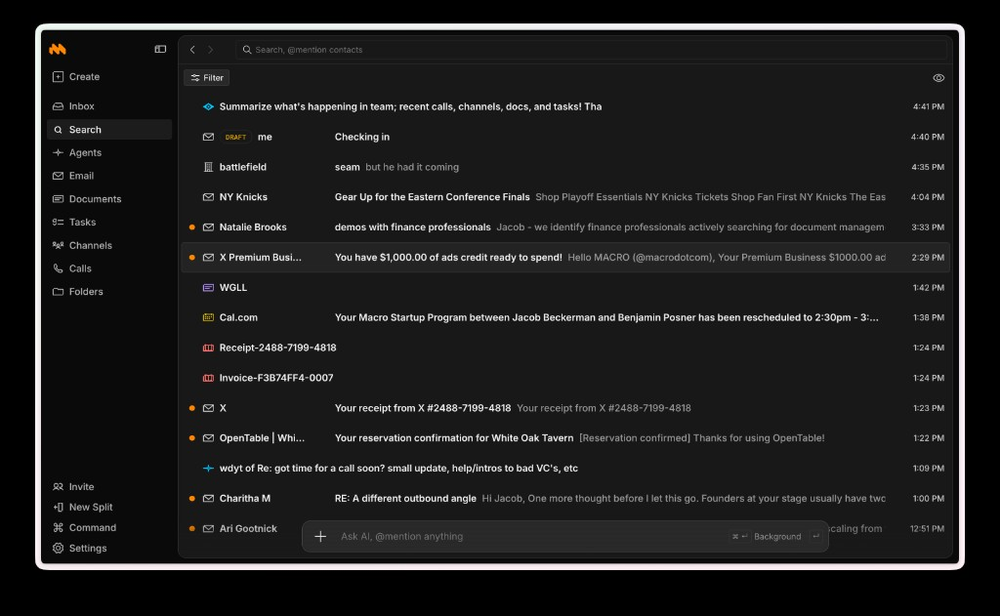
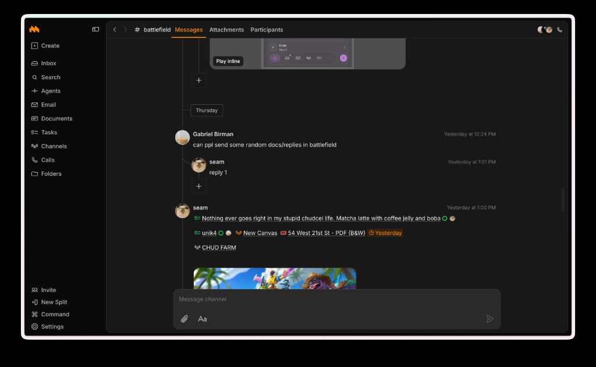
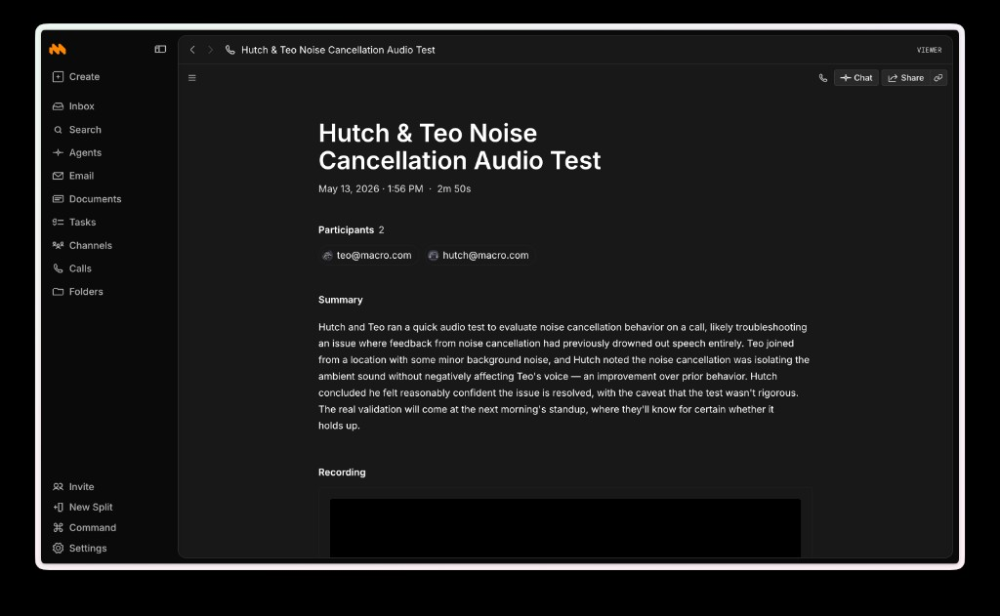
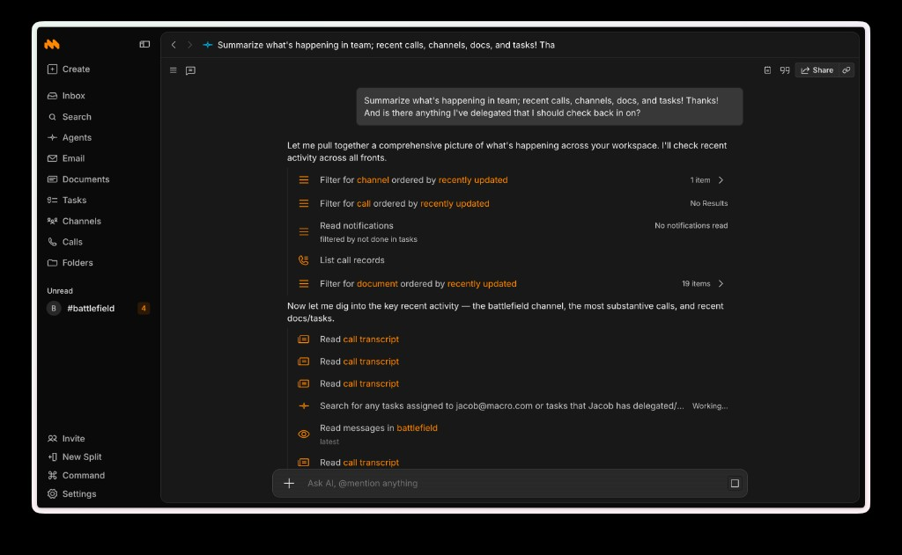

<div align="center">
  <a target="_blank" href="https://macro.com">
    
  </a>

  <p>
    Email, messaging, tasks, docs, files, calls, and AI in one linked workspace.
  </p>

  <p>
    <a href="https://macro.com">Website</a>
    ·
    <a href="mailto:contact@macro.com">Feature requests</a>
    ·
    <a href="mailto:contribute@macro.com">Contribute</a>
    ·
    <a href="mailto:teo@macro.com">Hiring</a>
  </p>
</div>

# Why Macro

Macro is for teams whose work is scattered across email, chat, documents, files, tasks, calls, search, and AI.

The important part is the graph between those objects. Mention a doc in a channel, link a task from an email, drop a file into a canvas, or ask AI about the context around any object; Macro keeps the reference instead of losing it in another tab.

# Features

<table>
  <tr>
    <td width="50%">
      <p>
        
        <strong>Search</strong>
      </p>
      
      <br />
      Search spans emails, channels, docs, tasks, files, calls, and people. Filter to the object you need, or ask AI with <code>@mentions</code> for context.
    </td>
    <td width="50%">
      <p>
        
        <strong>Messaging</strong>
      </p>
      
      <br />
      Channels hold messages, replies, attachments, docs, tasks, canvases, PDFs, and calls in the same thread. Every <code>@link</code> points both ways.
    </td>
  </tr>
  <tr>
    <td width="50%">
      <p>
        
        <strong>Calls</strong>
      </p>
      
      <br />
      Recordings, participants, summaries, and transcripts stay connected to the workspace, so follow-ups can link back to the discussion that created them.
    </td>
    <td width="50%">
      <p>
        
        <strong>Agents</strong>
      </p>
      
      <br />
      Agents can search, filter, read transcripts, and gather context across recent calls, channels, docs, tasks, and notifications before answering.
    </td>
  </tr>
</table>

# Stack

- TypeScript and Rust
- SolidJS, Tauri, Vite, Lexical, and CRDT-backed collaboration
- Bun workspaces, Biome, Vitest, and Playwright
- PostgreSQL, OpenSearch, WebSockets, and AWS
- Pulumi infrastructure

# Repository Layout

While we're not accepting contributions yet, we encourage you to explore the codebase. This overview should help you navigate.

```txt
macro/
├── js/app/                      # Frontend (SolidJS + Tauri)
│   ├── packages/
│   │   ├── app/                 # Web/Desktop app entry point
│   │   ├── core/                # Core shared logic and components
│   │   ├── lexical-core/        # Core text editor (Lexical-based)
│   │   ├── block-*/             # UI block components (email, chat, canvas, etc.)
│   │   └── service-*/           # API clients for backend services
│   └── src-tauri/               # Tauri Rust backend for desktop
│
├── rust/cloud-storage/          # Backend services (Rust)
│   ├── document-storage-service/    # Document storage API
│   ├── email_service/               # Email processing
│   ├── comms_service/               # Messaging
│   ├── search_service/              # Full-text search
│   ├── authentication_service/      # Auth
│   ├── connection_gateway/          # WebSocket gateway
│   ├── macro_db_client/             # PostgreSQL client
│   └── ...                          # Other services and shared crates
│
├── infra/                       # Infrastructure (Pulumi + AWS)
│   ├── stacks/                  # Pulumi deployment stacks
│   ├── lambda/                  # Lambda function configs
│   └── resources/               # Reusable AWS resource definitions
│
└── scripts/                     # Build and utility scripts
```

# Community

Macro is licensed under the Business Source License. See `LICENSE.md` for details.

Have an idea, want to contribute, or want to work on Macro?

- Feature requests: [contact@macro.com](mailto:contact@macro.com)
- Contributions: [contribute@macro.com](mailto:contribute@macro.com)
- Hiring: [teo@macro.com](mailto:teo@macro.com)
