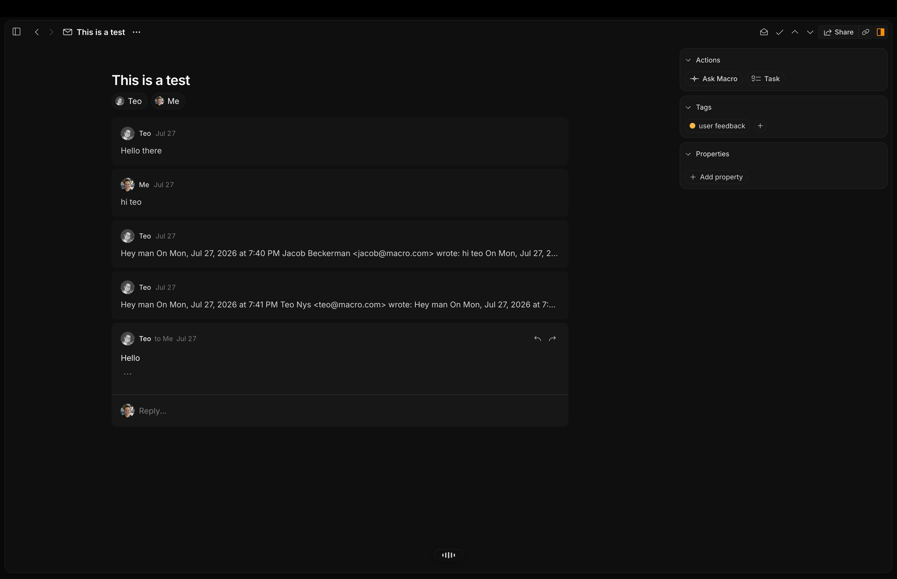
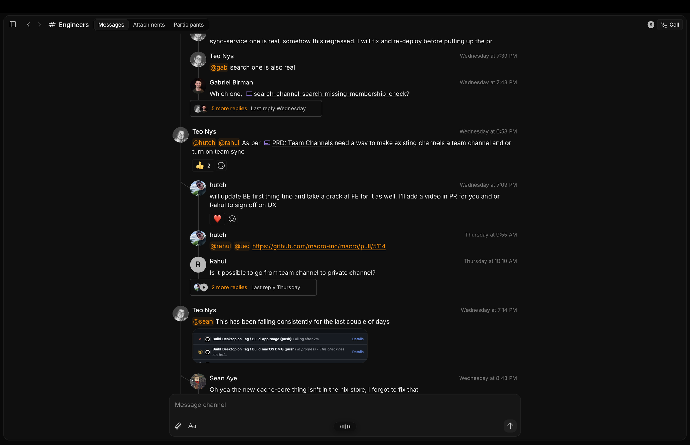
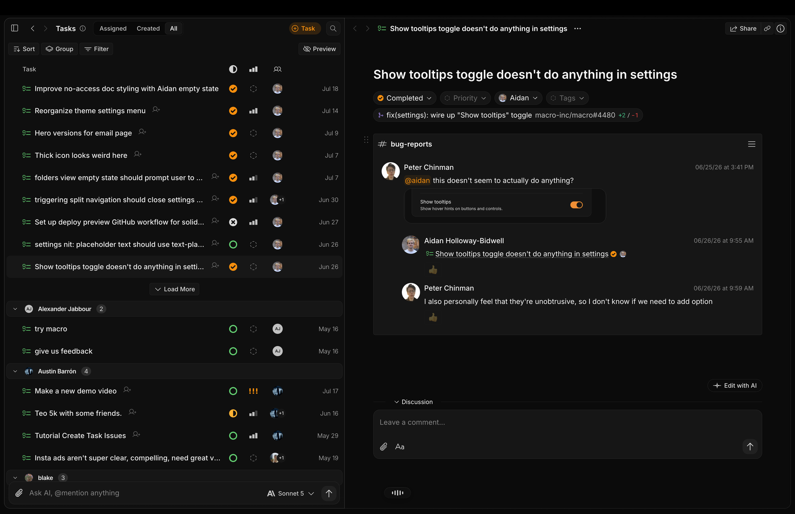
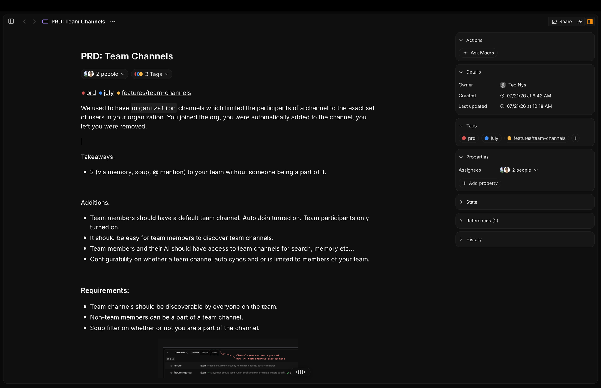
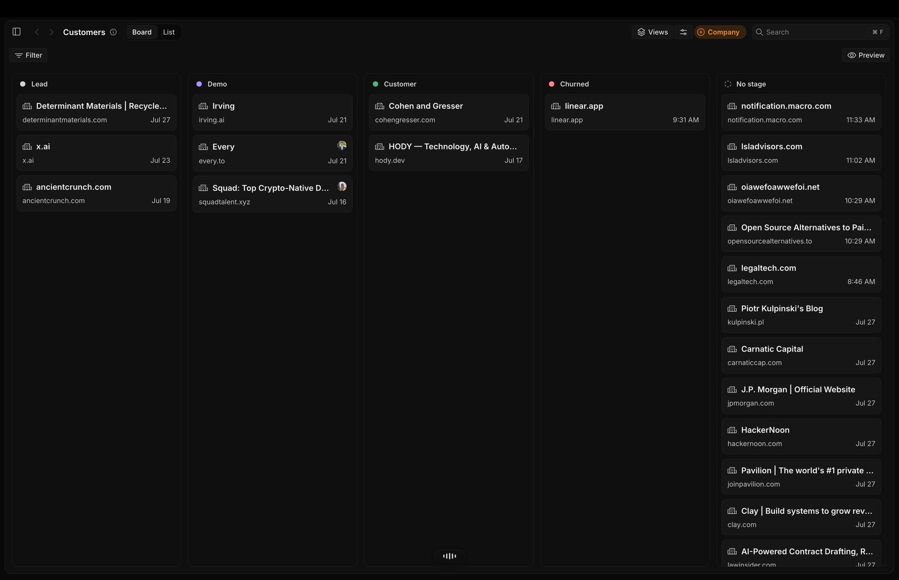
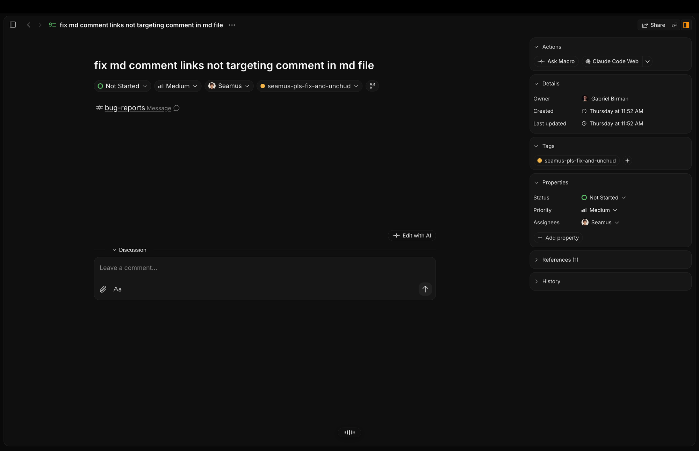
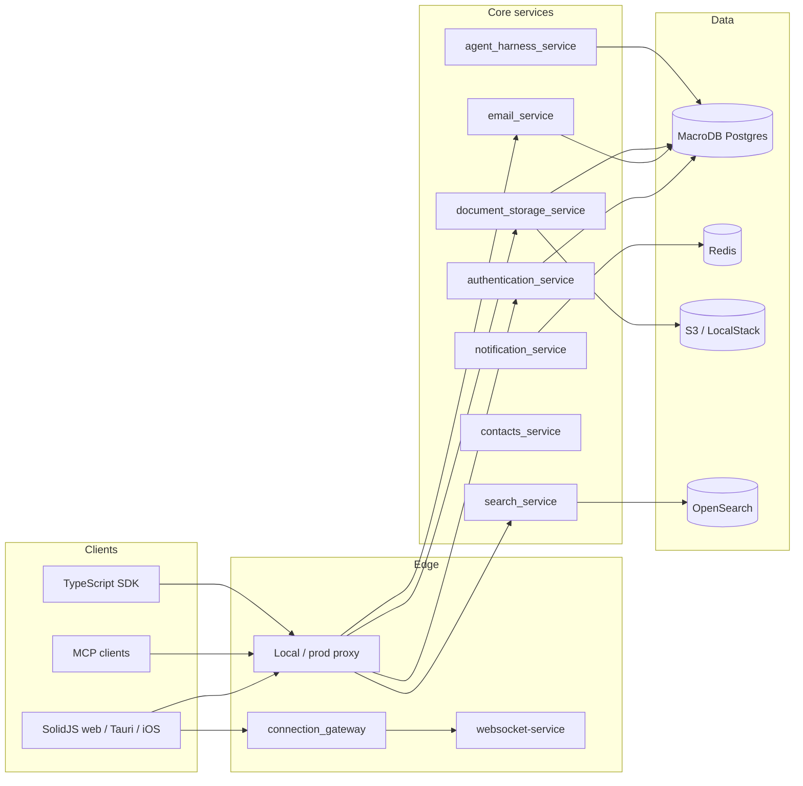

<div align="center">
  <a target="_blank" href="https://macro.com">
    
  </a>

  <br />
  <br />

  <p>
    <a href="https://macro.com/app">Sign up</a>
    ·
    <a href="https://docs.macro.com">Docs</a>
    ·
    <a href="https://cal.com/team/macro/macro-demo-call?metadata%5Bfbp%5D=fb.1.1778954074516.817396687896036613">Book demo</a>
    ·
    <a href="https://macro.com">Website</a>
    ·
    <a href="https://github.com/macro-inc/macro">GitHub</a>
    ·
    <a href="mailto:contact@macro.com">Feature requests</a>
    ·
    <a href="CONTRIBUTING.md">Contribute</a>
    ·
    <a href="mailto:teo@macro.com">Hiring</a>
  </p>

  <p>
    <a href="https://macro.com/app"></a>
    <a href="LICENSE.txt"></a>
    <a href="https://docs.macro.com"></a>
    <a href="mailto:security@macro.com"></a>
  </p>
</div>

<br />

**Macro is the all-in-one workspace for you and your team.** It unifies email + messages + docs + tasks + agents + CRM into a single fast interface with shared team-level memory. Everything in your workspace is @linked and searchable so your team (and your agents) never have to switch tools.

This repository is the full product: the SolidJS client, the Rust microservices, the local stack, the TypeScript SDK, and the docs site. Macro is **fully open source** under AGPLv3 — not "open core".

<br />

<details>
<summary><strong>Table of contents</strong></summary>

- [Why Macro](#why-macro)
- [Who it is for](#who-it-is-for)
- [Features](#features)
- [Email](#multiple-email-inboxes-w-good-ai-tools-integrated-crm)
- [Team chat](#team-chat-for-focused-technical-discussions)
- [Tasks](#task-management-built-around-chat)
- [Docs](#linked-markdown-docs-powered-by-crdts)
- [CRM](#crm-that-keeps-itself-up-to-date)
- [Canvas](#canvas-a-2d-board-that-is-still-part-of-the-graph)
- [Calls](#calls-that-become-team-memory)
- [Files, GitHub, and calendar](#files-github-and-calendar)
- [Agents and unified team-level memory](#agents-and-unified-team-level-memory)
- [How it all works together](#how-it-all-works-together)
- [Keyboard-first by default](#keyboard-first-by-default)
- [Using the hosted app](#using-the-hosted-app)
- [MCP, SDK, and automations](#mcp-sdk-and-automations)
- [Architecture](#architecture)
- [Repository layout](#repository-layout)
- [Running it locally](#running-it-locally)
- [Development commands](#development-commands)
- [Testing](#testing)
- [Contributing](#contributing)
- [Security](#security)
- [License](#license)
- [Community](#community)
- [Star us on GitHub](#star-us-on-github)

</details>

<br />

# Why Macro

We built Macro because we wanted a single operating system for our startup. There are many good software products, and we used them all — Slack, Linear, Notion, HubSpot, and Superhuman — but they don't work together as one system. As we scaled our last venture to ~20 people things started to break: every team got their own tools and the company was held together by MCP and Zapier. The company was not computable. It was chaotic.

Macro is a complete redesign of work software from the ground up as a single system.

Designed by us in NYC and Toronto, dogfooded by our team of ~15 for two years. Built in SolidJS and Rust for speed and reliability. We're focused on building something that any small company or team at a larger company can use as their "operating system".

The short version of the bet:

1. **One graph, not a pile of integrations.** Mentions, shares, and permissions are native. A task created from a customer email already knows the thread, the company, and the channel it spilled into.
2. **Chat is the center of gravity.** Work is discussed in messages. Tools that live somewhere else go stale. Macro puts tasks, mail, docs, and CRM next to the conversation instead of asking you to copy-paste between products.
3. **Agents should see what the company sees.** Team memory is built from email, channels, tasks, docs, and calls — not just prior chatbot transcripts. Tools cover nearly the entire UI surface, with no MCP rate limits.
4. **Speed is a feature.** The client is SolidJS. The backend is Rust. Docs collaborate over CRDTs. The UI is keyboard-first. We dogfood this all day.

<br />

# Who it is for

Macro is aimed at small companies and teams inside larger companies that want one workspace instead of a toolchain:

| If you currently… | Macro gives you… |
| ----------------- | ---------------- |
| Live in Superhuman / Gmail and Slack | One inbox for mail, mentions, tasks, and DMs |
| Track work in Linear that nobody updates | Lightweight tasks that spawn from the chat itself |
| Write specs in Notion and discuss them in Slack | @linked markdown docs with live CRDT collaboration |
| Keep a CRM that is two weeks behind | Company/contact objects next to the actual emails and messages |
| Paste context into ChatGPT / Claude | Agents with team memory and tools over the real workspace |
| Glue five products together with Zapier | One bidirectional graph and one permission model |

Coming from Notion, Slack, Superhuman, or Linear? See [Switch to Macro](https://docs.macro.com/switch-to-macro).

<br />

# Features

Macro is composed of 'blocks' designed to be modular, extensible, and work together like Lego. For each block, we studied the best prior art and tried to make it even better.

Each surface is purpose-built for its job rather than composed from a generic block primitive — but every one of them shares the same backend; cross-references between a doc and a task, or a channel message and an email, are natively stored as a **bidirectional graph**.

| Block         | Docs                                                      | What it does                                                                  |
| ------------- | --------------------------------------------------------- | ----------------------------------------------------------------------------- |
| Email         | [Docs &rarr;](https://docs.macro.com/product/email)       | Multi-account unified inbox, keyboard shortcuts, and shared inboxes. Gmail.   |
| Messages      | [Docs &rarr;](https://docs.macro.com/product/channels)    | Channels and direct messages designed for focused technical discussions.      |
| Tasks         | [Docs &rarr;](https://docs.macro.com/product/tasks)       | Linear-inspired tasks, tightly integrated with channels, email, and agents.   |
| Docs          | [Docs &rarr;](https://docs.macro.com/product/docs)        | Real-time collaborative, markdown-native docs built on CRDTs, with @mentions. |
| Canvas        | [Docs &rarr;](https://docs.macro.com/product/canvas)      | 2D board with embedded @links to tasks, files, and emails.                    |
| Agents        | [Docs &rarr;](https://docs.macro.com/product/agents)      | Unified, team-level memory. Can take action on your behalf.                   |
| Calls         | [Docs &rarr;](https://docs.macro.com/product/calls)       | Recorded, transcribed, and logged to team memory for agents.                  |
| File storage  | [Docs &rarr;](https://docs.macro.com/product/folders)     | Auto-imported from email and channels, fully searchable.                      |
| Pull requests | [Docs &rarr;](https://docs.macro.com/integrations/github) | Linked to tasks, embeddable in channels, available to agents.                 |
| CRM           | [Docs &rarr;](https://docs.macro.com/product/crm)         | Customer and contact objects, custom properties, email sync, enrichment.      |

Deeper reading: [key concepts](https://docs.macro.com/concepts/blocks) covers blocks, mentions, properties, and permissions; the [FAQ](https://docs.macro.com/faq) covers comparisons, licensing, and self-hosting.

<br />

# **Multiple email inboxes** w/ good AI tools, integrated CRM

Macro Mail is inspired by Superhuman's keyboard-first interface with a few key additions:

1. Multi-account. Triage all your Google accounts in a single inbox, with the same tagging and sharing system. Or triage individually.
2. Unified inbox: emails, messages, @mentions, and tasks to complete, all in the same list. Use `j` `k` and `e` to navigate everything.
3. Better AI, with a tools/MCP surface designed to work across inboxes and to help your agents more accurately retrieve information. For example, we expose a unified search tool that allows agents to search all file attachment PDFs (parsed out of email) directly, rather than pulling email threads then attachments. You can also draft, edit and send emails right from AI chats, without opening your email.



4. Multitasking ability — Macro has a built-in window manager that lets you create 3+ splits (scales with monitor size) so you can draft emails while reviewing prior threads.
5. Company/Contact objects. Macro has native CRM capability so you can `cmd+k` to a contact, like tim@acme.com to see all emails between you and that person, or companies, to see all emails and files between everyone on your team and everyone at that company, e.g. `@acme.com`. All of this right from your email without having to open a heavyweight CRM like HubSpot or Salesforce. Email aggregation by contact or company is also available to your agents so they can better assist with CRM-type queries and actions.

Macro Mail lives in the same interface as channels, docs, tasks, and code. From any email, hit "task" to create a linked task, e.g. a ticket for an engineer from a customer support email. @mention emails in documents, e.g. @Re: Contract Signature.eml inside of Todos.md. In Macro, your email is brought into the fold with all of your tools, and your team, in the same permissions system: just hit `Share` to share an email to any DM or channel — no need to screenshot.

What that looks like in practice:

- **Signal vs Noise.** The inbox is split so customer mail, mentions, and assignments do not drown in newsletters.
- **Shared inboxes.** A support or founders alias can be triaged by the whole team without forwarding chains.
- **Attachments become files.** PDFs and docs pulled out of mail are indexed and searchable, including by agents.
- **Same permissions as everything else.** Share a thread into a channel and members get access; leave the channel and they lose it.

[Email docs &rarr;](https://docs.macro.com/product/email)

<br />

# **Team chat** for focused technical discussions

Macro Chat is designed to be more focused than Slack. The first couple of replies show inline and the rest collapse into a thread, so a busy channel stays readable. Threads are permissioned severally so you can share threads across channels by copying links. Everything is stored in a bidirectional graph, so tasks @link to messages that created them, customer support emails tie into support channels, CRM records get updated when they're discussed in messages, etc. The core idea is that (i) messaging should be the centerpiece around which tasks, mail, docs, and content management are built, all in a lightweight way, and agents should be first-class citizens like human users and (ii) messaging needs to be more focused and readable for technical conversations, and not turn into battles where context is lost and progress is indistinguishable from noise.



Designed for people who actually read channels:

- Inline replies for the first couple of messages; the rest collapse so a busy `#eng` channel stays scannable.
- Threads you can share by URL, with their own permission boundary.
- Agents as first-class members — `@Macro` in a channel or DM, not a sidecar chatbot.
- GitHub checks, tasks, emails, and docs unfurl in place instead of living as screenshots.
- Channel membership *is* the ACL: @mention a doc or email in a channel and members can open it.

[Messages docs &rarr;](https://docs.macro.com/product/channels)

<br />

# **Task management** built around chat

Linear recently published a report that issue tracking is dead. We agree with that, but the stronger form is that issue tracking never really worked, at least for us. We really tried and we blamed ourselves, but as we talked to other companies, it turns out that nobody was using their issue tracker "correctly". And if that's the case, the problem is the design of the tool, not the companies that use it.

The core problem with traditional issue trackers or project management tools is that they get out of date. The reason they get out of date is that (i) they're a separate system from where the conversation really happens in team chat (e.g. Slack, Macro, Discord, etc.) and (ii) they don't add much benefit beyond tracking the work. They're a chore with near-term costs and only the promise of long-term benefit. They're too rigid compared to a 2D canvas, too opinionated, and don't match how your project actually functions.

The solution isn't to forgo tracking entirely. We tried that and it was a different form of chaos. **The solution we've found is lightweight issues tightly coupled to your channels and DMs, so that issue tracking naturally occurs where the conversation itself happens.**



Creating tasks in Macro is easy. Where possible, tasks created are bidirectionally linked to the creating context (e.g. a customer email) so the full chain is auditable from "why are we doing this" → task → agent → pull request, all in one system.

- Create a task from an email
- From anywhere via `c` `t`
- From a markdown doc with `/task`
- From any `- [ ]` bullet by highlighting and clicking "Task"
- `@Macro` create tasks in any channel or DM
- In any agent chat
- Via external MCP, API or SDK

Once a task exists it stays in the graph: assignees, status, the source message, the linked PR, the customer email that caused it, and the agent that picked it up. You can hand a task to a coding agent and watch the branch come back on the same record.

[Tasks docs &rarr;](https://docs.macro.com/product/tasks)

<br />

# @linked markdown docs powered by CRDTs

We wanted everything in a single markdown editor without switching tools.

- Native markdown compatibility and bulk/import export (see "file over app" paradigm)
- Live collaboration with CRDTs and Cloudflare durable objects make it feel like you're editing on the same computer. Edits come in ~instantly instead of ka-chunking like Google Docs
- Version control: history and forking, with a neat UI for scrubbing history. This is still in v1, there's a lot to do to get it closer to git, or we may eventually add git compatibility.
- Offline editing and reconciliation.
- @-linked to everything in your workspace: email, docs, tasks, messages, channels, companies, contacts, etc. Like Notion but multi-modal
- Mobile-friendly, in our [iOS app](https://apps.apple.com/us/app/macro-app/id6743133649) or on the web (Android app coming soon)
- Agent native editing, powered by swarms of agents operating as peers in the CRDT collaboration system like human collaborators. See [Wolf's tech blog on this](https://404wolf.com/posts/AgentsAttackTheDocument/). Use via MCP or internal agent.



Agents can edit documents that are open or closed. One interesting use case for agentic editing is to maintain team-context. For example we have a Macro Automation that runs daily to update our in-office Pool Games markdown doc. It scans through all of the channels to see if anyone has one and then updates the doc. If somebody has already edited the doc, it can know that and forgo the update. Conflicts are handled natively by the CRDT collaboration system.

The editor is markdown-native (Lexical + Loro) so you can treat docs as files when you want to, and as a live multiplayer surface when you don't. Properties, tags, and assignees sit on the same records as everything else in the workspace — a PRD is not a different object type living in a different database.

[Docs &rarr;](https://docs.macro.com/product/docs)

<br />

# CRM that keeps itself up to date

The problem with standalone CRM is the same as with task trackers: it's not up to date. The CRM only partially reflects reality, so if you want to know what the latest status on a deal is you still have to message the AE/SDR and ask for context. CRMs are also too rigid and closed-source, while DIY CRMs in Airtable/Notion don't provide email aggregation by Company/Contact/Deal that is the core feature of CRM. We went through all the CRMs, including the new AI-native ones, and while they're well-designed they're just structurally set up to fail over time.

**Macro fixes this by colocating your CRM with your team chat and email, instead of having a separate system.** When you @mention a company record in a message, your team can click that record to see the latest — it's much faster than navigating to your CRM to find the record, going back to Slack and pasting it in, and this speed difference makes all the difference. Secondly, @mentioning a Company/Contact creates a bidirectional link between that message and the record, so from the record later you can trace the conversations that happened. This fixes the core issue we had with Attio/HubSpot/Salesforce: the actual important conversation about a deal happens not in the CRM but over messages. Macro makes this a feature rather than making you feel disorganized about it. It's not your fault, it was the CRM's fault!



We haven't innovated on the core idea of CRM other than what you read in the above paragraph. None of this should be that interesting:

- Kanban board and customizable deal stages, list view, saved views, shareable views, personal and team views, etc.
- "Notes" on the company actually use the same system as channels/DMs, so you can @mention and do all of the things you expect in a channel. Basically, every deal gets its own channel, automatically, that's pinned right to the deal record
- @mention the company or contact from any note, message, task, pull request, etc., to create a bidirectional link between the record and that thing. For example, @mention a company from an engineering task to note their request. It all ties together.

[CRM docs &rarr;](https://docs.macro.com/product/crm)

<br />

# Canvas: a 2D board that is still part of the graph

Most whiteboards are a dead end: great for a workshop, disconnected from the work the next morning. Macro Canvas is a 2D board that embeds the same @links as everywhere else — tasks, files, emails, docs, companies — so a planning board is another view on the graph, not a screenshot of it.

Use it for sprint boards, architecture sketches, deal war rooms, or a weekly review that actually stays wired to the underlying records.

[Canvas docs &rarr;](https://docs.macro.com/product/canvas)

<br />

# Calls that become team memory

Calls in Macro are recorded, transcribed, and written into team memory so agents (and humans who missed the meeting) can retrieve what was decided. They are blocks like everything else: shareable, @mentionable, and searchable.

That means a customer call can sit next to the CRM record, the follow-up email, and the tasks that came out of it, instead of living in a separate recorder that nobody searches.

[Calls docs &rarr;](https://docs.macro.com/product/calls)

<br />

# Files, GitHub, and calendar

**File storage.** Attachments from email and channels are auto-imported, indexed, and fully searchable. Agents can search parsed PDFs directly instead of walking thread → attachment → download. See [folders](https://docs.macro.com/product/folders).

**Pull requests.** GitHub PRs link to tasks, unfurl in channels, and are available to agents so a coding handoff does not leave the workspace. See [GitHub](https://docs.macro.com/integrations/github).

**Calendar.** Events live in the same graph as tasks, messages, and docs. Guests, locations, and invitations stay next to the rest of the work instead of in a siloed calendar product.

<br />

# Agents and unified team-level memory

Since Macro has the team context in a single database, it is uniquely positioned to offer team-level memory with full context of all of the operations of the business. We do this every day via a cron job. Your memory is updated from team conversations, your DMs, your sent and received emails, tasks created and completed, etc. All of this is synthesized together in one pass, rather than severally, and combined with your previous memory to form the new memory output. The net result:

- Macro has the best memory on what you're working on and what you care about vs. chatbots that only build memory from prior chats
- This memory is available to external agents via MCP, or any AI model (OpenAI, Google, Anthropic, etc.) through the model picker for maximum portability
- The memory is plainly stored in markdown so you can export it as you please. To manually update it, just ask the AI to remember something/update your memory

Team memory comes in quite handy. For example, I took a screenshot of some features I'd written in a paper notepad and asked the agent to create tickets and assign to the appropriate engineer which it did perfectly without any runtime tool use.



Memory isn't supposed to encompass everything. Macro also has a tool/MCP surface with near 100% coverage of the things you can do in Macro's UI, so that your agents aren't limited in what they can do like they are in most SaaS. There are also no rate limits on MCP.

[Agents docs &rarr;](https://docs.macro.com/product/agents)

Your coding agents can use Macro too. Point Claude Code, Codex, or any MCP client at your workspace:

```bash
claude mcp add --transport http macro https://mcp-server.macro.com/mcp
```

See [MCP setup](https://docs.macro.com/AI/mcp/overview) and [agent recipes](https://docs.macro.com/AI/recipes) for what they can do once connected.

What agents can actually do (not a chatbot bolted onto search):

- Draft, edit, and send email
- Create and update tasks, including assignment
- Edit docs as CRDT peers alongside humans
- Search mail, attachments, channels, files, and CRM records
- Open coding-agent handoffs from a task (branch comes back on the same record)
- Read and write team memory in markdown

<br />

# How it all works together

As we've discussed above, each of the blocks is designed to be best-in-class. We have thoughtfully designed each of Chat, Docs, Email, Agents, etc., to improve on your status quo individually. But where it all comes together is how it's more than the sum of its modules; it's how they work together.

**Bidirectional @linking.** @mention a doc in a message and both know about each other. Your workspace becomes a web of context you can navigate in either direction.

**Channel-based permissions.** Anything you @mention in a channel is automatically shared with its members. Join a channel, gain access; leave, lose it. No permission-request dance.

**Unified memory.** Agents remember what your whole team is doing across email, messages, tasks, docs, and calls, not just your own chat history. Refreshed nightly.

**One inbox.** Emails, channel messages, task assignments, @mentions, and agent responses all land in one place, split into Signal and Noise. Keyboard-first throughout.

A typical loop we actually run:

1. A customer email lands in the unified inbox.
2. Someone hits **task** on the thread. The task is already linked to the email and the company record.
3. The task is discussed in `#eng`. The channel thread and the task point at each other.
4. An agent picks up the task, opens a branch, and the PR unfurls back on the task.
5. The decision is written into a doc. Tomorrow's team memory includes the mail, the chat, the task, and the call that closed it.

Deeper reading: [key concepts](https://docs.macro.com/concepts/blocks) covers blocks, mentions, properties, and permissions; the [FAQ](https://docs.macro.com/faq) covers comparisons, licensing, and self-hosting.

<br />

# Keyboard-first by default

Macro is meant to be driven from the keyboard. A non-exhaustive taste of the muscle memory:

| Shortcut | What it does |
| -------- | ------------ |
| `j` / `k` | Move through the inbox, lists, and threads |
| `e` | Archive / done (context-dependent) |
| `c` then `t` | Create a task from anywhere |
| `cmd+k` | Jump to a person, company, doc, channel, or thread |
| `/task` | Insert a task from inside a markdown doc |

The window manager is part of the same idea: split the workspace into 3+ panes so you can draft mail while the source thread stays on screen. Layout scales with monitor size.

<br />

# Using the hosted app

[Sign up](https://macro.com/app) and connect your Gmail or Google Workspace account. Macro runs in any modern browser, with an [iOS app](https://apps.apple.com/us/app/macro-app/id6743133649) for your phone. The [getting started guide](https://docs.macro.com/getting-started) takes you from a fresh account to a working setup in about 15 minutes. Coming from Notion, Slack, Superhuman, or Linear? See [Switch to Macro](https://docs.macro.com/switch-to-macro).

You do not need this repository to use Macro. Clone it if you want to self-host under AGPLv3, contribute, or run the local stack.

<br />

# MCP, SDK, and automations

Macro is built so agents and scripts are first-class, not an afterthought API.

**MCP.** The hosted MCP server is `https://mcp-server.macro.com/mcp`. There are no MCP rate limits. Tool coverage is intended to match the UI: search, mail, tasks, docs, CRM, memory, and more. Setup: [MCP overview](https://docs.macro.com/AI/mcp/overview).

**TypeScript SDK.** `packages/sdk` is a generated HeyAPI client plus a hand-written ergonomic layer. Authenticate as a user (`MACRO_API_KEY`) or as a bot (`MACRO_BOT_TOKEN` / `mbot_` keys from Settings → Bots):

```ts
import { Macro } from "@macro/sdk";

const macro = new Macro({}); // MACRO_API_KEY or MACRO_BOT_TOKEN
const asBot = new Macro({ auth: { type: "bot", token: myBotKey } });
const asWolf = asBot.requestedAs("macro|wolf@macro.com");
```

**Automations.** Scheduled jobs (daily team-memory refresh, a channel-scanning doc updater, and so on) run inside the same graph. Agents edit docs as CRDT peers, so an automation that rewrites a markdown file does not fight a human who has the same file open.

<br />

# Architecture

Macro is a Cargo workspace of 80+ crates plus a SolidJS client. Services talk over HTTP, SQS, Lambda, Redis, and WebSockets. Domain logic lives in crates; deployable binaries live in `services/`.



### Data stores

| Store | Role |
| ----- | ---- |
| **MacroDB** (Postgres) | Documents, users, projects, messages, channels, participants, email threads, notifications, CRM |
| **ContactsDB** | User connections and contacts |
| **S3** | Document files and attachments |
| **Redis** | Cache and session state |
| **OpenSearch** | Full-text search index |
| **DynamoDB** | Connection tracking (production gateway) |
| **Kafka** | Local/prod event plumbing for async processing |

### How a document moves

Upload → text extraction (PDF via pdfium, DOCX via Lambda unzip) → search indexing → storage → retrieval. Metadata lives in Postgres; bytes live in S3; text lives in OpenSearch.

### Hexagonal services

Inbound adapters (axum HTTP, tools, listeners) sit outside a domain core with ports; outbound adapters talk to databases and AWS. Conventions live in [`docs/STYLE_GUIDE.md`](docs/STYLE_GUIDE.md). New backend work should follow that layout rather than reaching for the database from a handler.

<br />

# Repository layout

```
macro/
├── apps/
│   ├── web/       SolidJS client — browser, Tauri desktop, mobile
│   └── docs/      Mintlify site for docs.macro.com
├── services/      Deployable services, workers, and Lambda handlers
├── crates/        Rust libraries — domain logic, models, db clients
├── packages/      shared TypeScript — sdk, collaboration, lexical-core, loro-mirror
├── infra/         Pulumi definitions and local stack generation
├── docker/        Compose files for Postgres, Redis, OpenSearch, Kafka, FusionAuth, LocalStack
├── nix/           pinned dev shell and build inputs
├── tooling/       repo scripts, seed CLI, code generators
└── docs/          running locally, style guide, architecture notes
```

Approximate shape of the tree today: **40+ services/workers**, **190+ crate directories**, a Bun workspace for the client and shared TS packages.

### Clients (`apps/`)

| Path | What it is |
| ---- | ---------- |
| `apps/web` | SolidJS app: browser, Tauri desktop, iOS/Android shells |
| `apps/docs` | Mintlify documentation; MCP tool pages are generated from `crates/ai_tools` |

### Shared TypeScript (`packages/`)

| Package | What it is |
| ------- | ---------- |
| `packages/sdk` | Typed client over Macro APIs |
| `packages/collaboration` | Realtime collaboration helpers |
| `packages/lexical-core` | Shared Lexical editor core |
| `packages/loro-mirror` | Loro CRDT mirroring |
| `packages/observability` | Frontend/shared observability |

### Services (selected)

The full list is under `services/`. A map of the ones you will hit first:

| Service | Role |
| ------- | ---- |
| `authentication_service` | Signup, passwordless login, sessions |
| `email_service` | Inboxes, threads, Gmail sync, sending |
| `document_storage_service` | Docs, files, metadata |
| `document_cognition_service` | Analysis and processing |
| `search_service` / `search_processing_service` | Query + indexing |
| `notification_service` | Preferences and delivery |
| `contacts_service` | Contacts graph |
| `connection_gateway` / `websocket-service` | Realtime |
| `sync-service` | Client sync |
| `lexical-service` | Collaborative editing backend |
| `mcp_service` / `mcp_auth_proxy` | MCP surface |
| `agent_harness_service` / `agent_trigger_service` | Agents |
| `static_file_service` | Static file serving |
| `convert_service` | Format conversion |
| Lambdas (`document_text_extractor`, `docx_unzip_handler`, …) | Event-driven processing |

<br />

# Running it locally

Two paths. Pick the smaller one unless you are changing a backend service.

Full detail: [Running locally](docs/RUNNING_LOCALLY.md).

### Shared prerequisites

Install [Nix](https://nix.dev/install-nix), clone this repo, and enter the pinned shell:

```bash
git clone https://github.com/macro-inc/macro.git
cd macro
nix develop
```

The shell provides `just`, Cargo, Rust, Bun, `wasm-pack`, sqlx, zig, and cargo-zigbuild. You do not install those separately.

If `nix develop` fails, enable flakes for that invocation:

```bash
nix develop --extra-experimental-features nix-command --extra-experimental-features flakes
```

Linux desktop / Android shells are separate because the Tauri deps are large: `nix develop .#tauri-linux` and `nix develop .#tauri-android`.

### Frontend against hosted `*-dev` services

No Docker. Vite on your machine, APIs on hosted dev:

```bash
bun install
cd apps/web
bun run dev
```

The first run may compile wasm. Sign-in is not the local Mailpit flow. Use this when you are only changing the client.

### Full local stack

Docker + local Postgres, Redis, LocalStack, OpenSearch, Kafka, and FusionAuth. Dummy AWS credentials and fixed test secrets. Doppler is optional.

On Linux, the Nix shell supplies the Docker CLI, daemon, Compose, and `fuse-overlayfs`. On macOS, install Docker Desktop, OrbStack, or Colima; Nix still supplies the CLI.

```bash
just doctor-local          # daemon, toolchain, ports
just run_local --no-doppler
```

If you have Doppler access to `lcl_personal`, `just run_local` pulls real integration secrets (Google, GitHub, Stripe, CloudFront). Without Doppler, those flows are stubbed; auth, documents, email, and search still work.

When the stack is up:

- Frontend URL is printed by `run_local` (default hosted-style app at the local frontend port).
- Passwordless login creates a user for any email. The one-time code lands in **Mailpit** at http://localhost:8025, not a real inbox.
- Press `r` to rebuild changed Rust services. Press `q` to stop the stack cleanly.

Seed a realistic workspace (users, teams, channels, docs, tasks, mail):

```bash
just seed-scenario apply --file seed/scenarios/team-perms.json
```

`apply` prints per-persona login links such as `http://alice.localhost:3000/app/login?email=alice@seed.macro.local`. Open each hostname in its own browser profile if you want several users side by side.

Named instances (worktrees, parallel agents):

```bash
just run_local --no-doppler --instance agent-a
just run_local --no-doppler --instance agent-b --port-base 31000
```

Each instance gets its own Compose project, volumes, and port window. Keep `--instance` and `--port-base` aligned across `run_local`, `seed-scenario`, and `status_local`.

<br />

# Development commands

Run these from the repository root, inside `nix develop`.

| Command | What it does |
| ------- | ------------ |
| `just doctor-local` | Preflight: Docker, toolchain, ports |
| `just run_local --no-doppler` | Full local product stack |
| `just build` | Build all services |
| `just check` | Format + lint + rules vs `origin/main` |
| `just check full` | `just check` plus `tsc` and clippy |
| `just clippy` | Extra Rust lints |
| `cargo fmt` | Format Rust |
| `cargo test -p <crate>` | Test one crate against live local Postgres |
| `just setup_macrodb` | Create and migrate MacroDB |
| `just prepare_db` | Refresh the workspace `.sqlx` cache after SQL changes |
| `just create_networks` / `just run_dbs -d` | Networks + Postgres/Redis for tests |
| `bun run dev` (from `apps/web`) | Vite frontend |

Environment variables are loaded through `macro_env_var` / `macro_config` — never `std::env::var`. New secrets belong in Doppler with names that match the env vars in code.

SQLx: leave `SQLX_OFFLINE` unset for `cargo test`. Offline mode is fine for `cargo check` / `cargo build` / `cargo clippy` only. If tests complain about missing cached query data, run `just prepare_db` (from the repo root, inside Nix) instead of flipping offline mode on.

Migrations live in `crates/macro_db_client/migrations/`. Do not invent migration timestamps; use `sqlx migrate add`. Some table/column names are camelCased — check the migrations or dump the schema before writing SQL.

<br />

# Testing

There is no `just test`. Test the crate you touched:

```bash
just create_networks
just run_dbs -d
just setup_test_envs
just initialize_dbs
cargo test -p {crate}
```

Frontend: see `apps/web` scripts (`bun run check`, Biome, Playwright notes under `apps/web/docs/`). Local E2E seeding is `just local-e2e-seed`.

Before you push a backend change: `cargo fmt`, `just clippy`, and the tests for the crates you modified. SQL or migration changes also need `just prepare_db`.

<br />

# Contributing

Macro is AGPLv3 and we welcome outside contributions. Please read [CONTRIBUTING.md](CONTRIBUTING.md) before you open a PR.

The short version:

1. **Open an issue first.** PRs without a linked issue may be closed.
2. **Understand the change.** AI-assisted work is fine; unreviewed generated dumps are not.
3. **Conventional Commits** for branches and PR titles: `feat(chat): …`, `fix(email): …`.
4. **Style guide:** [`docs/STYLE_GUIDE.md`](docs/STYLE_GUIDE.md).
5. **CLA:** outside `macro-inc`, sign at https://macro-cla.macroverse.workers.dev/cla, then comment `/macro-cla check` on the PR.

Frontend-only? Run the client against hosted `*-dev` services. Backend or database? Run the local stack.

<br />

# Security


Enterprise-grade security. Zero data retention with model providers, including no training on customer data. SOC 2 Type II certified. We welcome responsible security reports and pay bounties in accordance with severity and impact. Send reports to [security@macro.com](mailto:security@macro.com).

Do not file vulnerabilities as public GitHub issues. Use the mail alias above so we can patch before the details are public.

<br />

# License

Macro is fully open source — not "open core" — under the GNU Affero General Public License v3.0. See `LICENSE.txt` for details.

You can self-host Macro under the terms of the AGPLv3; the [FAQ](https://docs.macro.com/faq) covers what that involves. If you want to build on top of Macro under a different license, contact [licensing@macro.com](mailto:licensing@macro.com). For managed hosting or commercial arrangements, contact [self-host@macro.com](mailto:self-host@macro.com).

By contributing, you agree that your contributions are licensed under the same AGPLv3.

<br />

# Community

Have an idea, want to contribute, or want to work on Macro?

- Product: [macro.com](https://macro.com) · [docs.macro.com](https://docs.macro.com) · [app](https://macro.com/app)
- Feature requests: [contact@macro.com](mailto:contact@macro.com)
- Security: [security@macro.com](mailto:security@macro.com)
- Licensing / self-host: [licensing@macro.com](mailto:licensing@macro.com) · [self-host@macro.com](mailto:self-host@macro.com)
- Contributions: see our [contribution guidelines](CONTRIBUTING.md)
- Hiring: [teo@macro.com](mailto:teo@macro.com)
- MCP: `https://mcp-server.macro.com/mcp`

<br />

# Star us on GitHub

If Macro is interesting/useful to you, please scroll up and give the repo a star (scroll to the top of this page -> click `Star` in top right). Stars are how most users hear about Macro because they move us up GitHub's search and trending pages.

<a href="https://github.com/macro-inc/macro">
  <picture>
    <source media="(prefers-color-scheme: dark)" srcset=".github/readme/star-history-dark.svg" />
    
  </picture>
</a>
