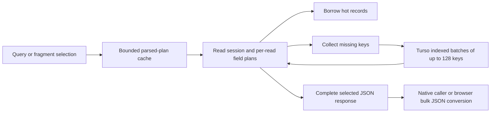

# GraphQL cache performance review

This change reduces repeated work when reconstructing GraphQL responses from the
normalized cache shared by native Turso and the browser's Turso/WASM/OPFS host.
It also adds automatically discovered query/fragment benchmarks, correctness
checks, saved distributions and reproducible workload controls.

The realistic workload returns **100, 250 or 500 outer collection entries from
exactly 10,000 normalized records**, including the requested data. Fragment reads
request that many keys. The normal memory tier holds 10,000 records. Each timed
read reconstructs the selected response; responses are not memoized.

## Results and comparison status

The [completed optimized workload study](PAGE_READ_RESULTS.md) contains every
operation's timings and p95 values. The matched rerun of the original
pre-optimization implementation is in progress. This document will be completed
with that comparison before the PR is marked ready for review.

The comparison freezes the original commit `ea7a41f9fd8a9106b839fad3695aac06ccb6244a`
and its schema/operation corpus: 22 queries and 10 fragment selections. Both sides
use the same fixtures, sizes, population, 30 measured reads after five warmups,
and warm-memory versus selected-record Turso hydration scenarios. Original source
and executable/WASM hashes are retained. The baseline uses the original production
code, including its original SharedWorker lifecycle.

Current `main` has since added an operation and schema fields. Separate integration
validation covers all **23 queries, 10 fragments and 13 Soup entity types** on
the rebased branch. Those correctness runs are not mixed into the historical
performance comparison.

## Changes

| Repeated work or failure | Implementation | Contract protected by tests |
| --- | --- | --- |
| Copying complete normalized records to read a subset of fields | Borrow hot records through `RecordSource`; allocate owned records for storage results and optimistic compositions | Partial selections, missing records and optimistic overlays retain their behavior |
| Rebuilding a partial response after every storage hydration round | Keep a `ReadSession` with the partial response and unresolved destinations, then resume after loading records | Nested lists, nulls, missing fields, repeated references and dependency tracking |
| Re-expanding selections and resolving field arguments for every entity | Build field plans per selection and concrete type within each read | Aliases, fragments, `@cacheOnly`, type conditions and changing variables |
| Re-parsing fragment selections and retaining unlimited query documents | Use bounded 128-entry LRU caches for parsed documents and fragment selections | Selection identity, eviction and invalid-document recovery |
| Rebuilding unchanged reverse dependency sets | Compare the prior operation dependencies and reuse identical entries | Changed dependencies still replace old reverse links and invalidate the right operations |
| Evicting recently used hot records while promoting hydrated records | Refresh recency of touched hot records before cold promotions | Reads preserve normal LRU capacity and remain correct under churn |
| Executing one SQL lookup per normalized key and copying each returned blob before decoding | Fetch at most 128 keys per statement using a requested-values CTE and indexed `LEFT JOIN`; decode each blob without the extra copy | Input order, duplicate keys, absent keys, batches spanning the limit and malformed records |
| Walking large JSON results across the Rust/JS boundary field by field | Serialize read envelopes in bulk and parse once in JS, retaining the original conversion for unsafe integer values | Nulls, nested data, Unicode, revision strings, unsafe-integer errors, negative zero and large floats; `float_roundtrip` avoids float drift |
| Reconnect racing a SharedWorker-wide shutdown | Give each connected client its own Effect runner scope, with shared routing and explicit finalizer cleanup | One client's departure cannot close the worker for a reconnecting client; transport cleanup disconnects router state |

Generic selection/projection logic stays in `cache-core`. SQL batching stays in
the Turso adapter; JS conversion and worker lifecycle remain in their host
adapters. The hexagonal boundary was checked: authorization and domain policies
remain in their owning services. The storage schema and public read envelopes do
not change.

## Validation on current main

Integrated with `main` at `6aa857f746acea8e7b19666b2698d20155a33f13`:

- 255 core/storage/OPFS Rust tests, 28 native cache-host tests and 25 WASM tests
  passed. Rust tests ran with `SQLX_OFFLINE` unset.
- 479 frontend cache tests, the application TypeScript check, the benchmark
  TypeScript check, native formatting and `just check` passed.
- Real browser ownership, reconnect and projection tests passed: nine in
  Chromium, eight in Firefox; one browser-specific case is skipped in Firefox.
- Current-schema fixtures passed 450 native correctness scenarios and 112 browser
  scenarios in each browser. These small-sample integration runs are correctness
  evidence, not published latency estimates.

Integration exposed stale full-projection fixtures after main added the required
`isFavorited` fact. Complete native/WASM/browser seeds now include it; deliberately
partial updates remain partial. This fixes seven native integration failures
without changing projection policy. `cache-wasm` is bumped to `0.6.27` so local
version-based artifact checks rebuild the optimized module.

## Reading the measurements

Warm reads include response assembly from memory. Hydration reads evict selected
records before timing, then include their Turso fetch and response assembly.
Seeding, invalidation and its auxiliary projection updates, and correctness checks
are outside timing. Parsing and OS caches remain warm. Browser timings include
worker messaging, WASM conversion and OPFS access when needed.

The cache population is a count of normalized records, not complete documents or
email threads. Background records are synthetic document metadata. GroupSoup sizes
count bins with two nested items each; multiple outer lists each get the stated
size. Email fixtures include 5 KB body fields, so large pages carry megabytes of
text. These are production selection shapes with synthetic data, not a
traffic-weighted sample.

Measurements use a shared Linux host with runs pinned to CPUs 0–3. File-backed
native databases and browser profiles use `/tmp`, which is tmpfs on this machine;
these are not cold physical-disk measurements. Thirty samples give indicative
p95 values, not a production tail guarantee. Network fetching, UI rendering,
live Tauri webview IPC, startup, concurrent request throughput and peak heap usage
are outside this comparison. Larger full-body responses and Firefox remain
important absolute-latency cases even when their relative improvement is large.

See the [benchmark guide](README.md) for commands, workload definitions and all
earlier studies. Historical raw data and slower rows are retained.
