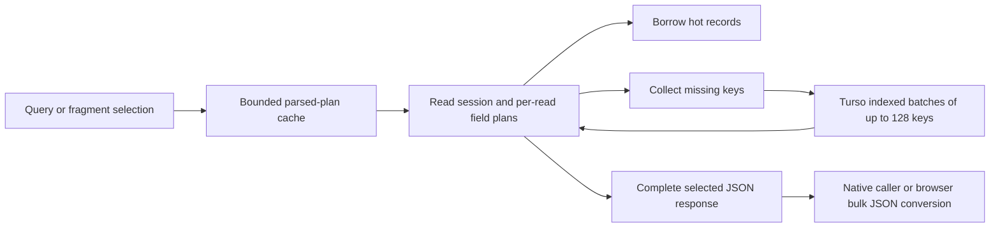

# GraphQL cache performance review

This change reduces repeated work when reconstructing GraphQL responses from the
normalized cache shared by native Turso and the browser's Turso/WASM/OPFS host.
It also adds automatically discovered query/fragment benchmarks, correctness
checks, saved distributions and reproducible workload controls.

The realistic workload returns **100, 250 or 500 outer collection entries from
exactly 10,000 normalized records**, including the requested data. Fragment reads
request that many keys. The normal memory tier holds 10,000 records. Each timed
read reconstructs the selected response; responses are not memoized.

## Before and after

The complete comparison contains **576 matched distributions and 34,560 timed reads** across native Turso, Chromium and Firefox. Each version uses 30 measured reads after five warmups, at each response size and read state. All result and population assertions passed.

[Explore every operation in the standalone HTML artifact](PAGE_READ_COMPARISON.html), [download p50/p95 comparisons](results/page-read-comparison.csv), or inspect [raw samples, hashes, run plans and diagnostic reruns](results/page-read-comparison-raw.json.gz).

Values below are the **unweighted median of the 32 operation p50s**, in milliseconds. The speedup column is the median of their individual before/after ratios; it is not the ratio of the two aggregate columns or a traffic-weighted estimate.

| Host | State | Returned entries | Before p50 median | After p50 median | Median operation speedup |
| --- | --- | ---: | ---: | ---: | ---: |
| native | Warm | 100 | 0.317 | 0.166 | 2.02× |
| native | Warm | 250 | 0.853 | 0.419 | 1.93× |
| native | Warm | 500 | 1.710 | 0.875 | 1.85× |
| native | Turso hydration | 100 | 0.923 | 0.727 | 1.26× |
| native | Turso hydration | 250 | 2.309 | 1.896 | 1.40× |
| native | Turso hydration | 500 | 4.527 | 3.587 | 1.39× |
| chromium | Warm | 100 | 1.350 | 0.900 | 1.73× |
| chromium | Warm | 250 | 2.900 | 2.050 | 1.74× |
| chromium | Warm | 500 | 6.200 | 3.700 | 1.94× |
| chromium | Turso hydration | 100 | 2.800 | 2.250 | 1.31× |
| chromium | Turso hydration | 250 | 5.850 | 5.100 | 1.45× |
| chromium | Turso hydration | 500 | 11.100 | 7.950 | 1.57× |
| firefox | Warm | 100 | 4.630 | 3.790 | 1.53× |
| firefox | Warm | 250 | 11.010 | 8.940 | 1.59× |
| firefox | Warm | 500 | 22.080 | 17.410 | 1.71× |
| firefox | Turso hydration | 100 | 10.030 | 9.150 | 1.19× |
| firefox | Turso hydration | 250 | 22.910 | 20.060 | 1.29× |
| firefox | Turso hydration | 500 | 44.040 | 38.520 | 1.38× |

Representative query **p50 before → after milliseconds** (p95 for every row is in the CSV and HTML artifact):

| Query | Returned entries | State | Native | Chromium | Firefox |
| --- | ---: | --- | ---: | ---: | ---: |
| ChannelListSoup | 100 | Warm | 1.79 → 0.96 | 6.40 → 4.10 | 20.54 → 13.86 |
| ChannelListSoup | 100 | Turso hydration | 5.16 → 3.18 | 11.60 → 7.30 | 44.18 → 31.62 |
| ChannelListSoup | 500 | Warm | 10.43 → 5.13 | 39.70 → 16.80 | 109.60 → 58.46 |
| ChannelListSoup | 500 | Turso hydration | 31.79 → 15.66 | 57.70 → 30.70 | 216.26 → 130.92 |
| EmailThreadPage | 100 | Warm | 3.62 → 1.81 | 19.00 → 12.90 | 76.14 → 40.70 |
| EmailThreadPage | 100 | Turso hydration | 11.27 → 6.12 | 29.60 → 17.70 | 122.80 → 72.36 |
| EmailThreadPage | 500 | Warm | 26.68 → 19.95 | 98.40 → 67.10 | 419.10 → 237.38 |
| EmailThreadPage | 500 | Turso hydration | 77.84 → 38.22 | 145.60 → 90.00 | 645.48 → 365.72 |
| Soup | 100 | Warm | 3.59 → 1.78 | 14.00 → 5.80 | 45.24 → 22.54 |
| Soup | 100 | Turso hydration | 9.36 → 5.73 | 19.20 → 11.70 | 72.84 → 50.50 |
| Soup | 500 | Warm | 23.95 → 13.67 | 71.50 → 34.50 | 217.70 → 126.46 |
| Soup | 500 | Turso hydration | 58.64 → 29.74 | 103.80 → 54.50 | 357.30 → 212.40 |

17 of the 576 rows crossed a diagnostic threshold: p50 >20% slower with >5 µs native or >100 µs browser added, or p95 >40% slower with >20 µs native or >500 µs browser added. All 17 were rerun in three alternating before/after pairs, using 60 measured reads after 10 warmups per version (6,120 additional timed reads). 0 cases crossed the same diagnostic threshold in at least two of the three repeat pairs. This is a diagnostic rule, not a statistical significance test or production tail guarantee. All initial rows and repeat samples are retained.

Some repeat medians remain slower: native ItemPreviewFileTypeCacheWrite (250, Turso hydration) p95 is 22.5% slower; firefox GraphqlProjectQuickAccessName (500, Turso hydration) p50 is 9.3% slower; firefox GraphqlProjectQuickAccessName (500, Turso hydration) p95 is 10.6% slower. These results are retained even when they do not cross the diagnostic threshold.

Repeat values are the median of the three paired speedup ratios, not pooled latency estimates. The native optimized repeat executable was rebuilt from the optimized sources in the isolated frozen-schema tree; it differs from the saved primary executable because that executable embeds a source-directory path now containing the newer schema. Both executable hashes are retained in the raw provenance. Browser repeats reuse the primary production WASM assets.

| Host | Operation | Returned | State | p50 speedup | p95 speedup | Threshold crossings (p50 / p95) |
| --- | --- | ---: | --- | ---: | ---: | --- |
| native | ItemPreviewFileTypeCacheWrite | 250 | Turso hydration | 1.10× | 0.82× | 0/3 / 0/3 |
| native | MailAccounts | 250 | Turso hydration | 1.19× | 1.26× | 0/3 / 0/3 |
| chromium | ChannelUnreadPresence | 100 | Turso hydration | 1.21× | 1.10× | 0/3 / 0/3 |
| chromium | EntityProperties | 100 | Warm | 1.94× | 1.67× | 0/3 / 0/3 |
| chromium | Favorites | 100 | Warm | 2.00× | 1.78× | 0/3 / 0/3 |
| chromium | GraphqlChatQuickAccessName | 100 | Warm | 1.33× | 1.22× | 0/3 / 0/3 |
| chromium | GraphqlDocumentQuickAccessName | 100 | Warm | 1.71× | 1.30× | 0/3 / 0/3 |
| chromium | GraphqlProjectQuickAccessName | 100 | Turso hydration | 1.07× | 1.10× | 0/3 / 0/3 |
| chromium | GraphqlProjectQuickAccessName | 250 | Turso hydration | 1.06× | 1.00× | 0/3 / 0/3 |
| chromium | ItemPreview | 250 | Warm | 1.89× | 1.62× | 0/3 / 0/3 |
| chromium | ItemPreviews | 500 | Warm | 2.04× | 1.93× | 0/3 / 0/3 |
| chromium | MailAccounts | 250 | Warm | 1.75× | 1.58× | 0/3 / 0/3 |
| chromium | MyActivityOverview | 100 | Warm | 1.60× | 1.25× | 0/3 / 0/3 |
| chromium | SoupMembership | 500 | Warm | 1.60× | 1.27× | 0/3 / 0/3 |
| firefox | GraphqlCrmCompanyQuickAccessFields | 100 | Turso hydration | 1.13× | 1.17× | 0/3 / 0/3 |
| firefox | GraphqlProjectQuickAccessName | 500 | Turso hydration | 0.92× | 0.90× | 0/3 / 0/3 |
| firefox | ItemPreviewFileTypeCacheWrite | 100 | Warm | 1.06× | 1.05× | 0/3 / 1/3 |

Baseline runs began 2026-09-28T03:16:03.610689+00:00; the saved optimized run began 2026-09-26T23:40:38.841621+00:00. These are separate runs on a shared host, so scheduling differences can affect the comparison. Native setup twice failed under temporary-filesystem quota pressure; those attempts are archived and excluded from the final distributions. Moving older benchmark fixtures out of `/tmp` allowed the unchanged run to complete.

The comparison freezes the original commit `ea7a41f9fd8a9106b839fad3695aac06ccb6244a` and its schema/operation corpus: 22 queries and 10 fragment selections. Both sides use identical workload inputs. Original production source, executable/WASM hashes and full manifests are preserved. The baseline includes the original SharedWorker lifecycle.

The original Firefox worker can stall for 60 seconds during untimed cache reopening. Its baseline harness waits 500 ms after the existing close/lock checks, before reopening. All four production assets are byte-identical to the original bundle. Seeding, validation, warmups and timed reads are unchanged; the interrupted run is archived but excluded. The extra wait can affect scheduling/GC state, so this study makes no startup/reconnect claim. The saved optimized run and Chromium baseline did not use that wait.

Current `main` has since added an operation and schema fields. Separate integration validation covers all **23 queries, 10 fragments and 13 Soup entity types** on the rebased branch. Those correctness runs are not mixed into this historical performance comparison.

## Changes

| Repeated work or failure | Implementation | Contract protected by tests |
| --- | --- | --- |
| Copying complete normalized records to read a subset of fields | Borrow hot records through `RecordSource`; allocate owned records for storage results and optimistic compositions | Partial selections, missing records and optimistic overlays retain their behavior |
| Rebuilding a partial response after every storage hydration round | Keep a `ReadSession` with the partial response and unresolved destinations, then resume after loading records | Nested lists, nulls, missing fields, repeated references and dependency tracking |
| Re-expanding selections and resolving field arguments for every entity | Build field plans per selection and concrete type within each read | Aliases, fragments, `@cacheOnly`, type conditions and changing variables |
| Re-parsing fragment selections and retaining unlimited query documents | Use bounded 128-entry LRU caches for parsed documents and fragment selections | Selection identity, eviction and invalid-document recovery |
| Rebuilding unchanged reverse dependency sets | Compare the prior operation dependencies and reuse identical entries | Changed dependencies still replace old reverse links and invalidate the right operations |
| Evicting recently used hot records while promoting hydrated records | Refresh recency of touched hot records before cold promotions | Reads preserve normal LRU capacity and remain correct under churn |
| Executing one SQL lookup per normalized key and copying each returned blob before decoding | Fetch at most 128 keys per statement using a requested-values CTE and indexed `LEFT JOIN`; decode each blob without the extra copy | Input order, duplicate keys, absent keys, batches spanning the limit and malformed records |
| Walking large JSON results across the Rust/JS boundary field by field | Serialize read envelopes in bulk and parse once in JS, retaining the original conversion for unsafe integer values | Nulls, nested data, Unicode, revision strings, unsafe-integer errors, negative zero and large floats; `float_roundtrip` avoids float drift |
| Reconnect racing a SharedWorker-wide shutdown | Give each connected client its own Effect runner scope, with shared routing and explicit finalizer cleanup | One client's departure cannot close the worker for a reconnecting client; transport cleanup disconnects router state |

Generic selection/projection logic stays in `cache-core`. SQL batching stays in
the Turso adapter; JS conversion and worker lifecycle remain in their host
adapters. The hexagonal boundary was checked: authorization and domain policies
remain in their owning services. The storage schema and public read envelopes do
not change.

## Validation on current main

Integrated with `main` at `6aa857f746acea8e7b19666b2698d20155a33f13`:

- 255 core/storage/OPFS Rust tests, 28 native cache-host tests and 25 WASM tests
  passed. Rust tests ran with `SQLX_OFFLINE` unset.
- 479 frontend cache tests, the application TypeScript check, the benchmark
  TypeScript check, native formatting and `just check` passed.
- Real browser ownership, reconnect and projection tests passed: nine in
  Chromium, eight in Firefox; one browser-specific case is skipped in Firefox.
- Current-schema fixtures passed 450 native correctness scenarios and 112 browser
  scenarios in each browser. These small-sample integration runs are correctness
  evidence, not published latency estimates.
- The standalone report passed offline Chromium checks for all 576 rows,
  filters, sorting, displayed p50/p95 values, exact selections and narrow layouts.

Integration exposed stale full-projection fixtures after main added the required
`isFavorited` fact. Complete native/WASM/browser seeds now include it; deliberately
partial updates remain partial. This fixes seven native integration failures
without changing projection policy. `cache-wasm` is bumped to `0.6.27` so local
version-based artifact checks rebuild the optimized module.

## Reading the measurements

Warm reads include response assembly from memory. Hydration reads evict selected
records before timing, then include their Turso fetch and response assembly.
Seeding, invalidation and its auxiliary projection updates, and correctness checks
are outside timing. Parsing and OS caches remain warm. Browser timings include
worker messaging, WASM conversion and OPFS access when needed.

Query pages are already cached under their variables; fragment reads request
explicit entity keys. This measures cached selections, not server-side pagination
or fetching a cache miss. Response size controls seeded list length or explicit
fragment keys; it is not a SQL limit over the 10,000 records. Turso looks up the
normalized keys needed to reconstruct the selection.

The cache population is a count of normalized records, not complete documents or
email threads. Background records are synthetic document metadata. GroupSoup sizes
count bins with two nested items each; multiple outer lists each get the stated
size. Email fixtures include 5 KB body fields, so large pages carry megabytes of
text. These are production selection shapes with synthetic data, not a
traffic-weighted sample.

Measurements use a shared Linux host with runs pinned to CPUs 0–3. File-backed
native databases and browser profiles use `/tmp`, which is tmpfs on this machine;
these are not cold physical-disk measurements. Thirty samples give indicative
p95 values, not a production tail guarantee. Network fetching, UI rendering,
live Tauri webview IPC, startup, concurrent request throughput and peak heap usage
are outside this comparison. Larger full-body responses and Firefox remain
important absolute-latency cases even when their relative improvement is large.

See the [benchmark guide](README.md) for commands, workload definitions and all
earlier studies. Historical raw data and slower rows are retained.
