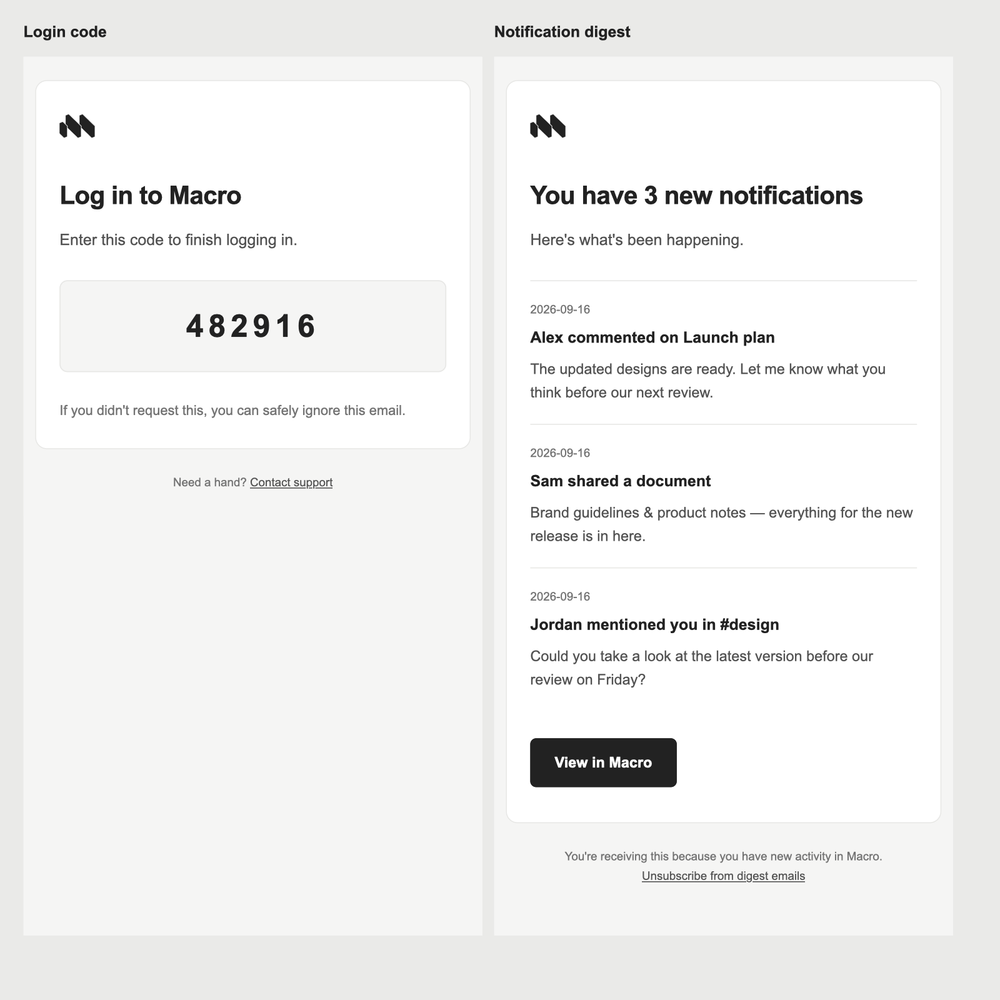

# Transactional email styling

Repository-owned email templates share a light neutral background, white card,
system sans-serif type, and dark buttons. Keep their shell and spacing consistent
across the different template engines; essential styles are inline and layouts
use presentation tables so the emails do not depend on web fonts or modern CSS.

## Templates

- `templates/digest.html`: notification digest (Askama).
- `../invite_email/templates/`: personal, channel, and team invitations (Askama).
- `../ses_client/templates/invite_user.html`: organization invitation (Rust replacements).
- `../../services/authentication_service/src/api/email/_verify_email_template.html`:
  email verification (Rust replacements).
- `../../services/authentication_service/src/api/merge/_merge_request_template.html`:
  account merge code (Rust replacements).
- `../../infra/stacks/fusionauth-instance/templates/`: login code and email
  verification (FusionAuth FreeMarker, with the auth service URL supplied by Pulumi).

Mobile welcome/nurture emails are owned by Loops and are not defined here.

## Logo and rollout

Digest and invitation templates use the anonymously readable orange Macro PNG at
`https://static-file-service.macro.com/file/b911aba9-94a6-435c-aa16-8404739f13b0`.

Authentication templates use `https://macro.com/app/macro-email-logo.png`, served from
`apps/web/public/macro-email-logo.png`. This 192 × 192 PNG is an export of the
current `apps/web/src/components/icon/macro-logo.svg` with fill `#222222` on white.
The opaque background keeps the mark legible when an email client changes colors.
Use the existing SVG as the source when regenerating the raster asset.

Deploy the web asset before rolling out the authentication or FusionAuth templates.
Verify that the public URL returns the PNG; an HTML fallback response is not enough.
FusionAuth template changes require deploying the `fusionauth-instance` stack.

## Preview

With Jinja2 installed, run `python3 crates/email_formatting/preview_digest.py`
from the repository root to preview a digest using sample notifications and the
public logo (requires network access). This
convenience preview translates Askama expressions to Jinja2; Rust compilation
and package tests remain the check for production template compatibility.

## Styling reference

Login code and notification digest, rendered with sample data:

