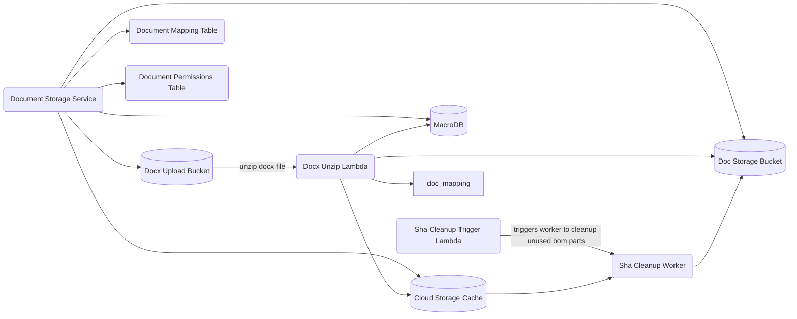

# Cloud Storage

The Rust backend is split across deployable processes in `services/`, reusable
libraries in `crates/`, and deployment definitions in `infra/`.

## Development and testing

- [Rust development](RUST_DEVELOPMENT.md): toolchain, build/check commands, and
  tests for the affected packages.
- [Database development](DATABASE_DEVELOPMENT.md): local test databases,
  migrations, SQLx cache preparation, and approved destructive resets.
- [Running locally](RUNNING_LOCALLY.md): frontend against hosted services or a
  full local stack.
- [Cursor Cloud](CURSOR_CLOUD.md): Cloud-only setup and rebuild entry points.

## Deployment

To learn more read the [infra](../infra/README.md) documentation.

## Instructions

- Lambda artifacts under `target/lambda` are built by CI for deployments. For local Pulumi deploys, run `just build_lambdas` first.
- `cd infra`
- install node modules `npm i`
- ensure you are on your correct AWS account and have pulumi cli logged into your correct work account
- `pulumi up`
- select the stack
- _read_ and understand the changes that are going to happen and ensure they are all to be expected
- done.

## Diagram

