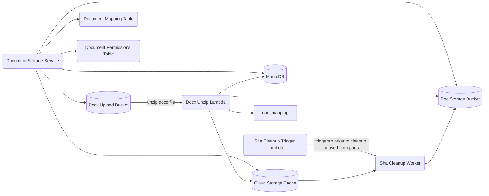

# Cloud Storage

The Rust backend is split across deployable processes in `services/`, reusable
libraries in `crates/`, and deployment definitions in `infra/`.

## Prerequisites

- docker
- sqlx-cli
- just
- pulumi cli
- aws cli

# Testing

To run tests locally, run the following commands from the repository root:

```bash
just create_networks
just run_dbs -d
just setup_test_envs
just initialize_dbs
crate=macro_db_client  # replace with the crate under test
cargo test -p "$crate"
```

Leave `SQLX_OFFLINE` unset for `cargo test`. `SQLX_OFFLINE=true` is only for
`cargo check` / `cargo build` / `cargo clippy`. If SQLx reports missing cached
query data, run `just prepare_db` from the repo root inside `nix develop` — do
not flip offline mode on for tests. After SQL or db-crate changes, run
`just prepare_db` and update tests.

`just setup_macrodb` and `just initialize_dbs` are the same recipe. Some MacroDB
table and column names are camelCase; cast them when reading
(`SELECT "userId" AS user_id`). Schemas live in
`crates/macro_db_client/migrations/`.

## clean up

To reset the local database, use the repository-root database recipes rather than deleting unrelated containers: `just crates/macro_db_client/drop_db -y -f`, then `just setup_macrodb`. If `just setup_macrodb` still fails, run `just force_drop_db` from `crates/macro_db_client`, then `just setup_macrodb` from the repository root.

## Deployment

To learn more read the [infra](../infra/README.md) documentation.

## Instructions

- Lambda artifacts under `target/lambda` are built by CI for deployments. For local Pulumi deploys, run `just build_lambdas` first.
- `cd infra`
- install node modules `npm i`
- ensure you are on your correct AWS account and have pulumi cli logged into your correct work account
- `pulumi up`
- select the stack
- _read_ and understand the changes that are going to happen and ensure they are all to be expected
- done.

## Diagram


