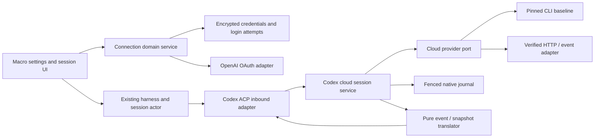

# Codex cloud sessions through Macro and ACP

Status: feasibility work in progress, 2026-09-15. Source and documentation review
complete; direct device login succeeded and an authenticated cloud environment
request initially returned `[]`. After environment setup, our binary successfully
created a read-only cloud task and observed `in_progress` snapshots. Initial running
snapshots exposed no output items. Completion and streaming are under investigation;
remote cancellation has not been probed. This document scopes the proof of concept and the production
integration separately. It does not assert that unknown provider operations work.

Implementation update: the first authentication probe now exists in
[`crates/codex_cloud_agents`](../crates/codex_cloud_agents/README.md). Per the
requested direction, it implements OAuth directly in our own binary and writes
our own private JSON file; it does not use the Codex subprocess baseline proposed
below. Login/status/environment discovery, explicit task launch, snapshot inspection
and bounded snapshot polling are built with 25 passing tests. Live task creation and status reads
have succeeded against an environment in the connected workspace. Snapshot polling is not proof
of streaming support; the task/streaming probes remain pending.

Standalone implementation update: `codex_acp` now serves ACP v1 over stdio with
hardcoded test environment and separate direct-OAuth credentials. SSE text/tool
updates, follow-ups, remote cancellation and private session journals are built.
48 tests, including recorded-provider and byte-stream snapshots, pass; live stdio
message/follow-up/cancel and final rebuilt-binary replay were verified. Automatic
load capability and structured elicitation replies remain unadvertised/unsupported.
See [Zed setup](../crates/codex_cloud_agents/ACP.md) and
[verification evidence](CODEX_ACP_VERIFICATION.md). Macro bot integration below
remains a design, not deployed behavior.

## 1. Product outcome

A Macro user connects their ChatGPT account, selects a Codex cloud environment
and branch, and starts work from Macro. Execution happens in OpenAI's Codex cloud.
Macro shows the provider link, observed status, and whatever conversation/tool
output the provider actually makes available. Eligible usage follows the connected
ChatGPT account/workspace's entitlements and limits; login does not add capacity.

Target experience:

1. Settings → Agents → Connect Codex → OpenAI device-code verification.
2. Confirm the connected account/workspace and choose an accessible environment.
3. Start a task from Macro with explicit environment, branch, and prompt.
4. Open the existing Macro session surface to follow progress or open Codex web.
5. Resume viewing after a reload without launching another task.
6. Continue the same cloud conversation and stop remote execution if the provider
   interfaces pass the feasibility gates below.

Use **Codex Cloud** as the provider name. Keep it distinct from the existing
Codex Desktop deep link and Codex running in a Macro-managed sandbox. Macro
login remains the source of Macro identity; ChatGPT is a linked credential.

## 2. Findings and confidence

| Capability | Evidence | Confidence / consequence |
| --- | --- | --- |
| ChatGPT OAuth | OpenCode uses Codex's client ID, PKCE and device login | Implemented in the supplied source; not live-tested here |
| Custom OAuth identity | OpenCode sends `originator=opencode` with the shared ID | Does not demonstrate a custom registered client or establish hosted consent wording |
| Cloud task launch | Documented `codex cloud exec --env …`; local source submits task creation | A viable first probe using the user's own login |
| Subscription access | OpenAI documents ChatGPT sign-in for subscription access and requires it for Codex cloud | Still requires account/workspace eligibility and available usage |
| Status and diff statistics | `codex cloud list --json`; typed task status in source | Polling monitor is implementable; `summary` is file/line counts, not an answer |
| Assistant output and diffs | Local cloud client reads task details, assistant text, attempts and diffs | Snapshot access exists in source; intermediate visibility must be measured |
| Token/tool event stream | No subscription method found in the reviewed Codex cloud client | Unknown; do not promise live transcript fidelity |
| Follow-up / remote cancel | Not implemented in the reviewed cloud client surface | Unknown; inspect and probe before designing wire requests |
| Remote history replay | Details contain selected/current turns and sibling attempts | Does not establish full conversation history or a resumable event cursor |
| Hosted third-party support | No public OAuth registration/delegation contract found in reviewed docs | Confirm with OpenAI before general SaaS rollout; source is not support approval |

### Relevant source

- [OpenCode OAuth](../opencode/packages/opencode/src/plugin/openai/codex.ts):
  shared client ID, `originator`, browser/device flows, refresh, account header.
  Its inference endpoint is `/backend-api/codex/responses`, not task creation.
- [Codex login](../codex/codex-rs/login/src/server.rs) and
  [device flow](../codex/codex-rs/login/src/device_code_auth.rs).
- [Codex cloud CLI](../codex/codex-rs/cloud-tasks/src/lib.rs),
  [cloud interface](../codex/codex-rs/cloud-tasks-client/src/api.rs),
  [HTTP mapping](../codex/codex-rs/cloud-tasks-client/src/http.rs), and
  [environment discovery](../codex/codex-rs/cloud-tasks/src/env_detect.rs).
- [Task HTTP client](../codex/codex-rs/backend-client/src/client.rs): source
  routes include `/backend-api/wham/tasks` and task details. These are source
  observations, not a published third-party REST guarantee.

The supplied `codex/` and `opencode/` directories are untracked reference
checkouts. Do not turn them into production path dependencies or commit them
with this work. Record their revisions in probe reports; vendor only deliberately
selected, license-reviewed code if needed later.

## 3. What to reuse from Cursor

Cursor CLI's `agent acp` is native ACP over stdio. Our relevant precedent is
different: [cursor_cloud_agents](../crates/cursor_cloud_agents/src/lib.rs) is
Macro's adapter from Cursor cloud REST/SSE into ACP.

Its useful boundaries:

- [Domain service](../crates/cursor_cloud_agents/src/domain/service.rs): one
  cloud agent per ACP session, serialized prompts, provider run lifecycle.
- [API client](../crates/cursor_cloud_agents/src/api.rs): create, run, cancel,
  and `/v1/agents/{agent}/runs/{run}/stream`.
- [Translator](../crates/cursor_cloud_agents/src/domain/translate.rs): pure
  provider events → ACP updates.
- [Journal](../crates/cursor_cloud_agents/src/domain/journal.rs) and
  [recovery contract](../crates/cursor_cloud_agents/REPLAY.md): record before
  publish, same live/replay transformation, do not invent missing history.
- [ACP adapter](../crates/cursor_cloud_agents/src/inbound/acp.rs): use the
  workspace ACP SDK and real stdio/in-process transports.
- [Harness manager](../crates/agent_harness/src/outbound/cursor/manager.rs):
  resolve the session owner's credentials, restore provider identity, use a
  duplex ACP pipe instead of provisioning a VM.
- [Replay tests](../crates/cursor_cloud_agents/src/replay/test.rs): sanitized
  provider recordings plus invariants, including arbitrary byte boundaries.

Reuse these patterns and the generic session/fold infrastructure. Do not reuse
Cursor event types, endpoints, cancellation assumptions, or its credential store
for OpenAI. Only extract provider-neutral pipe helpers when the Codex adapter
actually needs them. The older `CURSOR_AGENT_TRANSPORT.md` has historical names
and assumptions; current code and `REPLAY.md` take precedence.

## 4. Phase A: executable feasibility probe

Build a standalone Rust package, tentatively `crates/codex_cloud_agents`, with
database dependencies optional. Default automated tests use fakes/fixtures and
make no provider calls. Initial CLI operations: login, launch, watch, inspect,
and replay. CLI options use clap. Live operations are separate, explicit
commands; replay and tests never launch work.

### Authentication baseline

Prefer the supported Codex device-login implementation for the first experiment.
Run a pinned Codex binary with an explicitly supplied, isolated credential home.
Do not discover or copy the developer's ambient `~/.codex` credentials. An
interactive `login` command may run `codex login --device-auth`; the browser
verification is necessarily completed by the account holder. Record no tokens.

For a hosted UI prototype, app-server's `account/login/start` with
`type=chatgptDeviceCode` gives structured URL/code/completion messages. The web
process must not parse human-facing CLI output as an OAuth protocol. Before
production, select one credential lifecycle owner: a broker wrapping Codex or
a direct OAuth adapter. Never run competing refresh owners against one token.

### Probe matrix

| Probe | Action | Evidence / pass condition |
| --- | --- | --- |
| P1 identity | Complete fresh device login; read account state | Login flow, selected account/workspace, no secret output |
| P2 environments | List accessible environments or supply a known ID | Explicit environment, repo and branch verified for this account |
| P3 launch | Submit one harmless task in a disposable repo/environment | Returned task ID/URL opens under the same account in Codex web |
| P4 polling | Watch a task while it is genuinely running | Ordered snapshots, cadence and fields; record when text first appears |
| P5 output | Inspect successful, failed and no-diff tasks | Distinguish final answer, tool data, diff statistics and absent fields |
| P6 streaming | Inspect permitted browser network traffic and source, if needed | Actual event subscription, auth, terminal marker, ordering and reconnect behavior; otherwise mark unavailable |
| P7 continuation | Send a second prompt using an evidenced endpoint | Same task/conversation, distinct turn and preserved context |
| P8 cancellation | Stop a running task using an evidenced operation | Provider acknowledges stop and execution reaches cancelled/terminal state |
| P9 recovery | Disconnect/restart the observer, reconnect, and add a web-side turn | No second launch, duplicate text, invented history or missed terminal fact |
| P10 refresh/access | Exercise refresh, revoked/expired credentials and workspace mismatch | Correct account preserved, bounded retries, useful reconnect/error state |

Use the documented CLI for launch/status first. Add a source-derived task-details
HTTP adapter only for observations the CLI cannot expose. Do not infer endpoint
names for follow-up/cancel/streaming or brute-force them. A live test report must
distinguish real recordings from synthetic fixtures and include binary/source
revision, date, operation, observed capability and redacted results.

Do not scrape the Codex DOM as a production transport. Browser inspection is a
discovery tool; the resulting adapter needs a stable, reproducible contract.

### Decision gates

- **G1: launcher/monitor** — P1–P5 pass. Deliver launch, poll, result/link and
  recovery of known task IDs, even if full ACP cannot be delivered.
- **G2: full ACP lifecycle** — continuation and remote cancellation are proven;
  load is advertised only after complete replay is tested. Failure here limits
  the deliverable to a launcher/monitor or an explicitly experimental adapter.
- **G3: live transcript** — P6 proves incremental events, or P4 proves reliable
  incremental message snapshots. Label the latter polling, not token streaming.
- **G4: hosted rollout** — per-user storage/refresh, ownership, recovery and
  support questions resolved. A local working login alone does not pass this gate.

If G2/G3 fail, running Codex app-server in Macro infrastructure is a separate
product option, not an automatic fallback pretending to be Codex web.

## 5. Architecture and ownership

Proposed packages:

- `codex_cloud_agents`: task/turn/environment IDs, provider observations, domain
  service and ports; ACP inbound; CLI/HTTP outbound; memory journal for tests and
  local probe. No dependencies on reference checkouts.
- `codex_connection`: Macro-owned account links, login attempts, credential
  encryption, refresh coordination, disconnect and authorization. Authentication
  service handlers call its service. Harness consumes its public credential port.
- `agent_session`: owns durable external mapping, native journal storage and
  management fencing if stored alongside session rows. Do not access its tables
  directly from another domain's outbound adapter. Expose an owning-domain port.
- `services/agent_harness_service`: composition root wires implementations.

Proposed ports: `CloudTasks` (create/read), `CloudEnvironments`, `CloudEvents`
(only once evidenced), `CloudConversation` (follow-up/cancel only once evidenced),
`CredentialProvider`, `NativeJournal`, `SessionNotifier`, and a clock for
deterministic timeout tests. Keep transport DTOs in outbound; expose typed facts
in domain. Represent unknown statuses explicitly, never as success.

No deployment-wide user credential. Bind each client to a connection revision,
Macro owner, ChatGPT account/workspace and environment. A reconnect selecting a
different account cannot silently retarget an existing cloud task.

## 6. Connection API and credential lifecycle

Proposed authenticated Macro routes, under `/integrations/codex`:

| Method/path | Behavior |
| --- | --- |
| `POST /login-attempts` | Start device login; return opaque attempt ID, verification URL, user code and expiry when supplied |
| `GET /login-attempts/{id}` | Return pending/completed/expired/cancelled/failed for the owning Macro user |
| `DELETE /login-attempts/{id}` | Cancel local attempt; reject any late completion |
| `GET /connection` | Safe connected-account/workspace metadata and health; never credential material |
| `DELETE /connection` | Disable use immediately and delete stored credentials; distinguish local disconnect from provider revocation |
| `GET /environments` | Account-scoped environment discovery; empty/unavailable is explicit |

Token rules:

- Bind device-auth state to the authenticated Macro user and expiring attempt;
  never let the browser submit an arbitrary token/user association as login proof.
- Keep access, refresh and ID tokens out of URLs, logs, API responses and agent
  prompts. If direct OAuth is implemented, validate identity according to the
  provider's verified contract; decoding a JWT payload is not identity validation.
- Encrypt credentials with a context binding ciphertext to provider and owner,
  following the existing Cursor KMS pattern without sharing its table/types.
- One distributed refresh lease per connection; persist rotated credentials with
  a revision check. A stale writer or disconnected attempt cannot restore tokens.
- Refresh only within the verified account binding. Invalid grant → reconnect
  required. Bound refresh/retry attempts; an authorization failure isn't a cue
  to blindly resubmit a prompt.
- Honor provider device polling intervals and expiry; use bounded workers.
- Disconnect stops new launches and local observation. Existing cloud execution
  may continue; do not imply logout cancels remote work.

## 7. Session and ACP contract

Target mapping: one Macro/ACP session ↔ one Codex cloud task/conversation;
one `session/prompt` ↔ one cloud turn. Initially create lazily on the first
prompt because cloud task creation includes input. Never map a second prompt
to a new unrelated cloud task under the same conversation without telling the user.

| ACP operation | Required implementation / gate |
| --- | --- |
| `initialize` | Workspace SDK, protocol negotiation, only implemented capabilities |
| `authenticate` | Verify bound credential readiness; hosted login is done through Macro settings |
| `session/new` | Allocate local session/config; no remote execution yet |
| `session/prompt` | Serialize per session, durable intent, create or verified continuation, await provider terminal outcome |
| `session/update` | Translate actual provider observations; preserve ordering and stable IDs |
| `session/cancel` | Abort remote work and await confirmation; don't return `cancelled` merely because polling stopped |
| `session/load` | Replay a complete known transcript; only advertise after durability/replay coverage |
| Config options | Environment and branch before first launch; model only if a verified provider contract exists |
| Permission requests | Expose only if a provider approval interaction can actually be answered |
| MCP / filesystem / terminal | Do not advertise forwarding that the cloud environment cannot honor |

ACP requires cancellation as a baseline; there is no generic capability bit
that removes this obligation. An early monitor can offer an explicit local
detach operation, but it is not a conformant substitute for remote cancellation.
Similarly, advertise text/resource-link handling truthfully; do not silently
discard images, embedded resources or supplied MCP configuration. Text links
can be included in the prompt without claiming files were uploaded or fetched.

Proposed internal execution states:

`Unstarted → Submitting → Accepted → Running → Completed | Failed | Cancelled`.

`SubmissionUnknown` captures timeout/disconnect after a possibly accepted write.
Observer health is separate (`Attached`, `Retrying`, `Detached`, `AuthRequired`):
losing the stream does not mean the task failed or stopped. Rejection before
acceptance is distinct from unknown acceptance.

### Output fidelity

- Use stable provider task/turn/message/tool IDs when present.
- Snapshot repetition emits nothing. Append-only text growth emits only the
  missing suffix, with Unicode-safe boundaries.
- Shrinking or rewritten text is not append-only: record divergence and require
  a verified history replacement/resync path. Do not guess overlap.
- A current assistant turn or sibling attempt is not the entire conversation.
- Diff statistics stay statistics. A diff is an artifact, not proof of individual
  edit events. Do not synthesize shell calls, thoughts, or token usage.
- Poll status can update a clearly identified cloud-task activity item; keep
  adapter commentary distinguishable from model-authored text.
- Never emit `end_turn` for a network timeout, unknown status or missing task.
  Keep provider failure distinct from an ordinary completed response.

## 8. Durability, retries and concurrent users

Write prompt intent before sending; persist the accepted provider ID before
publishing readiness. Associate Macro request IDs with operations for local
deduplication, but do not claim provider exactly-once execution without a verified
idempotency mechanism. If acceptance is uncertain, reconcile using an authoritative
identifier or surface uncertainty; never match tasks merely by prompt text/time.

Journal provider observations before translation, plus local errors/terminal
decisions. Use one pure replay machine for live delivery and load. Keep journal
sequence and delivery checkpoint distinct. Fence writes using the existing
session-management claim so an old replica cannot emit or persist after takeover.

Credential revisions fence auth changes; session management generations fence
runtime ownership. Both must remain valid before executing a remote write.
Provider task IDs/URLs are not authorization capabilities. Resolve all operations
through the authorized Macro session and its owner's connection. Channel viewers
can receive authorized session output without gaining the owner's credentials.
For the first hosted release, only the owner starts/continues/stops remote work;
collaborative execution requires an explicit later billing/authorization policy.

Reads retry with bounded exponential backoff/jitter and provider rate hints.
Writes do not automatically retry after ambiguous acceptance. Cap response/event
size, queue depth and observation concurrency. Apply backpressure without silently
dropping transcript records. Stop idle observation, not remote execution. Polling
cadence is configurable and measured before rollout; don't copy Cursor's 1s loop.

Known remote tasks remain addressable after observer restart. An incomplete
provider history fails load explicitly, preserving the existing Macro transcript.
Opening a session must never replay prompts against the provider.

## 9. Macro integration work

After feasibility gates:

1. Add a distinct persisted `codex-cloud` harness/provider identity and route it
   through `AgentKind` and `RoutedContainerManager` without changing existing
   local/desktop Codex behavior.
2. Add the cloud manager and wire it in `agent_harness_service`; use generic ACP
   transport and external-session mapping. Refactor the Cursor-named byte pipe
   into a shared transport only if its contract is truly provider-neutral.
3. Add account connection/environment settings and generated auth clients.
   Read the web guide before edits and follow current query/UI conventions.
4. Gate picker/mention availability in the owning domain using connection and
   eligibility state. Missing or expired auth must produce a recoverable error.
5. Reuse session UI and `agent_fold`. Add provider-specific fold code only for
   real extension data standard ACP cannot already render.
6. Show the external Codex link, observation health, cloud status, final output
   and artifacts. Only expose Continue/Stop after their backend gates pass.
7. Persist mappings/journal through the owning `agent_session` API. Generate
   SQLx migrations and cache through repository workflows, not hand-created files.
8. Update relevant app agent guides for connection, task creation and session UX.

No API inference billing estimates derived from subscription use. Meter Macro
operations and report provider usage/limits only when supplied, otherwise unknown.

## 10. Test plan

Every phase includes tests; unit fixtures are not a replacement for live provider
contract evidence. Store synthetic and sanitized real fixtures separately.

| Layer | Required tests |
| --- | --- |
| OAuth adapter | Device pending/success/expiry/denial; interval handling; PKCE/state if browser login is implemented; malformed response; refresh rotation and invalid grant |
| Connection domain | Owner mismatch; concurrent attempts; cancel-versus-complete; disconnect-versus-refresh; revision conflict; changed account; no credential leakage |
| Credential storage | Cipher context mismatch; corrupt ciphertext; concurrent refresh lease/CAS; expiry and row lifecycle; cleanup without resurrecting credentials |
| CLI/HTTP adapter | Exact request/argument shape; prompt passed as data, never shell interpolation; explicit credential home; request timeout; paginated lookup; missing task; 401/403/429/5xx; bounded payloads |
| Session domain | First launch once; duplicate/concurrent prompt; rejected and ambiguous creates; provider failure; delayed visibility; reconnect never launches; per-session/account isolation |
| Translation | Repeated/growing/rewritten snapshots; Unicode; unknown status/event; distinct messages and attempts; empty answers; status-only response; diff statistics versus assistant text |
| Stream, if proven | Arbitrary byte splits; heartbeat-only; EOF without terminal; duplicate events; reconnect prefix/cursor behavior; oversized record; stream-to-poll reconciliation |
| ACP transport | Real SDK over channel and byte pipe; initialize negotiation; correlated responses; notifications before terminal response; unsupported content/config; active cancellation; EOF cleanup |
| Replay/storage | Append before publish; failed append emits nothing; live=replay; stale fence; incomplete load preserves history; restart after acceptance; delivery checkpoint crash boundaries |
| Macro authorization | Owner credential resolved on every attach; foreign session denied; permitted viewer cannot execute on owner's subscription; disconnected link blocks launches |
| Browser | Connection success/denial/expiry; env selection; launch/progress/result; reload; actionable auth failure; capability-gated stop/follow-up; desktop Codex unaffected |

Live contract suite: explicit opt-in, dedicated test account and disposable
repository/environment. Cover at least one text-only answer, one small file edit,
one failure, refresh, observer restart, and (if supported) follow-up and cancel.
Inspect account/workspace attribution; do not assert an exact billing delta if
the provider doesn't report one. Never execute live tests as part of ordinary CI.

Completion checks for implementation:

- `cargo test -p codex_cloud_agents` from root inside Nix, `SQLX_OFFLINE` unset.
- Corresponding tests for the connection, harness, session and fold packages
  when touched; DB tests use the live local schema.
- Frontend package tests and browser verification when UI work lands.
- `just check`; targeted type checks as appropriate. Report environmental blocks.
- Replay fixture scan for tokens, cookies, user data and private repository text.

## 11. Delivery slices and acceptance

| Slice | Deliverable | Exit condition |
| --- | --- | --- |
| A | Probe CLI, fake provider, fixtures, capability report | Fresh login creates one real cloud task; status and result shape documented; unsupported operations clearly identified |
| B | Pure translation and tested standalone ACP candidate | Proven lifecycle operations obey ACP; remaining limitations prevent false capability claims |
| C | Connection domain and durable journal | Cross-user, refresh-race, restart and stale-writer tests pass |
| D | Harness routing and Macro UI | User connects, launches, observes and reloads from Macro; authorized task attribution retained |
| E | Live transcript / continuation polish | Only features backed by recordings and failure/recovery tests enabled |

Streaming discovery cannot be reliably estimated until A. The first useful
deliverable is A, not a large UI integration built on assumed endpoints. B–E
can be scoped more tightly from its capability report. Each slice should be
reviewable independently; do not combine unrelated Cursor refactors.

Explicitly deferred: general OpenAI social login for Macro, arbitrary OAuth client
registration, automatic cloud-environment provisioning, terminal/desktop control,
automatic PR merge or patch application, model catalogs inferred from local Codex,
and multi-user sharing of a single subscription credential.

## 12. External references

- [OpenAI authentication](https://learn.chatgpt.com/docs/auth): ChatGPT versus
  API-key access, cloud eligibility and device login.
- [Codex app-server auth](https://learn.chatgpt.com/docs/app-server#auth-endpoints):
  structured managed device login; external token mode is experimental.
- [Codex cloud CLI](https://learn.chatgpt.com/docs/developer-commands?surface=cli#codex-cloud):
  documented task submission and listing, same CLI credentials.
- [Cursor CLI ACP](https://cursor.com/docs/cli/acp): native local ACP integration.
- [ACP initialization](https://agentclientprotocol.com/protocol/v1/initialization):
  negotiated capabilities and baseline session operations.
- [ACP prompt turn](https://agentclientprotocol.com/protocol/v1/prompt-turn):
  updates, stop reasons and actual cancellation requirements.

These references and supplied source establish a design direction. Phase A
supplies the missing end-to-end evidence for this account/login/task combination.
