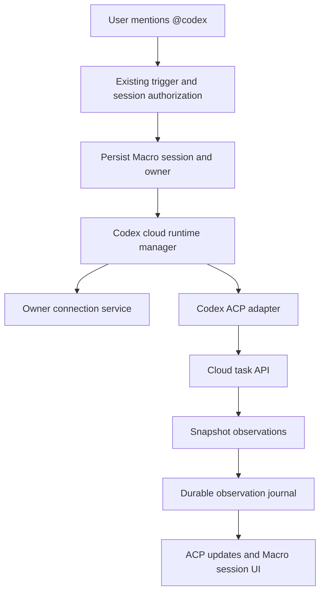

# Proposed `@codex` integration

Status: design sketch, 2026-09-15. This does not register a bot or deploy an integration.
Read alongside [the feasibility scope](CODEX_CLOUD_ACP_PLAN.md),
[Cursor comparison](CODEX_CURSOR_ACP_COMPARISON.md), and
[live probes](CODEX_CLOUD_LIVE_PROBES.md). The companion reports distinguish source-backed operations from live observations.

## Desktop bundle discovery

The verified official desktop package `26.908.70816` adds concrete source evidence
beyond the CLI client: follow-up task submission, task cancellation, turn/history
reads, and a per-turn SSE endpoint requesting `thread_event` and `log` items.
See [desktop transport findings](CODEX_DESKTOP_TRANSPORT.md). Live probes verified OAuth access to SSE, follow-up submission on the same task,
and remote cancellation. Five assistant text deltas were received while the
follow-up was still running. SSE closed without a captured terminal event on cancel,
so task/turn status must resolve stream EOF. Full event translation and recovery fidelity still need tests. The gates below describe what must be proven,
not a claim that these operations are absent. Final-only observations apply to the
older task-details polling path, not the newly discovered SSE transport.

## Product behavior

A globally discoverable `@codex` bot opens a Macro agent session. The session owner
connects their ChatGPT account and selects a Codex cloud environment and branch.
Macro submits the prompt, displays a provider link and progress state, and delivers
whatever assistant text and artifacts the provider exposes. OpenAI runs the work
in its cloud environment. No Macro sandbox is provisioned for this runtime.

The global bot is an identity, not a shared subscription. Every session resolves
its owner's connection. Another participant must not silently substitute their
credentials or cause work on the owner's account without the existing session
write/control authorization checks.

Initial polling UX: queued/running/completed status, final answer, and provider link.
Updated target after desktop discovery: incremental assistant text from the verified
SSE route, same-task follow-up and remote cancellation, with a durable event journal.
Do not promise terminal streaming, interactive approvals, or continuous text before
those capabilities are observed. The initial completed test and two additional bounded probes exposed text only at
completion, including a prompt explicitly requesting progress messages. A recovered
shell failure appeared as final prose, not structured tool events.
A provider output item saying a PR exists should become a verified structured
artifact only when its URL and metadata are actually returned and validated;
assistant prose is not authoritative evidence that a PR was created.

## Existing code to extend

| Concern | Existing anchor | Proposed change |
| --- | --- | --- |
| Global identity | `crates/bot_id/src/lib.rs`, `SYSTEM_BOTS` | Add a stable `CODEX_BOT_ID`, name `Codex`, handle `codex`, `has_agent: true`. No bots-table seed row: system identities already live in code. |
| Runtime classification | `crates/agent_harness/src/domain/model.rs`, `AgentKind` | Add `CodexCloud`; resolve fixed identity and persisted `codex-cloud` harness slug consistently. |
| Trigger policy | `crates/agent_trigger/src/domain/service.rs` | Reuse global system-agent availability and user/session authorization. Verify mention/reply behavior explicitly. |
| Composition | `services/agent_harness_service/src/main.rs` | Register fixed runtime and wire a Codex manager plus connection service. |
| Provider routing | `crates/agent_harness/src/outbound/routing.rs` | Route spawn/resume/token/teardown consistently to Codex; reject sandbox resize. Avoid repurposing the Cursor branch. |
| ACP transport | `crates/agent_harness/src/outbound/cursor/pipe.rs` | Extract only the provider-neutral in-process pipe if reusable; implement Codex semantics independently. |
| Durable provider mapping | `crates/agent_session/src/domain/model.rs`, `ExternalSession` | Store provider `codex-cloud`, cloud task ID, title and web URL. Persist environment, branch and connection identity in an explicit owned configuration. |
| Account settings | `apps/web/src/features/settings/Harness.tsx` | Add connect/disconnect, connected account/workspace metadata, environment selection, and actionable expired-login states. |
| Mention identity | `apps/web/src/lib/core/constant/cursorAgent.ts`, `features/channel/macroAi.ts`, `features/channel/Input/ChannelInput.tsx` | Add Codex identity and gated mention entry using the existing pattern. |
| Session composer | `apps/web/src/features/block-agent/component/ComposeAgentSession.tsx` | Add Codex selection and environment/branch input; hide unsupported model/tool options. |
| Names and provider links | `apps/web/src/lib/queries/bots/first-party-bot-name.ts`, `features/block-agent/context/AgentSessionContext.tsx` | Resolve Codex display name; render provider links by stored provider rather than a Cursor-only identity check. |

Do not copy Cursor's API-key storage implementation literally: OAuth rotation,
expiry and account binding require a connection service. Also do not enable
`OwnerConnections` MCP transport merely because Cursor accepts it. Codex cloud MCP
configuration from our task-creation surface has not been demonstrated.

## Connection boundary

Proposed owning domain: a Codex connection service with ports for credential
storage, encryption and OpenAI OAuth. The harness calls the service for its session
owner; it must not construct or import the connection crate's outbound adapters.
The service composition root owns database and encryption wiring.

- Start with the demonstrated device-code flow for hosted Macro. A signed-in Macro
  user starts an expiring login attempt, completes OpenAI verification, and checks
  attempt status. Bind attempts to that user and never expose returned tokens.
- Browser PKCE with a localhost callback is source-backed for a local binary.
  It does not establish that the shared Codex client accepts a Macro HTTPS callback.
  Treat branded OAuth registration and hosted browser callbacks as separate work.
- Store encrypted access/refresh credentials per Macro user and connection identity;
  keep expiry and safe account/workspace display metadata separately. The prototype's
  local plaintext JSON remains a development adapter, not the production store.
- Serialize refresh rotation across replicas with a lease or versioned compare-and-swap;
  persist the rotated token before use. Pin sessions to the connection/account identity.
  Reconnecting another account must not silently retarget an existing session.
- Disconnect removes local authorization to make new provider requests. It does not
  mean the provider revoked the token or stopped an already-running task.
- Environment discovery and selection run under that same connection. Revalidate
  visibility at launch; a repository label alone is not a stable environment ID.
- Surface missing connection, expired authorization and unavailable environments as
  actionable user states, not generic provisioning failures.

## Runtime and persistence

The diagram is proposed architecture, not implemented behavior. Keep the existing
probe's domain and HTTP adapter as the source of demonstrated operations. Add
provider ports only for operations actually observed in source and verified with
fixtures/live tests; do not invent a wire endpoint to satisfy an ACP method.

Persist a launch intent before submission, then the returned task mapping before
acknowledging successful creation. If the provider accepted a task but the response
was lost, record an unknown outcome and require reconciliation; do not blindly
retry. A local intent ID alone does not give provider-side idempotency.

Use a replica ownership fence and append journal records before client delivery.
Checkpoint the task ID, turn ID, terminal state and delivered output identity.
Snapshot polling at one-second intervals is suitable for the current experiment;
production needs configurable intervals, bounded concurrency, transient-read
backoff and account-level rate limits. Never apply a read-retry policy to creation.

Normalize duplicate source fields by turn ID: the observed final response repeated
the same turn under `current_assistant_turn` and `current_diff_task_turn`. A journal
must not emit two answers. Preserve snapshot text replacements as revisions, not
invented append-only deltas. If text becomes incrementally available, only derive
an appended suffix when stable identity and an exact prefix comparison support it.

On worker restart, recover the mapping and resume reads. Do not launch another task
because the in-process ACP pipe was lost. Resume and replay are distinct: restoring
observation is possible with a task ID, while complete historical conversation replay
requires retained journal data or an actual provider history surface.

## ACP and product release gates

Version boundary: the current Cursor integration uses `schema::v1` from the pinned
ACP dependency. Design against that deployed protocol first; do not silently adopt
newer ACP lifecycle requirements or treat current web documentation as the pinned
implementation. The comparison report covers the version differences.

The original single-prompt experiment can map `session/new` to local session allocation,
`session/prompt` to create-and-poll, and final text to `session/update`. The newly verified desktop transport now supplies continuation and cancellation;
full compatibility still depends on correct adapter implementation and tests.

| Feature | First integration policy |
| --- | --- |
| Initialization | Advertise only implemented and tested capabilities. |
| Text prompts | Supported by observed task creation; select environment and branch first. |
| Final assistant text | Supported by completed task snapshots; deduplicate repeated turn fields. |
| Status | Show observed state; avoid presenting synthetic status as model-authored text. |
| Follow-up | Live verified using the desktop-derived follow-up body. Persist task and parent turn; test ordering and ambiguous submission recovery. |
| Cancellation | Live verified remote cancel and terminal cancelled state. Wire ACP cancellation to it, with race/timeout tests. |
| Reconnect/load | Local journal replay plus provider mapping; advertise only after crash/replay tests. |
| Tools/terminal/permissions | SSE event families are available; inventory structured tool payloads and permission response support before advertising interactive controls. |
| Models/modes | Do not copy Cursor's model picker without a Codex discovery/selection surface. |
| Images, embedded context, MCP | Explicitly reject or omit unsupported inputs; do not silently drop content. |
| Sandbox management | Provider-managed; no Macro resize/exec/preview controls unless a separate surface is verified. |

If follow-up or remote cancellation has no accessible surface, ship a clearly
bounded cloud-task experience rather than treating an incomplete ACP adapter as a
normal interactive agent. This remains useful: users can start work and receive
results in Macro, with the web link for provider-only controls.

## Implementation slices and tests

1. **Connection service:** per-owner isolation, login expiry/cancellation, token
   rotation races, account changes, disconnect behavior, and redaction. Schema
   migrations must use `sqlx migrate add`; no migrations are included in this sketch.
2. **Cloud adapter:** fixture tests for each verified request and response; unknown
   statuses, final-only text, duplicate turns, output revisions, missing fields,
   transient reads, ambiguous creation and malformed artifact URLs.
3. **Durable manager:** crash before/after creation acknowledgment, atomic mapping,
   competing replica fences, restart during polling, replay without duplicate answer,
   credentials expiring mid-task, and zero accidental re-creation on resume.
4. **Global bot wiring:** stable identity resolution, mention-to-runtime routing,
   missing-account message, per-owner credential lookup, cross-user session controls,
   and consistent spawn/resume/teardown dispatch.
5. **Frontend:** gated mention/composer entries, connection and environment states,
   provider links, terminal failure and unsupported controls. Exercise in a browser
   and update the relevant `docs/AGENT_GUIDE` pages with the implementation.
6. **Release:** compare actual behavior against ACP obligations, run affected package
   tests and `just check`, then an end-to-end cloud test on the disposable repository.

No production code, bot identity, database changes, or frontend flows are introduced
by this document. The live experiments and compatibility review determine the final
release boundary.
