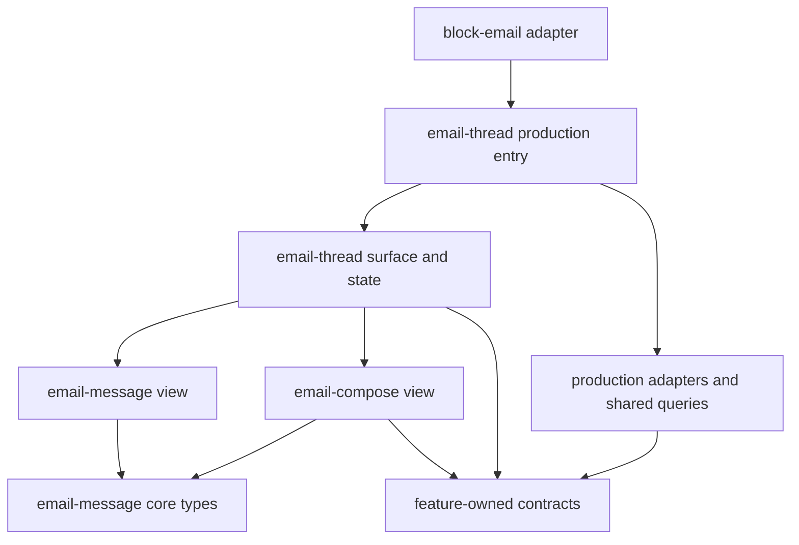

# Email feature architecture

Email applies the stronger composition and capability
boundaries in [Frontend feature architecture](FRONTEND_FEATURE_ARCHITECTURE.md).
Its reusable packages live under `apps/web/src/features/`. The application still
opens `/app/email/:threadId`, and existing drafts and mailto composition use the
same application routes.

## Ownership

| Package | Owns | Does not own |
| --- | --- | --- |
| `email-message` | A received or sent message, its sender/header, HTML or Markdown body, quoted content, containment, theme treatment, and attachment presentation | Thread ordering, pagination, selection policy, drafts, reply placement, navigation, block state |
| `email-thread` | A conversation, chronological ordering, hidden middle messages, pagination, draft association, reading stops, selection, scroll coordination, and where a reply appears | Rendering the internals of an email, editing or sending a draft, block lifecycle |
| `email-compose` | Form state, recipient rules, editor content, attachments, draft persistence, sending, scheduling, signatures, and undo recovery | Thread pagination/rendering, block identity, app routes or split navigation |
| `block-email` | The document-block host: load gate, read marker, block hotkeys/focus, location registration, header, modals, side panel, and host actions | Reusable thread, message, or composer state |

An email thread and an individual email are independent features. A message can be
rendered without a thread provider. A composer can run without a thread: the
standalone new-email route and the AI compose surface are examples. A reply takes
a narrow `EmailReplySession` describing only the conversation information it
needs.

Dependency arrows mean “imports or consumes”:



`email-message` must never import `email-thread` or `email-compose`.
`email-compose` must never import `email-thread`. Thread composition may import
both features' reusable views and contracts. No module in these three packages
may import a block package, `@core/block`, or block-related signal modules.

## Production entry points and reusable surfaces

- `email-message/email-message.tsx` constructs rendering capabilities and mounts
  `views/email-message.tsx`. The reusable view receives one `EmailMessage` plus
  resolved presentation values and event callbacks. A thread supplies selection,
  expansion, reply actions, and a footer through those inputs.
- `email-thread/email-thread.tsx` constructs the existing shared thread query,
  source adapter, viewer/contact capabilities, thread commands, composer services,
  notification subscription, rendering adapters, and host-independent cache
  cleanup. `views/email-thread-surface.tsx` builds thread state and providers from
  supplied dependencies. It imports no production entry point for a nested
  message or composer.
- `email-compose/email-compose.tsx` supplies real compose services and split-host
  callbacks to `views/email-compose.tsx`. Inline replies use
  `views/reply-input.tsx` with explicitly supplied services and a reply session.
- `block-email/EmailBlockAdapter.tsx` translates block focus, keyboard scope,
  location parameters, and block methods into `EmailThreadHost` callbacks and
  slots. The thread does not read a block ID or register a block method itself.
  The adapter captures block signal accessors during setup; event callbacks use
  those captured functions instead of resolving a provider after setup.

Capability contracts live in `context/`. Prepared view-state types live in
`primitives/`, and contexts holding a mounted screen's state live in `views/`.
These scoped UI providers have no production fallback. A missing required
provider throws a specific error instead of silently initializing the app.

A host frame receives a **content factory**, `() => JSX.Element`. It must call
that factory beneath its providers. Constructing the content first and then
passing an already-created element to the frame can make nested side-panel
sections execute before their layout provider exists. The surface regression
test exercises this ordering.

## Contracts and layer responsibilities

| Contract | Consumer needs |
| --- | --- |
| `EmailThreadSource` | Requested identity, available domain thread, request status, pagination availability, and refresh/page completion |
| `EmailThreadCommands` | Thread actions and their availability; no soup collection or mutation objects |
| `EmailThreadHost` | Optional location target, focus, activation status, and keyboard registration |
| `EmailRenderingDependencies` | Theme values, link preparation, and image resolution with disposal awareness |
| `EmailFormDependencies` | Viewer address and available inbox identities for recipient selection |
| `EmailReplySession` | Relevant messages/drafts, recipient options, reply request, and selection callbacks |
| `EmailComposeServices` | Account metadata and named draft, attachment, send, schedule, undo, and feedback operations |
| `EmailComposeHost` | Optional navigation, back handling, and focus movement supplied by the host |

Core types are owned by the features. Generated email service schemas and concrete
query results stop at adapters. `email-thread/queries/thread-source.ts` decodes
wire values and guards Solid resource reads. `email-compose/queries/inbox-source.ts`
projects linked-account metadata. Actual service-client operations remain in
`src/lib/queries/email`, alongside the existing mutations and cache conventions.

Primitives accept these domain capabilities; they do not construct shared queries,
import production adapters, or return JSX. The compose controllers use the real
Lexical editor API. That is an intentional editor dependency, not an application
service dependency. The narrow shared `utils/setEditorStateFromHtml.ts` helper
avoids the broad editor utility barrel and its plugin/application side effects.

Components receive values, slots, and handlers. For example, inbox names and
watermark upgrade actions are supplied from production wiring; the inbox selector
and signature button do not resolve the current user themselves. Clipboard
feedback, uploads, signature link interception, and editor focus traversal are
also supplied capabilities or host actions.

## State and lifetime rules

1. Query availability and display policy are separate. The adapter can expose
   cached data even when a completed request failed. A pending resource is never
   read eagerly. `primitives/thread-snapshot.ts` decides to retain a readable
   snapshot during transient reloads and rejects a snapshot for another ID. The
   block's load gate continues to prioritize structural errors over cached data.
2. Refresh and pagination preserve asynchronous completion. A caller awaiting a
   refresh must wait for the underlying query, particularly before revealing a
   newly sent message. Paging stops when the target is found, no progress is made,
   the source identity changes, or the owning view is disposed.
3. Selection, expansion, hover, reply placement, scrolling, and initial-load
   state belong to each mounted thread. There is no block signal or global scroll
   flag in a feature package.
4. A newer saved draft wins over an older response. Missing drafts in a stale
   response do not collapse an open editor, and locally discarded drafts are not
   resurrected by delayed responses.
5. An engaged reply editor latches its seed while the same message is being
   edited. Server echoes must not remount it and lose focus. A different reply
   target owns a new composer lifetime, including on mobile.
6. Undo recovery survives navigation but is keyed by draft and reply identity.
   One composer cannot overwrite another's snapshot or restoration callback, and
   an older owner's cleanup cannot unregister a newer owner. Recovery history is
   bounded; it is not a global reactive feature-state singleton.
7. Scheduling and immediate sending are mutually exclusive while a scheduling
   operation is pending. A rejected schedule keeps the previous confirmed time.
   If scheduling succeeds and archiving fails, the confirmed time remains and the
   user receives accurate feedback. A failed unschedule also retains that time.
8. Renderer resources follow their Solid owner. Image blob URLs, resize observers,
   image listeners, and pending measurement frames are released on source changes
   or disposal.

## Shared UI and explicit exceptions

Isolation of state and contracts does not mean every existing shared widget is
application-free. Message views still compose the shared Markdown renderer,
`UserIcon`, user tooltips, image galleries, and UI controls; compose views use the
shared rich editor, recipient selector, and mobile chrome. Their application
integration remains outside the controllers. Tests of a feature provider or
lifetime may replace the large rendering subtree while exercising the real state
and provider composition.

Two narrow shared pure utilities are allowed: `@core/util/base64` for the existing
codec semantics and `@core/user/macroId` for validated identity formatting. The
attachment pill also reuses the static MIME/file-type map and the shared
`EntityIcon` display type. None of these is a transport or app-context lookup.
Do not generalize these exceptions to the corresponding barrels.

## Enforcement and verification

The three features are registered in both TypeScript and TSX versions of all four
`feature-*` ast-grep families. Additional error-level `email-no-block-dependencies`
rules reject block imports. `email-thread/tests/architecture.test.ts` resolves
aliases and re-exports to verify cross-feature direction and layer boundaries,
then traverses runtime controller/contract dependencies to reject indirect
production-service and rendering imports. Type-only edges are treated separately.

Run from `apps/web`:

```sh
bun run test src/features/email
bun run check
```

Run from the repository root:

```sh
bunx --yes @ast-grep/cli@0.44.1 scan apps/web/src/features/email-message apps/web/src/features/email-thread apps/web/src/features/email-compose
just test-email-rendering
```

Regression coverage includes message parsing/containment and cleanup, chronological
selection and reading stops, pagination geometry, retained snapshots, draft
precedence, independent thread state, provider/frame ownership, reply target
lifetimes, account failures, secondary-inbox recipients, editor draft persistence,
scheduling failures and concurrency, mentions, and isolated undo recovery.

Browser verification must still exercise the mounted application: hidden-message
expansion, message headers and quoted content, deep-link reveal, keyboard reply,
inline draft persistence, standalone compose, and mobile reply presentation. A
local account without a real mail-provider connection can verify local drafts
and UI behavior; actual provider delivery requires its own integration environment.

### Migration verification — September 5, 2026

The pre-extraction email suite passed 94 tests in 9 files. The extracted features
pass 122 tests in 24 files, including 28 added regression tests. The full frontend
check (cache schema, TypeScript, and Biome), feature-scoped ast-grep scan, and all
five QC reviews passed.

The local stack was started with `just run_local --instance email-feature-eval
--port-base 24700 --no-doppler --with-chrome --no-build`. Chrome checks before and
after extraction exercised hidden-message expansion, email rendering, newsletter
containment, and reply draft persistence across navigation. Final checks also
covered header details, quoted content, deep-link reveal, keyboard movement and
reply, standalone compose, and a saved draft's touch drawer closing and reopening.
The final interaction runs reported no page errors.

The five existing rendering fixture tests differ from their committed screenshots
on this machine. The original pre-extraction renderer reproduces those failures.
A separate comparison using the original assets as temporary baselines passes all
12 screenshots, across both themes and narrow/wide panes, with **zero differing
pixels** after extraction. Committed screenshots were not regenerated. The local
seeded inbox has no real provider credentials, so these checks do not establish
Gmail delivery or native iOS behavior.
