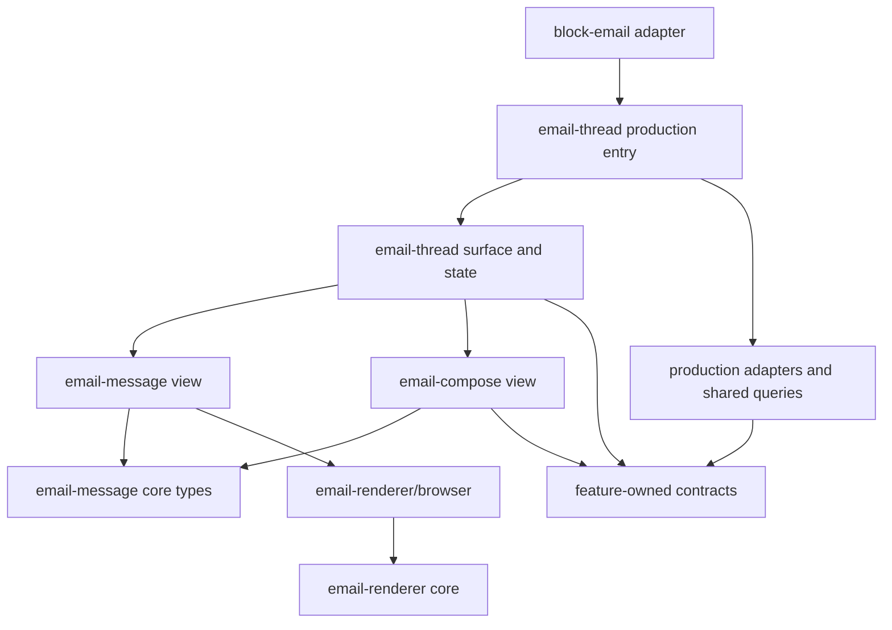
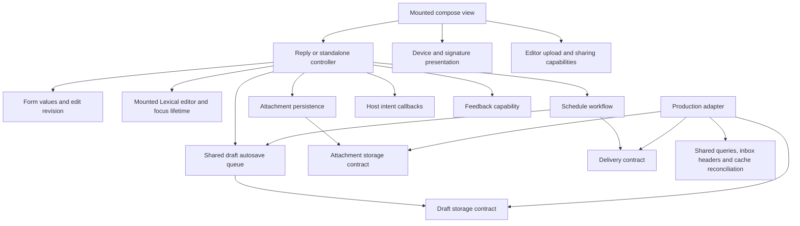

# Email feature architecture

Email applies the stronger composition and capability
boundaries in [Frontend feature architecture](FRONTEND_FEATURE_ARCHITECTURE.md).
Its reusable packages live under `apps/web/src/features/`. The application still
opens `/app/email/:threadId`, and existing drafts and mailto composition use the
same application routes.

## Ownership

| Package | Owns | Does not own |
| --- | --- | --- |
| `packages/email-renderer` | Deterministic preparation of HTML/plaintext bodies; framework-independent browser containment, colors, layout, and resource lifecycle | Solid, message DTOs, threads, app services, sender classification, block state |
| `email-message` | A received or sent message, its sender/header, body renderer lifecycle and policy, Macro Markdown, quote expansion controls, and attachment presentation | Thread ordering, pagination, selection policy, drafts, reply placement, navigation, block state |
| `email-thread` | A conversation, chronological ordering, hidden middle messages, pagination, draft association, reading stops, selection, scroll coordination, and where a reply appears | Rendering the internals of an email, editing or sending a draft, block lifecycle |
| `email-compose` | Form state, recipient rules, editor content, attachments, draft persistence, sending, scheduling, signatures, and undo recovery | Thread pagination/rendering, block identity, app routes or split navigation |
| `block-email` | The document-block host: load gate, read marker, block hotkeys/focus, location registration, header, modals, side panel, and host actions | Reusable thread, message, or composer state |

An email thread and an individual email are independent features. A message can be
rendered without a thread provider. A composer can run without a thread: the
standalone new-email route and the AI compose surface are examples. A reply takes
a narrow `EmailReplySession` describing only the conversation information it
needs.

Dependency arrows mean “imports or consumes”:



`email-message` must never import `email-thread` or `email-compose`.
`email-compose` must never import `email-thread`. Thread composition may import
both features' reusable views and contracts. No module in these three packages
may import a block package, `@core/block`, or block-related signal modules.

## Production entry points and reusable surfaces

- `email-message/views/email-message.tsx` receives one `EmailMessage` plus
  resolved presentation values and event callbacks. Its caller provides the
  rendering context, selection, expansion, reply actions, and footer.
- `email-thread/email-thread.tsx` constructs the existing shared thread query,
  source adapter, viewer/contact capabilities, thread commands, composer capabilities,
  notification subscription, rendering adapters, and host-independent cache
  cleanup. `views/email-thread-surface.tsx` builds thread state and providers from
  supplied contexts. It imports no production entry point for a nested
  message or composer.
- `email-compose/email-compose.tsx` supplies the production compose context and split-host
  callbacks to `views/email-compose.tsx`. Inline replies use
  `views/reply-input.tsx` with explicit capabilities and a reply session.
  `email-thread/views/thread-reply-input.tsx` owns the keyed reply lifetime;
  `email-compose/primitives/reply-composer.ts` owns the compose workflow.
- `block-email/EmailBlockAdapter.tsx` translates block focus, keyboard scope,
  location parameters, and block methods into `EmailThreadHost` callbacks and
  slots. The thread does not read a block ID or register a block method itself.
  The adapter captures block signal accessors during setup; event callbacks use
  those captured functions instead of resolving a provider after setup.

Capability contracts and provider/consumer modules live in `context/`. Prepared
view-state types live in `primitives/`; views mount the providers.
These scoped UI providers have no production fallback. A missing required
provider throws a specific error instead of silently initializing the app.

A host frame receives a **content factory**, `() => JSX.Element`. It must call
that factory beneath its providers. Constructing the content first and then
passing an already-created element to the frame can make nested side-panel
sections execute before their layout provider exists. The surface regression
test exercises this ordering.

## Contracts and layer responsibilities

| Contract | Consumer needs |
| --- | --- |
| `EmailThreadSource` | Requested identity, available domain thread, request status, pagination availability, and refresh/page completion |
| `EmailThreadCommands` | Thread actions and their availability; no soup collection or mutation objects |
| `EmailThreadContext` | Thread source, viewer and device state, recipients, and the command factory used by thread state and navigation |
| `EmailThreadViewContext` | Thread and compose contexts, plus view callbacks and optional compose host behavior |
| `EmailThreadHost` | Optional location target, focus, activation status, and keyboard registration |
| `EmailRenderingContextValue` | Theme values, explicit image policy, link preparation, and image resolution with an abortable resource lifetime |
| `EmailFormContextInputs` | Viewer address and available inbox identities for recipient selection |
| `EmailReplySession` | Thread identity, recipient options, personal-reply classification, a targeted reply request, and host intents for leaving the composer or removing its draft |
| `EmailDraftStorage` | Save/delete and restore an undone draft; inputs use domain inbox IDs and completion intent |
| `EmailAttachmentStorage` | Upload, forward, and remove draft attachments |
| `EmailDelivery` | Send, undo, schedule, unschedule, and archive operations |
| `EmailComposeFeedback` | User notices and error reporting |
| `EmailComposeAccounts` | Inbox identities, availability, and the primary inbox |
| `EmailComposePresentation` | View-only device state, signature visibility, upgrade action, and link preparation |
| `EmailEditorFiles` | View-owned editor file upload and sharing integration |
| `EmailComposeContext` | Compose capabilities supplied to views, which pass the narrow inputs each controller needs |
| `PersistedEmailIdentity` | Successful save/send result: draft, thread, and inbox identity without a transport envelope |
| `EmailComposeHost` | Optional navigation, back handling, and focus movement supplied by the host |

Core types are owned by the features. Generated email service schemas and concrete
query results stop at adapters. `email-thread/queries/thread-source.ts` uses
`toEmailThread` to explicitly project typed transport values and guards Solid
resource reads. This projection does not validate unknown input: reserve names
such as `decode` or `parse` for transformations that actually do that work.
The projection selects the fields the features consume and copies nested contacts,
labels, and attachment records. It preserves absent versus empty body content,
provider IDs needed for replies, attachment/CID identities, and project navigation
metadata. Sync headers and unused transport display settings stay out of the models. `email-compose/queries/inbox-source.ts`
projects linked-account metadata. Actual service-client operations remain in
`src/lib/queries/email`, alongside the existing mutations and cache conventions.

Compose controllers receive named `drafts`, `attachmentStorage`, `delivery`,
`notices`, and `accounts` capabilities plus the values their workflow needs. They
do not receive `EmailComposeContext`, `presentation`, or `editorFiles`. The
view wires file-paste/drop plugins, document sharing, upgrade actions, device
layout, and signature-link preparation. The reply controller receives a focus
policy accessor and reports content edits; it does not choose a device layout.

Primitives accept these domain capabilities; they do not construct shared queries,
import production adapters, or return JSX. The compose controllers use the real
Lexical editor API. That is an intentional editor dependency, not an application
service dependency. The narrow shared `utils/setEditorStateFromHtml.ts` helper
avoids the broad editor utility barrel and its plugin/application side effects.

Components receive values, slots, and handlers. For example, inbox names and
watermark upgrade actions are supplied from production wiring; the inbox selector
and signature button do not resolve the current user themselves. Clipboard
feedback, uploads, signature link interception, and editor focus traversal are
also supplied capabilities or host actions.

### Responsibilities within a feature

A feature boundary is not sufficient if a controller still owns every concern
inside it. Keep a primitive around one invariant or lifetime, and share it when
two controllers implement that same behavior. Avoid splitting a workflow into
helpers that need the entire controller passed back to them.

The compose controllers now assemble these smaller responsibilities:

| Module | Responsibility and boundary |
| --- | --- |
| `attachment-persistence.ts` | Upload/remove operations and completion tracking. Receives attachment state and three transport capabilities. A saved attachment ID does not mean its content upload has finished; every save waits for outstanding uploads. |
| `email-send-schedule.ts` | Confirmed send time, pending changes, unscheduling and archive feedback. Scheduling saves the current draft and waits for its attachments even when a draft ID already exists; each operation retains its selected inbox. |
| `draft-autosave.ts` | One debounce and serialized write queue used by reply and standalone compose. Captures editor values before queueing, flushes pending edits on disposal, and exposes cancellation and completion for send/discard. |
| `reply-recipient-fields.ts` | Recipient field expansion, drag/drop and outside interaction. Receives values, a setter and a change callback; it knows nothing about saving or sending. |
| `reply-composer-focus.ts` | Deferred editor/recipient focus and the forward focus guard. Receives DOM accessors and an editor `focus()` capability. Its timers, animation frames and event listeners end with its owner. |
| `views/reply-envelope.tsx` | Sender, recipients and subject presentation. One recipient input implementation supplies the desktop/mobile layouts while the parent keeps a single editor mounted. |

A reply retains the draft ID and the thread returned by persistence together.
Changing the sender can move the draft to another inbox's thread; the displayed
conversation still owns focus, completion and local undo recovery. Each serialized
save reports its previous persisted thread to the production adapter, which marks
both affected message caches for cleanup on disposal. Undo retains the selected
inbox and envelope and reconciles the actual sent thread, even after navigation.
Discard and scheduling also address the persisted thread.

The reply controller still owns draft collection, sending, reset and undo as one
coordinated workflow: they share editor snapshots, draft identity and pending
operation guards. Breaking that sequence into mutually dependent controllers
would make ordering harder to inspect. Its view receives named actions and
pending accessors instead of mutation objects, and derives layout details itself.

The shared autosave primitive wraps `@solid-primitives/scheduled` with explicit
pending-edit tracking and a disposal flush. Debounce cancellation alone would
lose the last edit. The queue captures body/envelope/inbox values before waiting;
each write uses the draft ID allocated by the preceding write. An ID is retained
before uploads finish so a failed upload can still be retried or discarded.
Attachment membership is reconciled after the save, so a forwarded file removed
while saving is not added back from an old snapshot.

Cached forms contain values and an edit revision. They retain no editor,
controller callback, focus flag, or timer. Reset/clear restore values without
emitting a user edit. The mounted reply controller observes edits and owns focus
and quote commands, including cancellation of deferred work. Showing an existing
quote is idempotent across editor remounts. DOM listeners use the installed
`@solid-primitives/event-listener` cleanup.



These are dependency edges, not event flow. Cached form values do not point back
to the editor or controller. A reply's host owns message selection and DOM focus;
the composer requests `exitToThread('last' | 'selected')`. The thread resolves
that request inside its own container, including when two split panes contain
the same message. Standalone compose receives a draft seed directly, rather than
receiving an entire thread session to look it up.

Production adapters translate domain inbox IDs to transport headers. They also
own preview invalidation, old-thread reconciliation when a draft changes inbox,
and restoring sent-message caches during undo. A composer supplies the saved
content and intended thread completion; it does not name query keys, choose
between cache implementations, or sequence cache repair calls.

Thread state composes `thread-drafts.ts` for stale-response reconciliation and
`thread-recipients.ts` for contact aggregation. `thread-navigation.ts` owns reading
stops, focus and scrolling; `thread-reply-area.ts` owns bottom/drawer reply
placement. Thread reset and cached-draft auto-open remain in one effect so reset
cannot overwrite an immediately available draft. Production read/unread and
completion/undo wiring live in separate adapters, with one shared link-header
converter created by `thread-action-adapter.tsx`. `EmailThreadViewContext` supplies
the `EmailThreadContext` consumed by state and navigation, alongside the compose
context and view callbacks. State creates one retained thread snapshot
and passes that accessor to the injected command factory, so commands and reading
state cannot disagree because they retained separate snapshots.

## Async completion and naming

TanStack remains in the production/query adapters. A write capability is a plain
async function: it resolves when its write succeeds and rejects when the write
fails. Do not wrap it in another mutation object with its own result, callbacks,
error state, or `start()` method. `createComposeOperation` was removed. The shared
query layer owns requests and cache conventions; feature workflows own ordering
between draft persistence, attachments, send, schedule, and undo.

Each composer keeps a local `idle | preparing | sending` phase because those
phases span multiple writes and multiple composers can share the same production
capabilities. This is workflow state, not a second server-state cache. Autosave's
serialized queue, schedule's exclusion guard, and the attachment set of outstanding
uploads each protect a concrete ordering invariant.

A successful server write stays successful if analytics, cache refresh, toast,
or navigation work fails afterward. Query callbacks catch/report their own
post-write errors, including detached refresh rejections. Moving a throwing
callback into TanStack's lifecycle callbacks alone does not establish that
separation: the installed mutation implementation awaits those callbacks within
its failure handling. Adapter tests therefore exercise real TanStack mutations.

| Failure | Owner and behavior |
| --- | --- |
| Draft save/delete or attachment write | Existing shared mutation reports the write failure; callers do not add a second schedule/save notice. |
| Send | Composer reports the failed send once. A failed reply restores only its original still-mounted editor; a newer editor's work is preserved. |
| Schedule/unschedule | Schedule workflow reports the failed request and keeps the last confirmed time. |
| Post-send refresh/navigation/analytics | Report the presentation/cache error; do not report that delivery failed or enable a duplicate send. |
| Archive after scheduling | Keep the confirmed schedule and identify the archive failure separately. |

Replies still clear optimistically when dispatch starts. After successful send,
the controller establishes the mark-done undo handle before starting a detached,
error-reported refresh. A slow refresh must not delay Undo or leave an
Undo-restored editor disabled. Each send owns its mentions, completion target,
and undo handle; sending again must preserve the earlier notification's undo
action. Standalone compose marks completion before its navigation callback, so
disposal cannot autosave or resend the successful message.

`EmailThreadSource.refresh()` and `fetchOlder()` require `Promise<void>`. Their
adapters await the underlying query, and callers that need fresh messages await
that completion. They must not launch the request and resolve early.

Feature capability parameters use `draftId`, `threadId`, `attachmentId`, and
`inboxId`; scheduling uses `sendTime`. `compose-adapter.ts` translates these to
transport `draftID`, `attachmentID`, `linkId` headers, and `send_time`. A domain
inbox ID is not a precomputed header: primary-inbox omission belongs to the adapter.
Existing message/thread model fields retain their established snake_case spelling;
this cleanup does not rename generated schemas or persisted URLs. In particular,
the host still reads/writes the existing `draftID` compose route parameter.

`EmailThreadStateProvider` and `useEmailThreadState` name mounted thread state.
`ThreadReplyInput` names the thread-owned reply entry point, while
`createReplyComposer` names the compose controller. Import a module that owns the
value directly; the old root compose-layout barrel and provider type re-exports
were removed. The frontend feature skill remains deleted while these rules are
refined in documentation.

## State and lifetime rules

Ordinary email body rendering is now owned by
[`packages/email-renderer`](../packages/email-renderer/README.md). Its default
entry point prepares serializable HTML from a narrow content input without DOM,
Solid, flags, or services. Its `/browser` entry point owns Shadow DOM, computed
styles, containment, width fitting, and resource cleanup. `email-message` only
translates reactive values and registers the renderer's disposal with Solid.
Production adapters supply theme, image proxy policy, CID resolution, native
authenticated image fetching, and mailto interception. The package never imports
the app to obtain those capabilities.

Macro Markdown and the existing plaintext fallback remain app Markdown rendering
paths because document mentions and editor semantics belong to the app. Neither
branch mounts an invisible HTML renderer or starts its resource requests. The
standalone package also offers literal plaintext preparation, but adopting that
policy in the app would be a separate behavior change. Missing replyless HTML
falls back to recognized quote removal or the full body instead of a blank body.
The shared editor HTML decorator still owns its Lexical/Solid lifecycle; its
sanitization/color helpers delegate to the package through `@core/email`.

1. Query availability and display policy are separate. The adapter can expose
   cached data even when a completed request failed. A pending resource is never
   read eagerly. `primitives/thread-snapshot.ts` decides to retain a readable
   snapshot during transient reloads and rejects a snapshot for another ID. The
   block's load gate continues to prioritize structural errors over cached data.
2. Refresh and pagination preserve asynchronous completion. A caller awaiting a
   refresh must wait for the underlying query, particularly before revealing a
   newly sent message. Paging stops when the target is found, no progress is made,
   the source identity changes, or the owning view is disposed.
3. Selection, expansion, hover, reply placement, scrolling, and initial-load
   state belong to each mounted thread. There is no block signal or global scroll
   flag in a feature package.
4. A newer saved draft wins over an older response. Missing drafts in a stale
   response do not collapse an open editor, and locally discarded drafts are not
   resurrected by delayed responses.
5. An engaged reply editor latches its seed while the same message is being
   edited. Server echoes must not remount it and lose focus. A different reply
   target owns a new composer lifetime, including on mobile. That lifetime binds
   its target, draft seed, form, and thread identity before disposal can observe
   the next target. Flushing an old editor must never retarget its body.
6. Undo recovery survives navigation but is keyed by draft and reply identity.
   One composer cannot overwrite another's snapshot or restoration callback, and
   an older owner's cleanup cannot unregister a newer owner. Recovery history is
   bounded; it is not a global reactive feature-state singleton.
7. Scheduling and immediate sending are mutually exclusive while a scheduling
   operation is pending. A rejected schedule keeps the previous confirmed time.
   If scheduling succeeds and archiving fails, the confirmed time remains and the
   user receives accurate feedback. A failed unschedule also retains that time.
   Scheduling may take precedence while an immediate send is saving its draft;
   it cannot start during the actual send or discard. Sender changes are also
   blocked while those operations own the composer.
8. Renderer resources follow their Solid owner. Source changes or disposal release
   image blob URLs, resize observers and image listeners, and abort pending adapter
   work.

## Shared UI and explicit exceptions

Isolation of state and contracts does not mean every existing shared widget is
application-free. Message views still compose the shared Markdown renderer,
user tooltips, image galleries, and UI controls; compose views use the
shared rich editor, recipient selector, and mobile chrome. Their application
integration remains outside the controllers. Sender avatars are slots in both
expanded and collapsed message presentation. `sender-icon-adapter.tsx` supplies
the app's profile lookup and user card through `UserIcon`; the reusable message
view does not import that navigation/DM integration. Some other shared widgets
still import app services: thread participants use `UserIcon`, which creates a
direct-message mutation, and `EntityIcon` imports the block registry. Removing
the UI test mocks exposes missing app providers and WebSocket initialization.
Consequently, the contexts isolate controller behavior, but the complete thread
and composer UI still require additional application providers.

Controller tests supply fake capabilities through their contexts. Their `vi.fn`
spies and `vi.mocked` type helpers do not substitute imported modules. The view
tests still use module mocks for the thread view, reply editor, and attachment
icon; they verify provider ordering, reply lifetime/focus handoff, and keyboard
behavior respectively, not complete view isolation. The native image adapter
test substitutes platform detection and transport to exercise Tauri behavior.

Two narrow shared pure utilities are allowed: `@core/util/base64` for the existing
codec semantics and `@core/user/macroId` for validated identity formatting. The
attachment pill also reuses the static MIME/file-type map; its shared
`EntityIcon` component has the app coupling described above. Do not generalize
the pure utility exceptions to the corresponding barrels.

## Enforcement and verification

The three features are registered in both TypeScript and TSX versions of all four
`feature-*` ast-grep families. Additional error-level `email-no-block-dependencies`
rules reject block imports. Review cross-feature imports and transitive
dependencies when changing feature boundaries.

Run from `apps/web`:

```sh
bun run test src/features/email
bun run check
```

Run from the repository root:

```sh
bunx --yes @ast-grep/cli@0.44.1 scan apps/web/src/features/email-message apps/web/src/features/email-thread apps/web/src/features/email-compose
just test-email-rendering
```

Regression coverage includes message parsing/containment and cleanup, chronological
selection and reading stops, pagination geometry, retained snapshots, draft
precedence, independent thread state, provider/frame ownership, reply target
lifetimes, account failures, secondary-inbox recipients, editor draft persistence,
scheduling failures and concurrency, mentions, and isolated undo recovery.

Browser verification must still exercise the mounted application: hidden-message
expansion, message headers and quoted content, deep-link reveal, keyboard reply,
inline draft persistence, standalone compose, and mobile reply presentation. A
local account without a real mail-provider connection can verify local drafts
and UI behavior; actual provider delivery requires its own integration environment.

### Renderer regression coverage

The renderer's fixture viewer and Chromium suite call the same public preparation
and mounting API as the app. Node tests cover preparation, resource policy, CSS
recovery, quote/signature selection, colors, and width fitting. A separate
TypeScript build excludes DOM libraries from core; import checks reject app and
framework dependencies. The package Node tests also run through the app's default
Vitest projects. Browser tests cover actual layout, delayed attachment, color
round trips, collapse/expansion, URL handling, CSS cascade, and resource cleanup.

The visual fixtures include personal calendar responses and announcements in both
themes. Personal fixtures explicitly enable color adaptation even when they
contain tables. Screenshots have a zero differing pixel tolerance within the
controlled Chromium/font environment. Standalone fixture snapshots complement
mounted-app interaction checks; they do not establish full application parity.

Use `bun run --cwd packages/email-renderer viewer` to inspect fixtures without an
account or backend. Do not regenerate visual expectations simply to make a
refactor pass: reproduce the baseline in the same browser and explain each
remaining difference before accepting it.
