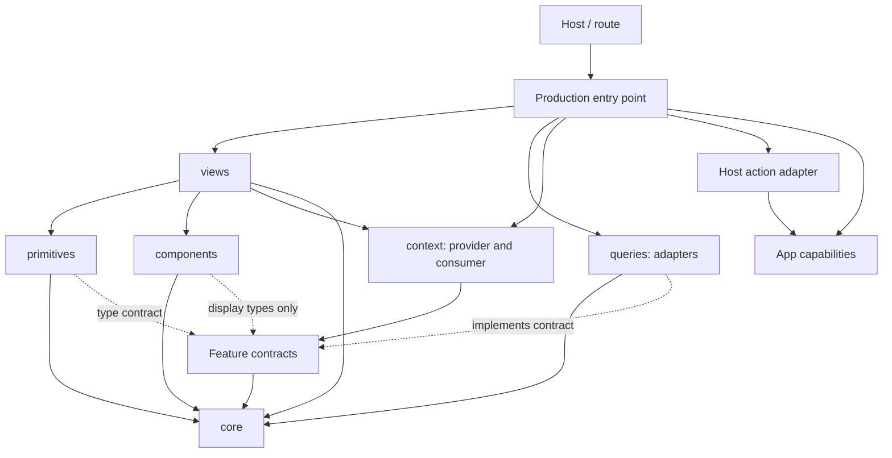

# Frontend feature architecture

New frontend features use the layered structure established by
`apps/web/src/features/activity` in commit `f598574d7` (PR #6176).
Use the same structure when
restructuring an existing feature, with the stronger production-composition and
feature-contract boundaries defined here. Activity is a worked example with
documented migration gaps, not a complete implementation of every rule below.
This is the detailed companion to FE-33 in
[the style guide](STYLE_GUIDE.md).

The goal is to make ownership visible: feature logic can run without the app,
reactive behavior can be tested without rendering, and the same visual component
can serve different surfaces. Folder names express these boundaries; moving files
without changing their dependencies does not complete a migration.

Existing features need not all migrate in one change. Apply the boundaries to the
feature or use case being created or restructured, and keep unrelated migrations
out of scope. Create only directories that have an actual responsibility to own.

## Contents

- [What the activity restructure establishes](#what-the-activity-restructure-establishes)
- [Layout and dependencies](#layout-and-dependencies)
- [Layer responsibilities](#layer-responsibilities)
- [Separate production composition](#separate-production-composition)
- [Feature-owned contracts](#feature-owned-contracts)
- [Context, props, and host actions](#context-props-and-host-actions)
- [Testing the boundaries](#testing-the-boundaries)
- [Adopting the structure](#adopting-the-structure)
- [Enforcement and reference limitations](#enforcement-and-reference-limitations)
- [Review checklist](#review-checklist)

## What the activity restructure establishes

Before the restructure, activity rows combined generated GraphQL types, entity
display lookups, split navigation, and markup. The merge separates these concerns:

| Before | Implementation in the reviewed merge |
| --- | --- |
| Feature vocabulary tied to GraphQL fragments and `__typename` | `core/event.ts` owns `ActivityEvent` and action unions; `queries/decode.ts` translates transport data. |
| Query flags interpreted directly throughout screens | `primitives/my-activity.ts` exposes feed and overview states plus `loadMore`. |
| A row looks up entity metadata and opens documents itself | `views/activity-timeline-row.tsx` resolves display and handlers; `components/activity-timeline-row.tsx` renders supplied values. |
| Shared app dependencies imported at use sites | `context/activity-context.tsx` defines the capability contract and production wiring. |
| Navigation coupled to the reusable row | The host passes `onOpen`; `open-entity-in-split.ts` implements the app's split behavior. |
| Activity-specific fetching under shared queries | The owning feature contains its query factories and decoding; shared clients and query infrastructure remain shared. |

The feed, entity side panel, and AI tool results demonstrate different compositions
of the same feature. The AI tool renderer translates its own response into
`ActivityEvent`; the reusable row does not need to understand the tool's transport.

Two aspects of that merge need a further boundary: its context still includes
production wiring, and its state primitives construct concrete GraphQL query
factories using an injected client. The target below separates production
composition and supplies narrow feature-owned sources to reactive logic.

## Layout and dependencies

```text
apps/web/src/features/<feature>/
  core/           Feature vocabulary and pure transformations
  queries/        Wire decoding and feature-owned query/mutation orchestration
  primitives/     Reactive state and actions, without JSX
  components/     Presentational JSX driven by props
  views/          Use-case composition of context, primitives, and components
  context/        Feature contracts and provider/consumer mechanism
  tests/          Shared test clients, context builders, and wire helpers
  <feature>.tsx   App-facing production composition and provider mounting
  use-<flag>.ts   Optional rollout gate used at the mounting boundary
  <host-action>.ts Optional app integration, such as open-entity-in-split.ts
```

Tests normally live beside the module they exercise as `*.test.ts` or
`*.test.tsx`. `tests/` holds helpers shared across those tests. Activity also keeps
transport fixtures in `queries/fixtures.ts`.

In this diagram, **an arrow means “imports or depends on.”**



This is a dependency direction, not a requirement to pass every value through
every layer. A view can use a core type directly. A small primitive can return an
accessor without creating a query. A static feature may need only core and
components. Feature layers must not introduce dependency cycles, including through
barrels or aliases.

Contracts can live in `context/` or a small dedicated module. They must not import
the adapters that implement them. The graph represents the target dependency
direction; the reviewed activity merge still imports queries from primitives.

Use the reference's descriptive kebab-case module names and plural layer names
when introducing this layout. Exported Solid components remain PascalCase;
reactive factories commonly use `create…`. There is no requirement for a root
`index.ts` or a barrel for every directory. Direct imports make the chosen layer
visible, including the distinction between a presentational row and its composed
view with the same name.

## Layer responsibilities

### `core/`: feature vocabulary and pure computation

Own domain types, discriminated unions, grouping, descriptions, statistics, and
other transformations of explicit inputs. Core must not import Solid, JSX,
query clients, generated GraphQL types, app contexts, or the feature's other
layers. Framework-independent libraries such as `date-fns` and `ts-pattern` are
appropriate here.

Define only the vocabulary the feature uses. Activity's domain model has
`{ kind: 'created' }`, not `{ __typename: 'GraphqlActivityCreated' }`. Unknown
actions and unsupported entities have explicit representations so the display
can degrade gracefully. Untyped property payloads remain `unknown` until the
appropriate adapter parses them; a type assertion does not validate wire data.

Keep JSX and visual choices outside core. For example, core computes an intensity
level; a component chooses the corresponding color and icon. Tests of grouping
or descriptions should need ordinary inputs and assertions, without an app
provider or mocked service.

See [event.ts](../apps/web/src/features/activity/core/event.ts),
[describe-action.ts](../apps/web/src/features/activity/core/describe-action.ts), and
[intensity.ts](../apps/web/src/features/activity/core/intensity.ts).

### `queries/`: adapt transport and own query mechanics

Keep feature-specific query factories, request variables, pagination, selectors,
decoders, and related mutation/cache orchestration here. Shared server-state
operations remain in `src/lib/queries`; network transport and generated clients
remain in `src/lib/service-clients`. Reuse that infrastructure instead of adding
`fetch` calls to a view or inventing a second cache.

Query adapters receive their concrete dependencies from production composition.
An urql client is appropriate as an adapter input; it should not become the
reactive feature consumer's capability contract. Adapters implement the narrow
sources described in [Feature-owned contracts](#feature-owned-contracts).

The current [feed-query.ts](../apps/web/src/features/activity/queries/feed-query.ts)
illustrates query mechanics and decoding but still accepts the old context's
`graphql` field. Generated documents and transport types are appropriate in this
layer. Return feature models to consumers instead of leaking fragments into
rendering logic. Project typed DTOs explicitly with names such as `toEmailThread`;
reserve `decode`/`parse` for actual decoding or validation. Keep only consumed
fields, and return small domain results instead of unnecessary transport envelopes.
Keep differences such as missing entity versus found entity with no history
explicit, as in
[select-entity-activity.ts](../apps/web/src/features/activity/queries/select-entity-activity.ts).

Query inputs that can change should stay reactive. Pause unsupported or incomplete
requests through the existing query wrapper's enabled mechanism. Choose stale-data
behavior deliberately: activity retains feed pages while loading more, but its
entity query uses `keepPreviousData: false` to avoid showing another entity's
history after an ID change.

The layout does not mandate a query-library migration. Activity uses the existing
urql Solid wrappers. For TanStack queries, preserve the repository's key, cache,
and invalidation conventions. Do not add a second generic mutation wrapper over
that library. Controllers can own workflow phases and ordering across operations;
adapters retain mutation/cache mechanics. Separate request failure from errors in
post-success presentation or cache work, and catch detached promise rejections.
Refresh/pagination capabilities used for sequencing return promises that cover
the underlying request. Queries and primitives must not import rendering code.

### `primitives/`: reactive behavior without rendering

Compose feature-owned sources, core transformations, and injected capabilities
into the state and actions a use case needs. Use Solid accessors, signals, and memos where
appropriate; do not return JSX or import components/views.

Reactive decisions depend on source contracts rather than importing concrete query
adapters. A primitive can receive an already-created source directly; it does not
need the whole feature context. Small pure/reactive helpers need no data-source
interface when they have no infrastructure dependency to separate.

Screen-sized primitives expose explicit view-state unions and named actions:

```ts
type FeedView =
  | { t: 'loading' }
  | { t: 'error' }
  | { t: 'empty' }
  | { t: 'ready'; groups: FeedGroup[]; hasMore: boolean; loadingMore: boolean };

type MyActivityState = {
  feed: Accessor<FeedView>;
  loadMore: () => void;
};
```

Choose states that represent the actual use case; not every primitive needs all
four variants. `createActorName` returns a string accessor, and
`createEntityOpener` returns a display/handler accessor. A name resolver does not
need a fabricated loading/error state machine.

Keep precedence decisions here so every consumer agrees about loading, errors,
empty data, and existing data during refetch. Activity's feed and overview retain
available content through background failures; its entity section handles query
errors and missing entities as unavailable. These are deliberate use-case
decisions, not a universal ordering of query flags.

Accept sources/capabilities explicitly and narrow dependency records with `Pick`
where practical. Keep changing entity IDs and other inputs as accessors instead
of eagerly snapshotting props.
Use derived accessors for cheap computations and memos for expensive derivations
or referential stability. Follow the existing Solid guidance on avoiding effects
for derived state and guarding resource reads. Activity's urql behavior does not
override the warnings about eager TanStack `query.data` reads in
[apps/web/AGENTS.md](../apps/web/AGENTS.md).

See [my-activity.ts](../apps/web/src/features/activity/primitives/my-activity.ts) and
[entity-opener.ts](../apps/web/src/features/activity/primitives/entity-opener.ts).

### `components/`: props in, JSX out

Render domain values, resolved display data, slots/children, and event callbacks
provided by the caller. Components can use Solid control flow and local
presentation derivations; “presentational” does not mean “cannot use Solid.”
For example, `ActionGraph` computes its grid from a supplied overview.

Components must not create queries, invoke feature primitives, consume the
feature's capability context at runtime, or decide how the app navigates.
Type-only imports of display contracts from `context/` are allowed. Reuse shared
UI components, icons, formatting, and clearly scoped presentation contexts.
A reusable control must not require a consuming use case's context to function.

Prefer composition and event handlers over mode flags that embed several host
workflows. A row can take resolved `display`, `propertyDefinition`, and `rowProps`;
it should not take an entity ID and secretly resolve all its app dependencies.
Resolve shared metadata once in the composed owner and pass it to its children.

See the presentational
[activity-timeline-row.tsx](../apps/web/src/features/activity/components/activity-timeline-row.tsx)
and [top-entities.tsx](../apps/web/src/features/activity/components/top-entities.tsx).

### `views/`: compose a use case

Read the feature context, invoke its source factories under the consuming Solid
owner, pass sources to primitives, and render components from their state.
Views own the composition for a feed, side panel, dialog, or
tool row; they need not be full pages. Keep query-result interpretation and
reusable domain computation in primitives/core.

Views may compose shared layout and presentation providers. Small layout helpers
and local UI state can remain with their only consumer: activity's side panel
owns its “Show all” toggle locally. The architecture does not require a separate
primitive for every signal or a separate exported component for every wrapper.

The two `activity-timeline-row.tsx` files show the intended split. The
[view](../apps/web/src/features/activity/views/activity-timeline-row.tsx) obtains
entity display, property definitions, and callback-based handlers, then passes
them to the presentational row. External hosts choose the view when they want
that wiring, and the component when they already have resolved values.

### `context/`: the feature's capability contract

Define the ambient capabilities each consumer needs. A production entry point may
group them into a context for views to wire, but reusable controllers receive
only their named contracts. Do not pass a complete screen context into every
helper or controller. Keep provider/consumer modules under `context/`. Keep the contracts and provider/consumer free
of production imports. The provider transports capabilities; production composition
constructs them. Direct arguments also work when context adds no value.

Name a feature context for what it is: `EmailComposeContext`, `composeContext`,
and `createEmailComposeContext`. Use `context` for its component prop and
`use…Context` for its context consumer. Avoid `deps` and `environment` aliases for
these objects. A source, storage operation, or command should retain its specific
name; calling the containing object a context does not require passing all of it
to every consumer or adding another provider.

Use accessors and resolver functions to preserve reactivity. Activity's
`currentUserId`, `displayName`, `entityDisplay`, and `propertyDefinition` illustrate
useful capability signatures. Replace its raw `graphql` capability for state
consumers with narrow feature sources as described below. Display contracts can
include a resolved icon accessor; they do not have core's purity requirement.

The existing [activity-context.tsx](../apps/web/src/features/activity/context/activity-context.tsx)
combines this contract with a production fallback. That is a migration gap.

## Separate production composition

The app-facing entry point assembles the real adapters and supplies them to the
feature. Importing the feature context or state must not initialize app services,
sockets, workers, or global listeners. A fallback such as
`useContext(Context) ?? appContext()` delays a function call but still imports the
module's production dependencies, even when a test supplies its own context.

The following snippets illustrate the target; they are not the current activity
implementation. Imports and unrelated display capabilities are omitted for focus.

```tsx
// context/activity-context.tsx
const Context = createContext<ActivityContext>();
export const ActivityProvider = Context.Provider;

export function useActivityContext(): ActivityContext {
  const context = useContext(Context);
  if (!context) throw new Error('ActivityProvider is required');
  return context;
}
```

```tsx
// activity.tsx — production entry point
export function Activity() {
  const context = createAppActivityContext();
  return (
    <ActivityProvider value={context}>
      <MyActivityView onOpen={openEntityInSplit} />
    </ActivityProvider>
  );
}
```

`createAppActivityContext` is production wiring: it connects query adapters
to the real client and display capabilities to the app's resolvers. It may live
in the entry-point module or a separate production module as its size warrants.
The context, views, and primitives must not import it. Production callers mount
one convenient `<Activity />`; tests import `MyActivityView` and supply their own
provider. Missing provider setup fails clearly instead of reaching real services.

Run hook-based construction under its intended Solid owner. Gate the mounting
boundary before initializing feature resources. Separating composition needs no
DI framework or class hierarchy, and it is useful even before replacing raw-client
injection with source contracts. Shared widgets can still import app infrastructure;
inspect those dependencies separately rather than assuming this change removes
all test module stubs.

## Feature-owned contracts

Introduce a contract where meaningful feature behavior needs independence from
its infrastructure. The feature defines the domain values, operations, and status
it needs. The adapter implements them using the existing query library. This is
dependency inversion: the consumer owns the interface, and the implementation
depends on that interface.

For example, activity feed behavior needs events, request status, and pagination.
It does not need a generic GraphQL executor. An illustrative contract is:

```ts
export type ActivityFeedSource = {
  /** Undefined until data is available for the current input; [] is a loaded empty feed. */
  events: Accessor<readonly ActivityEvent[] | undefined>;
  /** Initial loading, distinct from loading another page. */
  isLoading: Accessor<boolean>;
  /** May coexist with available events after a background failure. */
  error: Accessor<Error | undefined>;
  hasMore: Accessor<boolean>;
  isLoadingMore: Accessor<boolean>;
  loadMore(): void;
};

export type ActivityContext = {
  createFeed(): ActivityFeedSource;
};
```

The adapter maps decoded events and query state into this contract. Documents,
variables, transport errors, opaque cursor handling, and cache mechanics stay in
the adapter. Retain the existing client and query wrappers; do not add a second
cache. If the feature distinguishes failure categories, define those categories
in its contract and translate errors in the adapter instead of exposing urql errors.

The primitive receives a source and owns presentation decisions. The view connects
the source factory to the primitive:

```tsx
const context = useActivityContext();
const state = createMyActivityState(context.createFeed());
```

Here `createMyActivityState(feed: ActivityFeedSource)` groups events and decides
whether to show loading, errors, empty content, or existing rows. The adapter
reports that data is available and a background request failed; the primitive
decides to keep showing the rows. Do not put grouped rows or final screen view-state
in the source contract and thereby move feature policy into the adapter.

Accept Solid accessors, factories, and ownership as the reactive foundation.
Do not abstract Solid into a custom framework. A source contract must preserve
updates, enabled inputs, pagination, resource-read semantics, and cleanup. Describe
whether `undefined` means no data yet and whether existing data can coexist with
an error. For sources with changing parameters, accept reactive inputs. Instantiate
factories under the consuming owner and ensure disposal releases subscriptions;
do not create global feature-state singletons or replace a live source with a
promise that loses its lifecycle.

Keep contracts narrow and selective. Do not expose concrete clients, generated
GraphQL response types, or library-specific query results to state consumers.
Pass a source directly or a small `Pick` of dependencies. Existing resolver
functions can already be adequate contracts; they need no additional wrapper.
A generic `Repository<T>` or an interface around every helper adds no value when
there is no independent behavior to protect. A static/pass-through feature does
not need a manufactured state layer and source interface.

The practical test is whether a change stays with its owner:

| Change | Expected scope when semantics are otherwise unchanged |
| --- | --- |
| GraphQL response field or cursor encoding changes | Adapter and adapter tests |
| Feed changes its handling of background errors | Primitive and behavior tests |
| Row appearance changes | Presentation |
| A different app surface embeds the feature | Host composition and callbacks |

Activity's current primitives still construct concrete query factories and their
tests drive a fake GraphQL client. Keep those as useful integration coverage while
adding source-based unit tests when migrating the boundary.

## Context, props, and host actions

Classify a new dependency by what it means:

| Value or behavior | Owner | Activity example |
| --- | --- | --- |
| Ambient capability used consistently on every surface | Feature context contract; separate production wiring | Activity source factory, viewer identity, display-name lookup |
| Data identifying this instance | Props, passed as accessors to reactive factories | Entity ID and entity type |
| Derived state for a screen | Primitive | Grouped feed and pagination state |
| Already resolved display for one leaf | Component props | Actor name or property definition |
| Policy chosen by the embedding surface | Callback prop supplied by the host | `onOpen(target)` |
| Environment-derived request value | Compute at the relevant boundary | Browser time zone in overview query options |
| Rollout decision | Mounting wrapper or host | `EntityActivitySectionConditional` |

Do not add `feedRows`, `actorLabel`, or another single consumer's prepared result
to context when it can be derived from existing capabilities. Do not inject every
environment value speculatively; add only capabilities the feature actually needs
to replace. Activity computes the browser time zone in the query layer.

For navigation, the primitive translates an interaction into a target and the
host decides what to do with it. `createEntityOpener` passes `block`, `id`,
`params`, and `newSplit` to `onOpen`; the host's
[open-entity-in-split.ts](../apps/web/src/features/activity/open-entity-in-split.ts)
calls the app navigation API. Ordinary feature layers do not import that API.
Shared event-translation helpers are allowed in primitives when they delegate
the actual action to the supplied callback.

When a reusable row's `onOpen` is omitted, it must not install the host's row-open
handlers. This is a contract about that row action; it does not prove that nested
shared widgets have no interactions of their own. If a surface must be entirely
inert, verify the rendered descendants as well.

Feature flags stay outside the capability contract and gate the component that
creates state. Hiding JSX after creating queries is too late. The activity side
panel mounts no query while disabled; the feed's route wrapper handles its own
rollout state. Preserve route registration and fallback behavior during migrations.

## Testing the boundaries

Framework-independent behavior can live in a standalone workspace library when
it should run without a feature's reactive runtime. Keep deterministic
transformations in core and browser effects behind a separate browser export;
the Solid feature translates accessors to plain values and registers disposal.
Supply policy and host capabilities explicitly. Do not let the library import
app flags, clients, routes, or block signals through a convenience barrel.

[`packages/email-renderer`](../packages/email-renderer/README.md) demonstrates
this split: HTML/CSS preparation compiles without DOM libraries and runs under
Node; the browser layer handles Shadow DOM, computed colors, layout and resource
lifetimes; the email-message adapter retains Solid and Macro Markdown integration.
Its vanilla fixture viewer and browser tests call the exact production API.
Pure output determinism and pixel determinism are different guarantees: browser,
fonts, viewport, theme, and resources must also be controlled for screenshots.

Test observable behavior at the layer that owns it. Dependency injection should
make feature behavior testable without module-mocking the real query factories,
current-user hook, or display resolvers.

| Layer | Test shape | Useful assertions |
| --- | --- | --- |
| Core | Ordinary Vitest tests with domain inputs | Grouping, descriptions, calendar boundaries, unknown cases |
| Projection/decode/select | Wire fixtures passed to pure adapters | Domain output, missing versus empty, unsupported variants, malformed property payloads |
| Query adapters | `createRoot` with a fake client; dispose roots after each test | Request variables, enabled gates, decoding, cursors, cache behavior, source lifecycle |
| Primitives | `createRoot` with fake feature sources and controlled domain data/status | Loading/error/ready decisions, grouping, background failures, pagination actions, changing inputs |
| Components/views | Testing Library; feature provider for composed views | Visible states, emitted callbacks, pagination controls, interaction behavior |
| Host integration | Browser verification on the relevant surfaces | Flag gates, mounting, real mentions, navigation, focus/scroll behavior |

The reference's
[mock-context.ts](../apps/web/src/features/activity/tests/mock-context.ts) supplies
defaults and overrides for the capability record.
[mock-graphql.ts](../apps/web/src/features/activity/tests/mock-graphql.ts) exposes
pending operations that tests resolve or fail, exercising the real query and
primitive code. Its fake implements the query methods those tests need; extend a
fake for new operations rather than assuming it is a complete urql client.

Source-based primitive tests should not name GraphQL operations or construct wire
responses to exercise a feature decision. A fake source with event and error
signals can test retention of rows through background failure. Adapter tests
separately verify wire behavior; retain integration tests that exercise the real
adapter and primitive together. Test the real implementation of the layer under
test and replace its dependencies through the contract.

Check that context/state imports work without production-service quarantine and
that omitted provider setup fails clearly. Use existing import smoke tests where
available, or inspect and exercise the import boundary when migrating it.

See [my-activity.test.ts](../apps/web/src/features/activity/primitives/my-activity.test.ts)
and [my-activity-view.test.tsx](../apps/web/src/features/activity/views/my-activity-view.test.tsx).
The current view test still stubs shared layout/Markdown UI and quarantines
websocket import-time effects with `vi.mock`. Those are integration limitations;
feature data and capability behavior are supplied through the provider. Do not
turn those stubs into a pattern for replacing the feature logic under test.

For a frontend implementation change, run the relevant tests and checks from
`apps/web` with dependencies installed:

```bash
\cd apps/web
bun run test src/features/activity
bun run check
```

Replace the test path with the feature under change. Exercise user-visible changes
in a browser using [the frontend instructions](../apps/web/AGENTS.md). Documentation
changes alone do not require bringing up a frontend or backend stack.

## Adopting the structure

1. **Map the existing use cases and consumers.** Find routes, side panels, tool
   renderers, flags, tests, and external imports. Identify app capabilities and
   behavior that varies by host. Review imports as well as the folder tree.
2. **Establish the domain boundary.** Extract feature vocabulary and pure
   transformations into core. Decode generated transport types at their source
   boundary, including non-query inputs such as AI tool responses.
3. **Separate production composition.** Keep contracts and the provider/consumer
   free of production imports. Wire real adapters in an app-facing entry point
   and make missing provider setup fail clearly. Build a test provider without
   importing the production entry point. This step is useful independently of
   changing the data-source contract.
4. **Separate query mechanics and reactive behavior.** Define narrow feature-owned
   sources for meaningful state decisions, implement them with adapters in
   `queries/`, and pass sources to primitives. Retain shared query infrastructure.
   Preserve enabled conditions, cache behavior, cursors, resource-read semantics,
   owner cleanup, and entity-switch behavior. Keep view-state decisions in primitives.
5. **Separate presentation and composition.** Make leaves render supplied values;
   let views connect primitives and context. Move host-specific actions to callback
   props and wire app implementations at the mounting boundary.
6. **Update all consumers.** Follow moved imports in production, tests, lazy route
   loaders, and tool renderers. Preserve required presentation providers. Remove
   obsolete modules once callers are migrated; avoid barrels that reintroduce
   dependencies on the entire feature.
7. **Register enforcement and verify.** Add the adopting feature's layer globs to
   both TypeScript and TSX feature rules below. Test the changed behavior, inspect
   warnings, and exercise affected UI surfaces. Update
   [the agent interaction guide](AGENT_GUIDE/README.md) if routes or interaction
   behavior changed; a file move alone does not change that guide.

## Enforcement and reference limitations

The rules live in [rules/ast-grep](../rules/ast-grep), configured by
[sgconfig.yml](../sgconfig.yml). Each family has a `ts-` and `tsx-` rule because
the scanner treats those languages separately. When a feature adopts the layout,
update `files` in all eight rule files with the corresponding layer paths:

| Rule family | Layer globs to register | Main check |
| --- | --- | --- |
| `feature-core-pure` | `core/**` | No framework, generated GraphQL, app, or sibling-layer dependencies |
| `feature-components-presentational` | `components/**` | No query/primitives/views or navigation-helper imports |
| `feature-data-no-ui` | `queries/**`, `primitives/**` | No rendering-layer imports |
| `feature-layers-use-context` | `queries/**`, `primitives/**`, `components/**`, `views/**` | No direct imports of the listed ambient app capabilities |

From the repository root, the existing scanner invocation can be scoped to a feature:

```bash
bunx --yes @ast-grep/cli@0.44.1 scan apps/web/src/features/activity
```

These rules currently have warning severity and their `files` lists cover
activity and the three email features. They do not automatically enforce every
feature directory, resolve the whole transitive import graph, or prove that a
component is presentational.
Passing the scan is supporting evidence, not a complete architecture review.
The current rules also do not enforce separation of production composition or
the dependency inversion between primitives and query adapters. Those remain
explicit review obligations until structural checks cover them. This document
defines the target; it does not claim the existing checks enforce all of it.
Inspect aliases, re-exports, and runtime behavior too. Keep new exceptions narrow
and documented instead of weakening a rule to permit a new dependency leak.

The reference has specific qualifications worth preserving accurately:

- `context/activity-context.tsx` imports production capabilities and supplies an
  automatic fallback. Migrate that wiring into an app-facing entry point; the
  shared contract/provider should have no production imports or fallback.
- `primitives/my-activity.ts` constructs concrete query factories using the
  context's urql client. Its tests therefore drive GraphQL operations. Migrate
  meaningful reactive decisions to feature-owned sources and keep those existing
  tests as integration coverage. This is not full dependency inversion today.
- `core/group-events.ts` imports the pure `dateBucket` module from soup so feed
  labels match other views. The rule documents this exception. It does not permit
  importing the soup barrel or arbitrary feature infrastructure into core.
- `components/property-change.tsx` imports pure wire-value parsing/formatting from
  `queries/property-value.ts`. The presentational rules explicitly allow that
  path. It is not permission to execute a query from a component. For new code,
  prefer returning display-ready data at the adapter boundary rather than copying
  this exception by default.
- Shared UI may carry its own runtime requirements. Activity's entity mention uses
  `StaticMarkdown` and requires `StaticMarkdownContext`; the view tests stub it.
  The branch establishes a feature dependency seam, not complete isolation from
  every transitive app module or shared widget.
- View-state unions describe use-case state, while small helpers can return simple
  accessors. Activity does not establish a mandatory union for every primitive.
- The navigation adapter and flag hooks intentionally remain at the feature root.
  The layout does not require every file to live inside a layer directory.

These qualifications describe the reviewed merge. They should not grow into
general exceptions without a concrete need and an updated explanation.

## Review checklist

- Does each changed module's responsibility match its layer, beyond its path?
- Can core run without Solid, generated transport types, or app setup?
- Are transport inputs decoded before feature logic and presentation use them?
- Are contracts and provider/consumer modules free of production imports, with
  real adapter construction owned by an explicit app-facing entry point?
- Does missing provider setup fail clearly instead of reaching production services?
- Do meaningful reactive decisions depend on feature-owned sources instead of
  concrete query adapters, generated responses, or a raw client?
- Do adapters report data availability while primitives own presentation policy?
- Does each new interface protect independent behavior rather than add forwarding?
- Does context contain ambient capabilities, while instance data and host policy
  stay in props and callbacks?
- Do components render supplied values and handlers without querying, consuming
  feature capabilities, or choosing app navigation?
- Do primitives own meaningful data-state transitions, and do views compose them
  without rebuilding those decisions?
- Are enabled gates, background updates, pagination, and entity changes preserved
  and tested where the change can affect them, including owner cleanup and
  resource-read semantics?
- Can tests replace capabilities through the contract while exercising real
  feature logic? Can primitive unit tests use domain data/status while separate
  adapter tests verify wire behavior? Are any remaining integration stubs explained?
- Are external consumers, route wrappers, presentation providers, and both lint
  language variants covered by the migration?


## Email application of the stronger boundaries

[Email feature architecture](EMAIL_FEATURE_ARCHITECTURE.md) documents the complete
`block-email` experiment: separate `email-thread`, `email-message`, and
`email-compose` ownership, a thin block adapter, production entry points, domain
sources, and tests of imports and instance lifetimes. Use it alongside activity
when applying the composition and source-contract rules.

The four feature-rule families now cover these email packages as well as activity.
Email additionally has error-level rules against block dependencies and an import
graph regression test. Its two narrow shared pure utility exceptions are the
base64 codec and validated Macro identity helper; see the email document for the
remaining shared UI integration limits.
