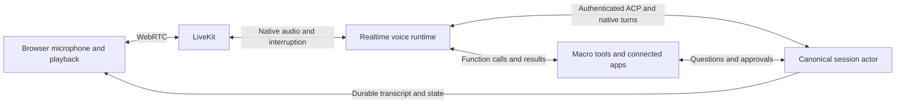

# Native voice harness for Macro agents

Voice is a temporary runtime attachment to the existing agent session. While
voice is active, one external realtime model owns speech, typed input, tool
selection, and conversation context. The ordinary in-memory text model is
suspended. Ending voice permits a fresh text runtime to replay the same durable
history. The persona, instructions, and saved text-model preference are retained.

## Boundaries

- `crates/agent_voice` owns edit-access authorization, controller leases, worker
  identity/generation checks, and start/end/cleanup policy. LiveKit and Redis are
  outbound adapters. The browser receives a room-scoped microphone credential.
- `agent_harness` serializes runtime handoff with ordinary session commands.
  A shared voice claim prevents another replica from starting a competing text
  model. Attachment and logging use the existing session actor and ownership fence.
- `services/agent_voice` is the LiveKit/OpenAI Realtime runtime. Provider-native
  semantic VAD detects turns and interruptions; LiveKit reconciles played audio
  with the provider conversation. The worker has no browser task bridge.
- `agent_inmem::voice_tools` composes the same native Macro tools, persona prompt,
  user memory, connected integrations, and review finisher as the text runtime.
  It executes functions directly, without invoking a second agent loop.
- The frontend voice feature owns media permission, microphone contention,
  playback, captions, and visible connection state. A read-only session observer
  keeps canonical transcript and review updates subscribed during navigation.

## Canonical conversation and interruption

Final audio transcripts have stable action identities. They enter the session's
serialized command path as native turns and are logged as canonical user prompts
without being delivered back to the already-listening speech model. Spoken
assistant content is taken from playback-synchronized SDK items, including
truncation on interruption. Typed prompts use ACP and reach that same model.

Tool execution waits for admitted user input and a durable tool-opening frame.
The backend deduplicates provider call IDs, records tool outcomes, and keeps
executing actions separate from interrupted speech. Barge-in dismisses an
unapproved draft; it cannot grant permission or undo an action already executing.
Existing visual question/review controls authenticate human decisions.

A late tool result patches its original transcript row. Text-mode history replay
also reconciles that result to its original call before synthesizing responses
for tools that never completed. Worker frames and cleanup are generation-fenced,
so stale workers cannot write to or close a replacement conversation.

## Lifecycle and recovery

A private room has one caller and one expected worker. Starting voice obtains
microphone permission before provisioning. The worker authenticates directly to
the backend with a short-lived signed media identity bound to the room and active
voice generation; the browser cannot impersonate it with its own join token.

Successful media reconnection keeps the conversation alive. Browser, worker, and
room policy allow a two-minute recovery window. Durable participant readiness
and terminal attributes cover missed SDK notifications. Connected silence,
listening, and mute do not end voice. The existing absolute thirty-minute limit
remains. Worker/backend failure ends visibly and releases the runtime claim;
reopening loads saved context without automatically repeating tool calls.

No raw audio is recorded. Final conversational text and tool evidence use agent
session retention. Provider token totals are converted to deltas and recorded for
the session owner and session entity. Unknown prices are left to the usage service.

## Extensibility and limits

The media UI, lease policy, session actor, and product tools are independent of
the speech provider. Another native speech provider can implement the worker
contract while retaining canonical history, permissions, and runtime ownership.
Voice eligibility currently covers Macro agents. External coding harnesses do
not gain conversational parity merely by exposing a prompt endpoint.

Local and hosted stacks run the worker alongside the harness service. See
[worker operations](../../services/agent_voice/README.md) and the
[browser guide](../AGENT_GUIDE/ai-chat.md). There is no enable feature flag.

Provider-native interruption is integrated, but perceived conversational quality
and real microphone behavior require live listening tests. Offline SDK tests and
Chromium media tests cannot establish ChatGPT voice parity. Automatic provider
failover, native mobile audio sessions, and provider cost pricing are separate
capabilities, not claims made by this implementation.
