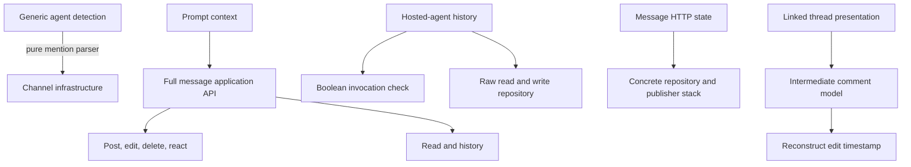
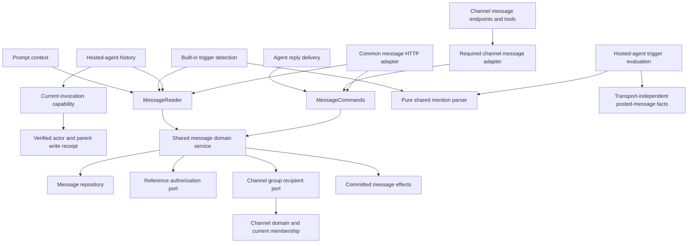
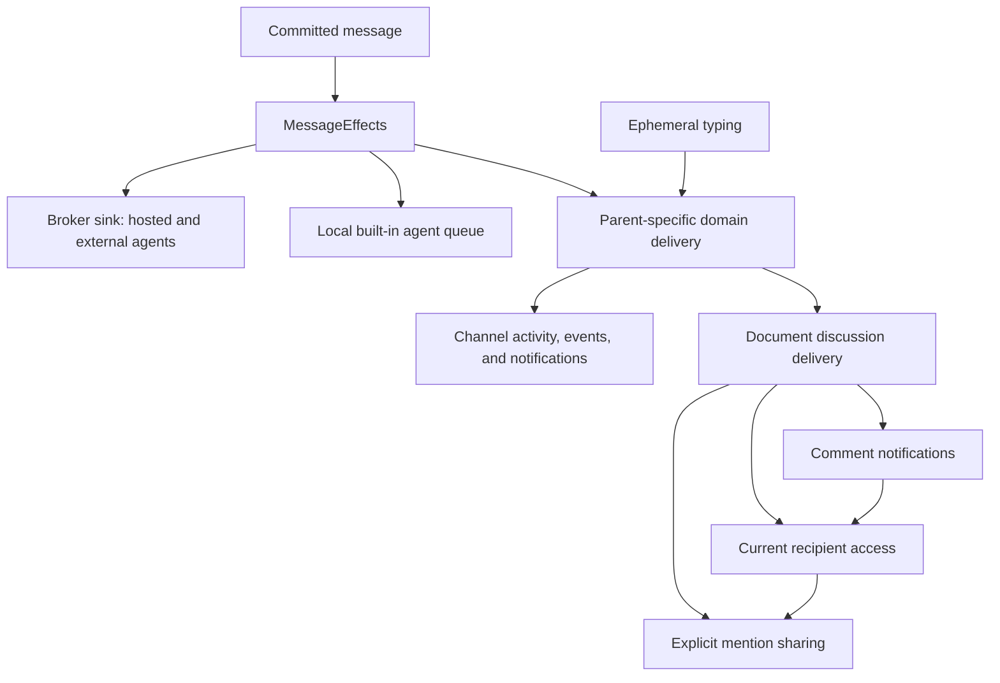
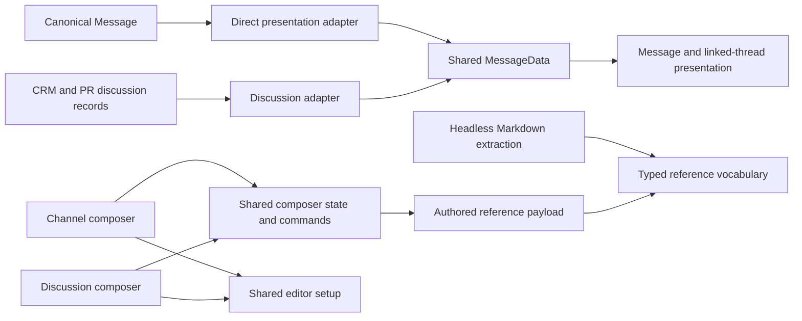

# Message dependencies after the cleanup

Historical snapshot of the 2026-09-07 cleanup. The
[2026-09-09 consolidation](entity-messages-simplification.md) supersedes these graphs:
the parallel client/read paths and adapters described below have been removed.

Implemented on the message-unification branch, 2026-09-07. This document describes
application dependencies and capabilities, separate from the database cutover in
[entity-messages.md](entity-messages.md).

The cleanup removes dependencies that existed because of where code happened to
live. Parent-specific authorization, audiences, notification wording, anchors, and
channel timeline queries remain explicit domain responsibilities.

## Where capabilities were leaking

This was the partial dependency graph before this cleanup. Arrows mean “receives
or depends on,” rather than the order in which a request executes.

Those edges had concrete consequences: a pure parser enabled channel infrastructure;
a read consumer received write methods; history access depended on a prior boolean
check; adding a publisher changed HTTP state types; and presentation confused
activity timestamps with content edits.

## Application boundaries now

- `MessageReader` exposes message/thread reads, history, legacy lookup, and
  accessible channel-reference discovery. `MessageCommands` exposes posting,
  editing, partial patches, deletion, reactions, typing, and thread lifecycle.
  Both are implemented by the existing message domain service. The combined
  `MessageServiceApi` is used only where both capabilities are appropriate.
- Invocation authorization returns an `AuthorizedInvocation` carrying the actor's
  current write receipt and the exact thread root. History receives that object,
  downgrades its receipt to view access, and calls `MessageReader::get_thread`.
  It no longer reads the raw repository or reimplements whole-thread deletion.
  Queued work rechecks write access; a view-only user cannot dispatch an agent.
- The HTTP state names the application API and authorization services. It no longer
  names the repository, broker, local queue, or notification delivery generics.
- `ChannelServiceImpl` handles channel management and specialized reads.
  `ChannelMessageAdapter` requires `MessageCommands` at construction and translates
  existing channel requests. There is no optional writer or “message service is not
  configured” branch. HTTP, tools, webhooks, and support welcome messages receive
  the appropriate sibling dependencies.
- Attachment additions/removals are represented by `AttachmentChange::Delta` and
  interpreted in the common `patch` command. An adapter no longer fetches a message
  to reconstruct its body, mentions, and attachments. This centralizes semantics;
  it does not introduce revision checks for conflicting simultaneous edits.

Key code: [application ports](../../crates/messages/src/domain/api.rs),
[message service](../../crates/messages/src/domain/service.rs),
[invocation capability](../../crates/agent_trigger/src/domain/service.rs),
[history adapter](../../crates/agent_trigger/src/outbound/message_thread_history.rs),
[channel command adapter](../../crates/channels/src/domain/message_commands.rs).

## Delivery is a fixed set of siblings

Previously, `BrokerMessagePublisher` wrapped `LocalBotPublisher`, which wrapped
parent delivery. Each wrapper owned both its own failure handling and continuation
of the next publisher.

The three targets are attempted independently and each failure is logged with its
identity. The parent target retains real ordering requirements: a sharing grant
must precede an audience check that depends on it. This preserves existing delivery
reliability; it does not add durable retries or an outbox.

`MessageDeleted` and `ReactionChanged` are separate facts. Channel delivery no longer
infers the operation from `deleted_at`; human reactions explicitly update channel
activity. Typing bypasses both agent sinks. Broker envelopes live in the outbound
adapter, while `MessagePostedMetadata` and the bot mention parser live in the shared
domain. `channel_bots`, `agent_trigger`, and `agent_harness` no longer declare direct
`channels` dependencies for these helpers.

Key code: [coordinator](../../crates/messages/src/domain/effects.rs),
[neutral facts](../../crates/messages/src/domain/events.rs),
[broker sink](../../crates/messages/src/outbound/broker.rs),
[local sink](../../crates/channel_bots/src/outbound/conversation.rs),
[parent policies](../../crates/messages/src/domain/delivery.rs).

## One presentation and composer path

Canonical messages map directly into the shared `MessageData` model. Actual
`edited_at`, sender identity, bot profile, attribution, and thread identity survive
that conversion. A reaction's later `updated_at` does not label an unedited message
as edited. The remaining discussion adapter serves external CRM/PR records and
preserves explicit edit timestamps for canonical document comments.

`createMessageComposer` owns draft state, mention tracking, attachment state,
snapshots, send/retry behavior, and typing. Both surfaces use the same editor setup.
Channel persistence, collapse behavior, native focus handling, document anchors,
and surface-specific upload controls stay in their wrappers. Failed sends retain
the complete draft, pending sends cannot dispatch twice, and successful sends clear
mentions as well as text and attachments.

The linked drawer continues to own a reference-counted subscription to its source
parent. A separate view can hold the same subscription independently.

Key code: [presentation](../../apps/web/src/lib/core/messages/message-data.ts),
[shared model](../../apps/web/src/lib/core/messages/types.ts),
[composer](../../apps/web/src/lib/core/messages/create-message-composer.ts),
[editor](../../apps/web/src/lib/core/messages/configured-message-editor.ts).

## Authored references and recipients are different data

The web payload and headless Markdown extractor use the same typed TypeScript
reference parser. The Rust domain parses the corresponding reference kinds and
normalizes supported aliases for authorization; existing email tags (`thread`,
`email_thread`, `email`), calls, and calendar events remain recognized. Recognizing
a kind does not grant access to it.

A single `@here` now travels as `{ entity_type: "group", entity_id: "here" }`.
The common command bounds authored references before asking channel policy for
current active human members. It persists the authored group, while delivery facts
carry deduplicated resolved recipients. Thus a 300-person channel does not consume
300 authored-reference slots. Document parents and unknown group aliases reject
these group references. Bots are excluded from `@here` expansion.

On each post or edit, expansion uses current membership. Thread-participant reads
and filters also understand the authored group, so current members participate in
those threads and departed members are excluded. Historical per-user mention rows
continue to work as explicit mentions. The old comms participant helper delegates
to the same channel repository query instead of maintaining a second SQL policy.

Key code: [shared editor vocabulary](../../packages/lexical-core/utils/message-references.ts),
[domain reference parsing](../../crates/messages/src/domain/mentions.rs),
[channel group policy](../../crates/channels/src/domain/group_mentions.rs),
[participant reads](../../crates/channels/src/outbound/pg_channels_repo.rs).

## Scope and verification

This cleanup requires no additional migration and performs no Loro snapshot or
history rewrite. The existing Rust migration runner and single-PR cutover remain.
Email comments remain excluded. Indexed channel projections remain specialized
read models; removing those views is not required for these boundary changes.

Focused tests cover actor/parent/root-bound history, revoked write access, deleted
threads, failure isolation across delivery sinks, reaction activity, attachment
patch semantics, 300-recipient group mentions, current group membership in SQL
reads and filters, canonical edit timestamps, and composer retry behavior. SQLx
metadata was regenerated with `nix develop --command just prepare_db` from the root.
Final browser and lint results are recorded in [entity-messages.md](entity-messages.md).

Hexagonal boundaries were checked: authorization, message lifecycle, reference
validation, group audience selection, and notification policy remain in domain
services. Inbound adapters mint and forward capabilities; outbound adapters read
facts or deliver effects. Composition roots own concrete infrastructure wiring.
