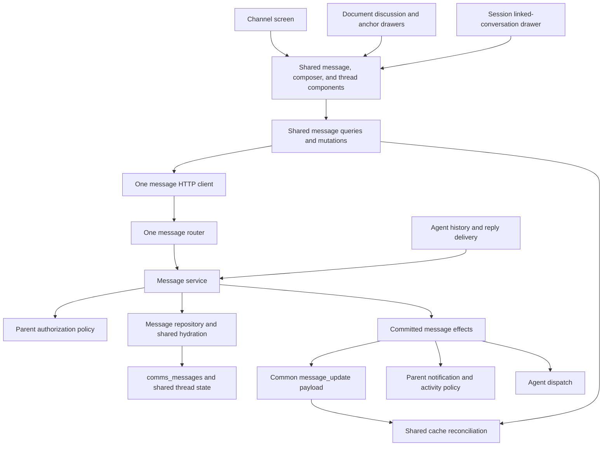

# One message system, mounted on channels or documents

Implemented on 2026-09-09 after re-evaluating the first version of this PR. This
supersedes the stopping point in the [earlier dependency cleanup](entity-messages-dependencies.md).
The [full walkthrough](entity-messages.md) covers agents, notifications, and the
[cutover runbook](../../scripts/message-cutover/README.md) covers deployment.

## What changed

The first version unified storage and backend writes while retaining parallel
channel and document interfaces. This revision finishes the consolidation: both
surfaces use the existing channel message behavior, generalized to a `MessageParent`.

| Concern | Implemented shared path |
|---|---|
| Stored message content | `comms_messages` |
| Identity | `MessageParent::Channel(id)` or `MessageParent::Document(id)`; replies reference a root message |
| HTTP | `/messages/{parent_type}/{parent_id}` and its item/thread/reaction subroutes |
| Backend use cases | `crates/messages`: reads, posts, partial edits, deletion, reactions, typing, thread state |
| Database hydration | `PgMessageRepository`: messages, attachments, mentions, reactions, and agent profiles |
| Client and mutations | `service-storage/messages.ts` and `queries/messages/mutations.ts` |
| Cache and live updates | Parent-scoped keys and the shared timeline/replies/reconciliation implementation |
| Native rendering | The existing message, composer, and thread components accept a parent |
| Agents | The committed message event and `(parent, root_id)` conversation identity |

Arrows show dependencies or delivery direction. Parent policy is a deliberate
boundary. A document does not depend on channel membership to send a message.
Some reused frontend components still have `Channel` in their filenames; their
message operations take a parent and serve both surfaces. Input placement belongs
to the containing view: a channel screen can own a floating input, while a source
channel thread inside a document uses inline controls. The shared components do not
infer placement from the stored parent or global channel feature flags.

## Storage: why there is still a thread table

`comms_messages` is the sole content store. `comms_message_threads` is a small shared
record for root ownership, resolution, anchor, and whole-thread deletion. It does
not contain another copy of the messages, and is used for channel roots too.

Deleting the first message and deleting a discussion are different actions. Keeping
thread state independently preserves replies, root ownership, and empty historical
discussions. Anchors are a tagged Markdown mark, PDF highlight, or PDF placeable.
They do not require changing document contents or rewriting Loro snapshots.

Old comments are imported by the Rust `message_cutover` runner. Immutable numeric-ID
mappings preserve old links. Legacy Comment/Thread tables and the channel-only
storage columns disappear in the same cutover; no dual-write phase is introduced.

## Reads retain channel behavior

A timeline returns a bounded page of root messages, each with thread state, live
reply count, latest reply time, and at most three preview replies. Opening a thread
loads its replies into the shared thread cache. Both parents support older/newer
cursors, a window around a root or reply, selected root IDs, and activity filters.
Imported reply ordering survives edits and live updates.

Annotation layout walks root pages to position document anchors; it does not load
every root's full reply history. Document export deliberately reads full threads.
These are consumers of the same reader, not separate message implementations.

Channel lists, inbox selection, unread/activity ranking, and attachment searches
remain specialized read selections because their product rules involve channels.
Inbox thread selection passes root IDs to the common hydrator and receives the
canonical message shape. Inbox presentation is a projection of that data.

The `comms_channel_messages` and `comms_channel_attachments` compatibility views and
their CASE/cast expression indexes are removed. Readers query `parent_entity_type`
and `parent_entity_id` directly. Composite indexes cover timelines, history,
activity, thread order, and attachments; the cutover tests check indexed plans
with 30,000 unrelated messages present.

## One write and live-update implementation

Both surfaces call the same send, patch, delete, and reaction mutations. The patch
contract supports preserving, replacing, or applying deltas to attachments. The
shared mutations retain optimistic IDs, nonce handling, rollback, and draft
recovery. Timeline pages, selected roots, and open replies are read views updated
by that same reconciliation code. Thread and reply components keep stable message-ID
keys across updates, preserving active drafts and edits. Reference discovery ignores
typing/reaction events and keeps source threads mounted when its results refresh.

Both parents receive `message_update`. The old channel message realtime publisher
and frontend handlers are gone. Channel notification, activity, and search effects
consume the committed common event; channel lifecycle/member events remain channel
events. External broker/search formats are translated only at their integration
boundary. A failed live delivery does not suppress independent committed effects.

Every mounted thread holds its source parent's reference-counted subscription.
Closing a linked drawer cannot close tracking owned by another view. Reconnection
reopens subscriptions and invalidates the corresponding common cache entries.
The existing tracking registry owns one heartbeat and one message-cache refresh
per parent, regardless of how many threads or views hold that subscription.
The first subscriber also refreshes cached messages after all views were closed.

Deleting a PDF highlight commits its discussion deletion in the same transaction.
The annotation service publishes that committed thread state through the shared
discussion delivery policy, so a linked drawer updates even without a PDF open.
Explicit Markdown discussion deletion removes that thread's mark through the same
committed-state path; missing timeline pages never imply deletion. Markdown thread
tombstones retain their mark identity. The web document timeline includes those
states for annotation reconciliation after reopening; Discussion filters them from
the same cache. Normal API/SDK lists exclude whole-thread deletions by default.
Read-only viewers suppress a deleted mark's styling locally; authorized editors
remove the persisted mark. Live or not-yet-loaded overlapping comments stay visible.
Linked drawers show an unavailable thread after deletion instead of retaining its
old content.

## Differences that belong to the parent

| Policy | Channel | Document |
|---|---|---|
| Access | Membership and channel access | Document view/comment/manage access |
| Available agents | Installations and existing bot rules | Available system/private/team agents |
| Notifications | Channel posts, replies, mentions | Document comments, replies, mentions |
| Placement | Channel timeline | Discussion section or document anchor |
| Additional controls | Channel activity | Resolve/reopen or delete discussion |

Notification meaning follows the stored parent; no extra `is_comment` flag or
second CRUD pipeline is needed. Email references are supported, but email comment
parents are excluded.

## The two driving features

An agent mention enters the same invocation flow from either parent. Availability,
authorized history, session origin, document context, and reply delivery all retain
`(parent, root_id)`. Current permissions are rechecked before dispatch and delivery.
A new shared message capability has one implementation; only parent policy branches.

`Include channel mentions` discovers accessible source channel roots using structured
mentions. The document renders those roots with the same thread component and cache.
Replying, editing, or reacting uses the source message's parent; it does not copy or
move the conversation. Discovery grants no access. Document discussion controls do
not appear on channel sources.

Discovery returns only the authorized source parent/root, channel name, and reply
capability. Message content is fetched through the common selected-root query. This
keeps discovery out of message hydration and avoids a second copy of message state
that every discovery refresh would fetch and discard.

## Decision audit after review

The governing rule is one owner for each behavior. A difference in placement or
notification wording does not warrant a second message implementation.

| Decision | Simplest retained design and reason |
|---|---|
| Content and parent identity | One message table and a two-variant parent. No comment flag, document message store, or email parent. |
| Root lifecycle | Keep shared thread state. Imported thread ownership can differ from its first message's author, and deleting that message must preserve replies and anchors. |
| Mutation API | Keep one `patch` application command. Remove the public full-edit wrapper that converted to a patch and then back to a normalized persistence update; classic Macro answer delivery uses `patch` too. |
| Read and write ports | Keep `MessageReader` and `MessageCommands` as capability boundaries over the same implementation. A history reader does not need write access. |
| Timeline, selected roots, and open replies | Keep bounded projections for pagination and lazy expansion. One target-message mapping updates them; remove repeated per-field/root/reply walkers and the extra merge pass. Preserve event kinds so only posts insert replies and a successful optimistic deletion is applied once. |
| Reference discovery | Return identities and source capabilities only. Remove per-root content hydration and the redundant content carried by every discovery refresh. |
| Mentions | Keep authored entity references and resolve `@here` on the server. Display-only date, contact, and PR chips remain in the body without becoming authorized entity references or preventing a send. |
| Parent policies | Keep channel membership/activity and document permissions/comment notification wording at their owning domain boundaries. Reuse persistence, rendering, and message mutation behavior. |
| Agent dispatch | Keep parent/root-bound invocation and fresh access checks at asynchronous execution and reply delivery. Those checks prevent stale or cross-conversation authority; they are not compatibility layers. |
| Autonomous webhooks | Keep installed bot membership as the authority for autonomous channel posts. The bot domain issues a capability for that channel alone; it carries no acting user or access to the owner's private documents. Acting-user requests retain their separate current-access check. |
| Anchors | Keep stable document mark IDs and PDF geometry references. Detach only after an observed final-mark deletion, using the existing thread patch. Inferring orphanhood from absent DOM marks would flash live anchored comments in Discussion because message and document updates arrive separately. |
| Migration | Keep the Rust cutover and immutable old-ID mappings needed by existing links. Do not rewrite Loro data or retain old comment writers. |

Existing component filenames containing `Channel` are not a reason to introduce a
facade or rename unrelated presentation code. Reused controls must have their
required context mounted by the containing conversation, including on touch devices.

The previous last-mark deletion behavior deleted the conversation. Detachment now
preserves it in Discussion; restoring old text does not reattach that conversation.

## Removed parallel paths

- Channel message HTTP reads/writes, their DTOs, `ChannelMessageCommands`, and
  `ChannelMessageAdapter`.
- Separate document CRUD/cache behavior and native `Message → DiscussionComment →
  MessageData` conversion. CRM/PR adapters still adapt external conversations.
- Eager document thread-page reads and duplicate channel message hydration.
- Old channel message realtime publishing and handling.
- Channel-only compatibility views and computed-column indexes.
- Unused native-comment capabilities in the retained CRM/PR discussion adapters.
  External comments keep text and inline images; native messages own attachments,
  agents, typing, reactions, resolution, and source-channel controls.
- Redundant message hydration while locating a centered timeline window. The
  repository selects the authorized target/root rows first and hydrates the page once.

Hexagonal boundaries were checked: domain services own access and business policy;
SQL, HTTP parsing, and external delivery are adapters; service binaries compose
those adapters. This revision changes neither the supported parent types nor the
Rust migration's preservation guarantees.

## Review and validation on 2026-09-09

The review fixes cover SDK route cutover, optimistic reply deletion, reaction events
outside loaded previews, touch controls, canonical comment links, and anchor lifecycle.
Additional review found and corrected PDF annotation deletion delivery, autonomous
webhook authority after a bot owner leaves a channel, duplicate subscription work,
stale linked drawers, and deletion recovery when a Markdown document was closed.

Validation used the named local `messages` instance with live Postgres and Chrome:

- Rust tests passed for messages, channel bots, bots, documents, entity access,
  MacroDB, properties, and teams. The six Rust cutover tests seed the old schema
  before migration and verify retained conversations/anchors plus indexed reads.
- All 16 opt-in channel HTTP/WebSocket integration tests passed, including persisted
  mutations, attachments, notifications, membership changes, and live delivery.
- Shared message/cache, document, touch, editor, and subscription regression suites
  passed (107 tests), along with the full frontend typecheck. The SDK's 22 tests, typecheck,
  build, coverage check, and reproducible generation passed.
- Chrome exercised reply deletion and reactions outside previews in both parents,
  linked source drawers, anchored-versus-Discussion placement, final-text detachment,
  mobile actions, whole-thread deletion in two views, and closed-document deletion
  followed by a fresh session and reload. A read-only viewer also sees no dead
  highlight while retaining the underlying mark and receiving 403 on attempted writes.
  A real mark-discovery ordering failure was reproduced in focused tests before
  fixing command registration and lookup order.
- Workspace SQLx metadata and the storage OpenAPI/web/SDK clients were regenerated
  through their normal generators; formatting and diff checks passed.
