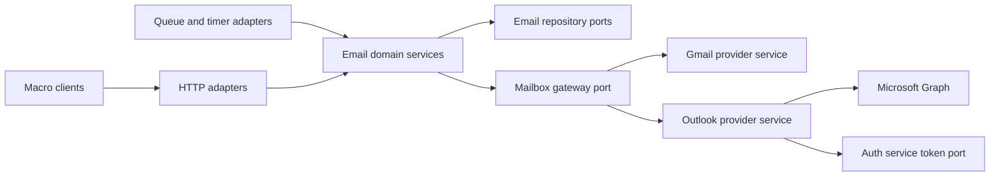

# Outlook email architecture and implementation plan

Status: implementation awaiting live testing, updated October 4, 2026. Account scope,
full-parity release target, and uncertain-send behavior are agreed. The working
branch includes the provider adapters, durable mailbox workers, shared API/UI
integration, contacts, settings, drafts, and calendar integration. Affected automated
suites and desktop/mobile recovery flows have passed; release approval and
live-provider verification remain outstanding.

The organizer-confirmed replacement flow and an “Open in Outlook” action for
resetting your own RSVP are approved and implemented. The cloud-reference attachment
difference is also approved: these open the original Outlook message and are
explicitly identified when forwarding; Graph v1.0 does not expose downloadable
bytes or a source-file URL for these references. Test-environment configuration
and live tests with both supported account families remain release gates.
Occurrence-specific reminders, automatic-reply recovery across reconnect, and
throttling have implementation and regression coverage.

New Outlook connections, sync, and writes have separate configuration switches,
defaulting off. Registration of the new email-service variables in Doppler is
blocked by the available credential's lack of access to that project; no remote
configuration has been changed. Live account verification has not started.

Implementation details hardened during review:

- OAuth attempts stage distinct encrypted grant versions. The active inbox retains
  its grant until an authorized initializer atomically adopts the new one; closing
  the consent browser cannot interrupt an existing connection.
- Authentication independently expires abandoned grants after 24 hours, including
  grants belonging to deleted accounts. Collection preserves mailbox, custodian,
  and in-flight initialization references and continues while new linking is off.
- Graph message/attachment identifiers remain provider-specific storage facts;
  Macro identifiers and normalized mail state remain the public product contract.
  Folder ancestry changes trigger trash re-evaluation even with an unchanged ETag.
- Import completion durably schedules attachment eligibility re-evaluation after
  all correspondence is ingested, including a repeated import or expired cursor.
- Conditional organization writes preserve proven draft ETag transitions without
  advancing the ingestion watermark. Draft edits, sends, transfers, and recovery
  remain fenced by mailbox generation and current ownership.
- Authorization and mutation policy live in the owning email/calendar/authentication
  domains. HTTP, Graph, Postgres, and queue adapters provide I/O and transaction
  enforcement; composition roots wire the provider implementations.
- Calendar AI tools expose the same provider capabilities as the editor and use
  provider-neutral instructions and errors. Conference requests therefore use the
  actual connected calendar's entitlement.

### Approved calendar replacement behavior

The organizer reviews the saved event, recurrence scope, guest count, and online
meeting choice, then explicitly acknowledges cancellation and reinvitation.
The replacement journal freezes those details, creates the new event, copies all
edited/cancelled occurrences (including outside the sync window), and conditionally
cancels the original. New invitations reset guest responses. “Open in Outlook”
resolves the actual provider link for an attendee's own RSVP, including moved
exceptions. This follows the accepted product decision; Graph cannot turn an
existing online event into an ordinary event ([Microsoft documentation](https://learn.microsoft.com/en-us/graph/outlook-calendar-online-meetings)).

Every provider command is recorded before execution. Only the caller that records
creation may initiate it; a lost response permits read-back by the stable creation
marker on the exact calendar, without a blind second POST. Conditional updates and
cancellations preserve externally edited versions. Background recovery and the
“Check progress”/“Continue replacement” controls resume the same operation after
client or service interruption. Unconfirmed creation never cancels the original.

Known provider meeting HTML is split at its exact DOM boundary, removing old
credentials and preserving user notes; retained Teams occurrences receive only
their new meeting details. Preview rejects native event attachments, unportable
custom time zones, and unrecognizable online-meeting markup before any provider
write, with an Outlook action for preserving those native details. These guarded
cases must be included in live verification and documented before release.

### Live verification handoff

Use dedicated Outlook.com and individual Microsoft 365 test mailboxes through the
normal Microsoft OAuth flow. Enable the deployment switches only in the test
environment after registering them in Doppler:

| Service | Switches (all default to `false`) |
| --- | --- |
| Authentication | `OUTLOOK_CONNECTIONS_ENABLED` |
| Email | `OUTLOOK_CONNECTIONS_ENABLED`, `OUTLOOK_SYNC_ENABLED`, `OUTLOOK_WRITES_ENABLED` |
| Calendar | `OUTLOOK_SYNC_ENABLED`, `OUTLOOK_WRITES_ENABLED` |

The calendar service's existing global sync switch must also permit work. Existing
Microsoft application credentials, redirect URI, public webhook routing, and KMS
configuration must be available in the test environment. The available Doppler
credential cannot register the email-service values; an authorized configuration
owner must finish that step before hosted testing.

Verify each account family against a Gmail inbox in the same Macro account:

1. Link and import folders, categories, contacts, native drafts, attachments, and
   older mail; compare folder and message counts with Outlook. Repeat an import.
2. Receive, reply, reply-all, forward, compose, schedule, cancel, and send. Exercise
   inline images, large attachments, changing the sender inbox, and simultaneous
   draft edits in Outlook and Macro.
3. Read/star/archive/trash/restore, category assignment, and sender policies from
   both clients. Move/delete folders, reconnect, disconnect, revoke consent, and
   check that identities, permissions, search, and collaboration remain intact.
4. Create/update/delete calendar events and recurring occurrences, reply to
   invitations, create Teams meetings where entitled, and verify email reminders
   and out-of-office auto-declines. Replace an organized event and a series with
   moved/edited/cancelled occurrences; verify reset responses, conference removal,
   descriptions, and recovery after interrupting creation or cancellation. Check
   an attendee's “Open in Outlook” link against the exact occurrence.
5. Interrupt sync and writes, recover an expired cursor, test uncertain outcomes,
   and observe at least two subscription renewals. Check that paused writes never
   cause automatic resend and that reconnect restores permitted work.

Real-provider results, account entitlements, and throughput remain release gates;
automated fixtures cannot establish those outcomes. The calendar replacement,
attendee Outlook action, and cloud-reference attachment differences are approved.

Add personal Outlook.com and individual Microsoft 365 mailboxes to Macro using
the existing email domain, provider interfaces, and message pipeline. Hutch's
work supplies the provider abstraction, Microsoft account linking, and encrypted
grant storage. The remaining work is a Graph provider implementation and reliable
mailbox orchestration.

The decisions to settle first are provider selection, credential ownership,
message identity, synchronization durability, and send recovery. This plan gives
each a proposed contract and a verification gate. The initial implementation
should prove those contracts on test mailboxes before enabling a full-parity release.

## Release scope

The release target is parity with Macro's existing Gmail experience for personal
Outlook.com and individual Microsoft 365 accounts. Development can proceed in
vertical slices, but a reduced email MVP is not a shipping milestone. Parity means
the features Macro currently offers, not every feature of Outlook or Gmail itself.

The first release supports:

- Existing Macro users connecting personal Outlook.com accounts or individual
  Microsoft 365 mailboxes in the Microsoft public cloud, including organizations
  other than Macro's own tenant.
- Multiple Gmail and Outlook inboxes in the same Macro account.
- Initial import and continuing sync of Inbox, Sent Items, Drafts, Archive,
  Deleted Items, Junk Email, and ordinary user-created mail folders.
- Existing thread display, search, attachment downloads, inline images, and
  mail-derived contacts/CRM behavior.
- Compose, reply, reply all, forward, attachments, and scheduled send through
  one durable delivery path.
- Read/unread, flag/unflag, archive, move to trash, and restore to Inbox.
- Reconnect, disconnect, sync status, and the existing browser/native return flow.
- Equivalent behavior for existing calendar/invitation flows, contacts,
  organization controls, sender policies, and draft editing. Audit the current
  Gmail product feature by feature and implement/test each counterpart before
  release; these are no longer blanket exclusions.

The agreed initial account scope excludes Microsoft shared/delegated mailboxes:
for example, a team support inbox or a mailbox another person lets you access.
This provider-level permission model is separate from sharing an already-linked
inbox or thread inside Macro; preserve Macro's existing collaboration behavior.
Application-wide tenant access, on-premises Exchange, sovereign clouds, and
separate online archive mailboxes remain outside the proposed account scope.
Microsoft sign-in as a new Macro login method is separate from connecting a mailbox.

Folders and categories need explicit semantics for the organization controls
Macro actually exposes. Do not declare parity by hiding a Gmail feature for
Outlook. Where Microsoft APIs cannot reproduce a behavior, investigate an
equivalent implementation and bring any material limitation back for a product
decision. Capability errors must be explicit, including missing consent.

Uncertain sends may show a confirming/unknown outcome while reconciliation runs;
an unresolved outcome requires deliberate user resend rather than automatic
duplication. The user can supply test accounts at the live-validation stage.
Contract and implementation work can start beforehand; account-dependent gates
remain unverified until the appropriate personal and organizational accounts exist.

## Recommended solution

**Build one provider-neutral email product contract and migrate Gmail through it
before enabling Outlook.** Retain the existing viewer, composer, Macro IDs, and
domain ownership. Complete the abstractions where Gmail semantics still leak.
The following decisions are the recommended implementation, subject to the
specific live-provider verification gates below.

| Area | Recommended decision | Why this fits the existing foundation |
| --- | --- | --- |
| Public API | Shared domain requests/results behind GraphQL and active REST routes. | Reuses current clients without making an unrelated transport migration a prerequisite. |
| Mailbox state | Explicit normalized state plus separately stored folders, tags, and provider metadata. | Removes label-string assumptions without discarding information or changing Macro identities. |
| Actions | Typed intentions and durable operation records. | Makes retries, optimistic state, and provider failures consistent. |
| Sync | One durable coordinator; provider-specific streams and checkpoint formats. | Shares correctness machinery while respecting different provider protocols. |
| Backfill | Initial enumeration feeds the same ingestion service as incremental sync. | Avoids separate normalization and side-effect implementations drifting apart. |
| Connection | Provider selection from stored mailbox binding; auth owns token lifecycle. | Extends the existing linking work and isolates credentials. |
| Drafts and send | Local draft revisions; frozen delivery commands; provider confirmation/reconciliation. | Preserves composer behavior while handling uncertain external outcomes. |
| Full parity | Extend the owning calendar/contacts domains and inventory every exposed action. | Includes the less obvious Google assumptions in the release work. |

**1. Public API: keep one contract across transports.**

Keep current GraphQL thread/message fields and Macro UUIDs. Add OUTLOOK to the
account provider enum and add normalized organization/state fields and operation
status. REST handlers and GraphQL resolvers call the same email domain services;
neither implements a second version of policy. Use GraphQL for new app-facing
state/actions where the client already uses it; retain active REST attachment,
upload, settings, and compatibility routes.

Clients select a mailbox by Macro link ID, never by access token or a provider
name that could override the stored binding. User operations pass the existing
typed access receipt or authenticated actor to the domain. The server resolves
the mailbox and authorization. Add generic connection initiation with an
explicit provider choice, while preserving the existing Gmail route as an alias.

Return backend-resolved original-message URLs and account branding. Keep sync
cursors, grant references, and provider protocol versions internal. Existing
opaque provider-ID fields may remain for compatibility, but are not operation
keys for new frontend code. A provider enum extension requires updated decoders,
generated clients, and workers before any Outlook account becomes visible.

Capabilities distinguish provider support, granted permissions, and actor access.
They explain setup or access failures; they do not turn an unimplemented Outlook
feature into an acceptable parity exclusion. Domain checks remain authoritative.

**2. Mailbox state: normalize facts without pretending folders are labels.**

Preserve independent read, flagged, draft, sent, inbox, trash, and junk facts.
Do not replace them with one mutually exclusive folder-state enum: a sent copy
can also appear in an inbox. Keep actual folder membership and sent-by-mailbox
provenance separate; moving a sent message must not erase its sending history.
Store typed organization entries with stable Macro IDs and kinds: folder or tag.
Gmail user labels and Outlook categories are tags; Outlook folders retain their
own identity, parent, and well-known role. The same display name never merges a
folder with a tag. Preserve raw provider values in a private binding record.

Provider adapters emit normalized facts. One email-domain policy derives thread
visibility, ordering, read state, and Signal/Noise; persistence adapters implement
that policy's queries/materialized projections. Replace literal label-name SQL
and client lookups. Backfill normalized Gmail fields from existing rows, then
compare old/new query results before switching readers.

During migration, derive legacy responses from the normalized projection and
update any still-required compatibility columns in the same transaction. Avoid
two independently writable representations. Preserve unique mailbox-scoped
provider bindings, existing Macro foreign keys, and stable cursor pagination.

For Signal/Noise, preserve the current decision order, including sender overrides,
known-contact rules, drafts/sent behavior, and system-message exclusions. Extract
provider classification as an input, not a SQL string: map Gmail categories to
normalized category evidence; map Outlook focused/other to attention evidence.
Retain an explicit unknown value with the existing no-category fallback. This
mapping is our product recommendation, not a claim that Microsoft's classifier
is identical to Gmail's. Test identical normalized facts through one policy.
[Graph message fields](https://learn.microsoft.com/en-us/graph/api/resources/message?view=graph-rest-1.0).

**3. Actions: express intent and return durable outcomes.**

Use commands such as SetRead, SetFlagged, Archive, MoveToTrash, RestoreToInbox,
AddTag, RemoveTag, and MoveToFolder. Existing generic label updates translate to
these commands when the label is a system role. User tag assignment remains a
separate operation. Do not send Gmail label IDs from the frontend to achieve an
Outlook action.

| Action | Shared meaning | Provider translation |
| --- | --- | --- |
| Read / flag | Set desired message state. | Gmail label changes; Outlook message properties. |
| Archive | Remove inbox membership from relevant messages, preserving existing user filing. | Gmail removes INBOX; Outlook moves current Inbox members to Archive. |
| Trash | Move applicable messages into recoverable trash. | Gmail trash operation/labels; Outlook Deleted Items. |
| Restore | Explicitly restore selected messages to Inbox. | Provider-specific restoration, with no promise to recover an unknown original folder. |
| Tag | Add/remove a non-exclusive organization tag. | Gmail user label; Outlook category. |
| Folder move | Change physical filing. | Outlook folder move; remains distinct from tag assignment. |

Persist command ID, actor, mailbox generation, payload hash, target set, sequence,
and status in the same transaction as the optimistic local projection and outbox
wakeup. Reusing an ID with different content is an error. Snapshot a thread's
eligible messages when the command is accepted; a later incoming reply is not
silently archived by an earlier command. Track per-message outcomes for partial
failures and serialize conflicting message operations.

Return operation ID, current projection revision, and status: pending, applied,
needs-reconciliation, or failed. Applied means provider work succeeded and its
result was recorded, not merely that a queue accepted a job. The client keeps
pending state across refreshes and can query status after a lost response.
Separate observed provider state from pending desired state so a stale sync
cannot erase a newer command. A later external edit can supersede a confirmed
command; do not enforce completed intentions forever. Failure recomputes the
projection from current facts and remaining commands rather than restoring an
old snapshot over newer changes.

**4. Sync: one correctness framework, different provider protocols.**

Extend the current ports into independent content-read, change-enumeration,
subscription, mutation, and delivery capabilities. Do not require every provider
to list/count native threads or implement Google's other-contacts endpoint.
Subscription identity/expiry are separate from sync checkpoints: subscribing
does not necessarily create a usable change cursor.

The email domain owns scheduling, retry policy, and state transitions. An
injected provider gateway resolves the stored provider and dispatches to the
appropriate composed services. Gmail has a mailbox history stream; Outlook has
one message stream per folder. Stream keys, opaque checkpoints, continuation
state, leases, lifecycle generation, and pending work are durable. Microsoft
documents both the per-folder requirement and separate continuation/checkpoint
links. [Message delta](https://learn.microsoft.com/en-us/graph/delta-query-messages).

Webhook handlers authenticate/validate and durably mark work before acknowledging.
Workers fetch bounded pages outside transactions, then commit page work and
cursor advancement together. Database work records are authoritative; queues
wake workers. A recovery sweep can find unpublished or unprocessed work.
Notifications, indexing, and CRM effects also use durable, deduplicated events.
Renew subscriptions, reconcile missed notifications periodically, and use
separate provider/live/import rate budgets.

Every provider removal is reconciled before it becomes a mailbox deletion.
Outlook uses immutable message IDs scoped to the mailbox; a folder removal can
be the old half of a move. Preserve Macro IDs, local metadata, and recoverable
tombstones. Expired cursors rebuild affected streams without blanking the inbox.
[Immutable identifiers](https://learn.microsoft.com/en-us/graph/outlook-immutable-id).

**5. Backfill and progress: share ingestion, allow unknown totals.**

One ingestion use case accepts normalized messages with an origin of import,
live sync, or reconciliation. All origins share storage and classification;
origin controls user-facing effects so historical mail never generates new-mail
notifications. Both origin and event identity survive retries.

For Gmail, keep its efficient enumeration during migration, capture a starting
history checkpoint before enumeration, and replay changes after it. For Outlook,
initial folder deltas become the incremental streams. Prioritize Inbox and Sent,
then cover every scoped folder. Do not truncate history to make a recent-mail
preview look like a completed import. Group messages into Macro threads using
mailbox-scoped provider conversation identity.

The public progress object reports phase, processed message count, nullable
total, completed/discovered folders, last successful reconciliation time, and
whether the inbox is usable. An exact denominator is optional; no fabricated
percentage or ETA. Count unique committed messages rather than replayed pages.
Report content and attachment readiness separately. Initial import is complete
only after required streams and durable projection work finish. Ongoing health
is fresh, catching-up, degraded, or requires reconnect; completing yesterday's
backfill is not evidence that today's sync is healthy.

**6. Accounts and credentials: finish the auth-owned lifecycle.**

Retain Hutch's encrypted grant storage and linking flow. Add an internal token
service used by email, calendar, and contacts, with provider-aware cache keys,
refresh coordination, grant versioning, and disconnect generation checks. No
worker decrypts refresh tokens directly. Only composition roots construct
concrete adapters; the gateway receives services through domain ports.

Request identity and mail permissions for connection, then the permissions
required for calendar, contact import, and mailbox rules/categories through
explicit feature consent. Proposed additions are Calendars.ReadWrite,
Contacts.Read, and MailboxSettings.ReadWrite; request Contacts.ReadWrite only if
the product inventory requires writing address-book entries. Full functionality
requires the relevant consent, but its absence must not destroy mail access.
Verify personal and cross-tenant Microsoft 365 linking, canonical identity,
revocation, and reconnect on real accounts before enabling connections.

**7. Drafts and delivery: preserve edits and model uncertainty.**

Use Macro as the authoritative store for active draft edits, with revision checks
and existing attachment storage. A provider-imported draft has a separate last
observed remote snapshot. The first local edit creates a local revision; sync
cannot overwrite it. Concurrent remote changes preserve both versions and
surface a conflict. This extends the current local draft model instead of
introducing a second autosave system in the client.

Immediate and scheduled sends freeze one draft revision into a durable delivery
command. Prepare a provider draft/snapshot, record its identity, then submit it.
Keep provider draft creation, attachment preparation, submission, and confirmation
as distinct recoverable steps. If draft creation times out, reconcile by command
correlation before creating another candidate; only one recorded candidate can
be submitted. Imported-source cleanup must not delete a newer remote edit.
Do not assume that a returned changeKey alone guarantees conditional writes;
verify supported concurrency behavior before relying on destructive cleanup.
If that guarantee is unavailable, preserve the remote source and expose the
conflict instead of guessing. [Draft update API](https://learn.microsoft.com/en-us/graph/api/message-update?view=graph-rest-1.0).

Replace the required immediate SentIds result with accepted/pending/confirmed/
unknown outcomes and optional provider IDs. Graph accepts a send without returning
a sent message body. A lost response leaves the same command under reconciliation;
it never automatically creates a second send. Confirmation records the sent copy,
not recipient delivery. A deliberate resend is a new command, as already agreed.
[Send response](https://learn.microsoft.com/en-us/graph/api/message-send?view=graph-rest-1.0).

**8. Full parity: include the owning domains and concrete provider mappings.**

| Feature | Recommended implementation | Specific validation |
| --- | --- | --- |
| Contacts and suggestions | Import address-book contacts by folder delta; feed existing mail-derived contacts/CRM. Build correspondent suggestions from shared interaction data rather than requiring a Google other-contacts clone. | Contact edits/deletions, multiple email addresses, photos, autocomplete, and duplicate identities. |
| Sender blocking | Persist sender policy; create a tracked Outlook inbox rule matching the exact sender and moving incoming mail to Deleted Items. Reconcile rules and distinguish Macro-managed from external rules. | Rule ordering, pre-existing rules, external edits, account quotas, and both account families. |
| Tags/categories | Map the existing user-label experience to Outlook categories while storing folders separately. Track stable local organization IDs and provider bindings. | Assignment, removal, catalog deletion, and external changes; category rename is a migration if an exposed feature needs it. |
| Calendar and invitations | Add provider-neutral calendar ports in calendar_events and a Graph adapter in calendar_service. Reuse current event views, permissions, reminders, and invitation resolution. | All calendars, RSVP, recurring exceptions, time zones/DST, reminder updates, and cancellation. |
| Conferencing and out-of-office | Model requested behavior independently from Google Meet and Google's out-of-office schema. Select supported conference creation for the target calendar; map ordinary availability to Outlook out-of-office. | Provider account limitations, conference removal, recurrence edits, and automatic invitation decline. These require verified equivalents before claiming parity. |
| Macro collaboration and attachments | Keep Macro access policy, sharing, search, notifications, storage, and rendering shared. Download/forward attachments through selected provider ports. | Mixed accounts, identical-looking provider IDs, inline images, forwarded files, shared threads, and reconnect. |

The rule API supports delegated personal and work accounts with mailbox-settings
permission; exact-sender conditions and move actions are documented. Keep policy
pending until provider confirmation, and never silently remove a user's unrelated
rules. A pre-existing rule that prevents the expected outcome is a surfaced
conflict requiring reconciliation, not a successful block.
[Create rule](https://learn.microsoft.com/en-us/graph/api/mailfolder-post-messagerules?view=graph-rest-1.0),
[sender predicates](https://learn.microsoft.com/en-us/graph/api/resources/messagerulepredicates?view=graph-rest-1.0),
[rule actions](https://learn.microsoft.com/en-us/graph/api/resources/messageruleactions?view=graph-rest-1.0).

Graph exposes contact-folder deltas. Category names cannot be renamed in place
through the documented API, so do not promise that a display-name update is a
single PATCH. Existing Macro label routes expose create/delete; avoid inventing
extra label features as part of parity.
[Contact delta](https://learn.microsoft.com/en-us/graph/api/contact-delta?view=graph-rest-1.0),
[category behavior](https://learn.microsoft.com/en-us/graph/api/resources/outlookcategory).

For calendar sync, keep the existing materialization window and use documented
delta support where available. The stable delta documentation describes the
primary calendar; secondary calendars can use bounded complete calendarView
reconciliation, with no deletion by absence until every page succeeds. This
provides calendar coverage without depending on a beta endpoint. Advancing the
window starts/reconciles a new range rather than reusing a token for other dates.
[Calendar delta](https://learn.microsoft.com/en-us/graph/api/event-delta?view=graph-rest-1.0),
[calendarView](https://learn.microsoft.com/en-us/graph/api/calendar-list-calendarview?view=graph-rest-1.0).

The current calendar schema explicitly offers Google Meet and out-of-office
auto-decline. Outlook's event schema has different conferencing and availability
properties. A custom decline scheduler or a conference replacement would have
additional behavior and failure modes; do not silently substitute one. Build and
validate the equivalents, then present any remaining material limitation with
its exact user impact. Full parity stays the release gate.
[Current calendar contracts](../../crates/calendar_events/src/domain/models.rs),
[Graph event model](https://learn.microsoft.com/en-us/graph/api/resources/event?view=graph-rest-1.0).

**Implementation and acceptance order.**

1. Freeze a behavior matrix from current app, AI tool, GraphQL, REST, calendar,
   and background-worker flows. Add shared contract tests for the seams above.
2. Add normalized state, provider bindings, command/sync records, and compatible
   API fields. Migrate Gmail reads first with old/new result comparisons. Switch
   Gmail actions behind a flag and test recovery before enabling the new path.
3. Add Graph reads/auth and initial/incremental sync using the completed contracts.
   Run the account-dependent verification gates as soon as test accounts arrive.
4. Add mutations/delivery and full calendar/contact/organization parity. Run the
   same frontend behavior tests against Gmail and Outlook, plus provider-specific
   wire tests and injected-failure tests.
5. Release Outlook only when the parity matrix and reliability gates pass. Deploy
   compatible readers/workers before exposing rows. Use separate switches for
   connections, sync, and new writes; reconciliation of submitted work stays on.

Gmail correctness is the first acceptance gate, not something to discover after
Outlook rollout. Application-owned tests can run before test accounts exist;
provider concurrency, tenant consent, and behavioral equivalence remain explicit
empirical gates. This proposal does not represent those gates as already proven.

## How generic is the existing email stack?

**The frontend read model is largely reusable. The application boundary is
partially generic, and provider execution is still substantially Gmail-specific.**
Hutch's interfaces are a useful foundation, but implementing an Outlook HTTP
client behind them would not by itself produce a working Outlook integration.
This audit describes checkout `5678f9bd777413f66e8bddac58f13f21150d831b`, not a
claim about a newer deployment.

| Layer | What is reusable | What still needs work |
| --- | --- | --- |
| GraphQL thread/message reads | Macro IDs, mailbox link IDs, body, recipients, attachments, read/starred/draft state, pagination, and access checks. | Labels still carry provider IDs. Some underlying classification/filter logic relies on Gmail label names. |
| GraphQL mailbox catalogs | User-scoped links, settings, labels, and coarse sync status go through email domain ports. | `GraphqlEmailProvider` accepts only Gmail. Label types/visibility reflect Gmail; there is no distinct folder/category contract. |
| GraphQL mutations | Seen/unread/archive and draft inputs already express useful Macro operations. | The domain still resolves INBOX/UNREAD labels and enqueues Gmail label operations. A generic input does not imply generic execution. |
| REST and frontend client | Most routes and response objects use email/thread/message/link terminology. GraphQL messages map into the existing viewer model. | The app uses both REST and GraphQL. Backfill listing calls `/email/backfill/gmail`; older unread and trash flows look up literal provider label IDs. |
| Frontend sync notifications | Upsert/delete/label refresh, link IDs, cache invalidation, and coarse status can be reused. | Progress requires `completed_threads` and `total_threads`, and ETA assumes a known total. Healthy status is derived mainly from initial backfill and grant flags. |
| Provider client ports | Normalized messages, attachments, errors, and injected token/rate-limit services. | Thread count/listing, label operations, Gmail-only cursors, and send-result assumptions need extension. Production composition selects only Gmail. |
| Continuous synchronization | Reusable normalization, persistence, attachment, search, notification, and CRM work exists after fetching. | Notification orchestration uses numeric Gmail history, Gmail queues, and Gmail token/budget wiring. Shared message classification also needs normalization. |
| Backfill | Job tracking, retries, storage, downstream processing, and outbox patterns. | Enumerates Gmail threads in batches of 500, requires total thread counts, and prioritizes CATEGORY_PERSONAL. Outlook needs message/folder enumeration. |
| Connection and delivery | Linking groundwork, local draft model, scheduled-delivery service boundaries, and shared rendering. | Active connection/reconnect UI uses Gmail; initialization assumes Google grants; the delivery adapter binds to `GmailApi`. |

The evidence is in the [GraphQL message fields](../../crates/graphql_email/src/objects.rs),
[mailbox objects](../../crates/graphql_email/src/user_objects.rs),
[mutation boundary](../../crates/graphql_email/src/mutation.rs), and
[GraphQL-to-viewer mapper](../../apps/web/src/lib/queries/email/graphql/mapper.ts).
The mapper is strong evidence that Outlook should use the existing message viewer.

The less obvious coupling is below the response types:
[thread actions](../../crates/email/src/domain/service/thread_labels.rs) resolve
system labels and call `enqueue_gmail_ops_modify_labels_batch`;
[message classification](../../crates/models_email/src/email/service/message.rs)
uses INBOX, TRASH, and SPAM; and
[thread queries](../../crates/email/src/outbound/email_pg_repo/thread.rs) use Gmail
category names for signal/noise decisions. Returning the same JSON shape is not
enough if Outlook messages land in the wrong view or trigger the wrong action.

On the frontend, [trash](../../apps/web/src/features/next-soup/utils.ts) looks up
TRASH, while the [unread fallback](../../apps/web/src/lib/queries/email/thread.ts)
looks up UNREAD. The GraphQL unread path is already better: it passes a thread ID
and leaves resolution to the server. Generalize remaining actions in that direction.
[Progress state](../../apps/web/src/lib/queries/email/backfill.ts) and
[refresh events](../../apps/web/src/lib/queries/email/sync.ts) need a progress unit,
optional total, and trustworthy completion/error semantics.

The architectural target is one frontend email experience: Macro-owned message
state and folder/category roles on reads; intent-based commands such as archive,
trash, set-read, and flag on writes; provider identity mainly for connection,
account branding, and opening the original. Keep raw provider history/delta
cursors behind the backend. Preserve opaque provider IDs only where needed.
Gmail labels and Outlook folders/categories translate at the provider boundary;
do not scatter Outlook branches through readers, composers, or list rendering.

**Acceptance gate:** the same public contract and frontend action tests run
against both providers, with mixed-provider mailboxes in one Macro account.
Cover GraphQL and still-active REST paths, inbox/trash/signal classification,
attachments/drafts, reconnect, progress with unknown totals, and delivery outcomes.
This is a focused refactor of real contracts plus a new provider implementation,
not a frontend rewrite and not merely plugging in a second HTTP client.

## Existing foundation

| Work | Reuse decision |
| --- | --- |
| [Provider-neutral email client, merged #5490](https://github.com/macro-inc/macro/pull/5490) | Keep its capability ports and error model; extend the contracts that assume Gmail semantics. |
| [Microsoft identity provider, merged #5607](https://github.com/macro-inc/macro/pull/5607) and [account linking, merged #5635](https://github.com/macro-inc/macro/pull/5635) | Retain the linking flow; harden account identity, tenant validation, and callback consumption. |
| [Encrypted Microsoft grants, merged #5739](https://github.com/macro-inc/macro/pull/5739) | Retain KMS/envelope encryption and persistence; add the runtime grant service. |
| [Provider schema, unmerged #5749](https://github.com/macro-inc/macro/pull/5749) | Recover useful types and tests. Generate fresh migrations after revising the per-folder sync model. |
| [Earlier Graph prototype, unmerged #3887](https://github.com/macro-inc/macro/pull/3887) | Consult its wire models and conversions. Verify each reused piece against current interfaces and Graph behavior. |

Current constraints are visible in the
[Gmail-only composition](../../services/email_service/src/outbound/email_api/mod.rs),
[Google token source](../../services/email_service/src/outbound/email_api/token_source.rs),
[mailbox initialization](../../services/email_service/src/api/email/init.rs),
[sync cursor model](../../crates/email_api_client/src/domain/models/changes.rs), and
[thread-based backfill](../../services/email_service/src/pubsub/backfill/list_threads.rs).

## Domain ownership and provider selection

**Decision: preserve one email domain and select a provider from the persisted
mailbox binding.**

| Component | Responsibility |
| --- | --- |
| `crates/email/src/domain` | Mailbox access policy, setup and teardown, sync state transitions, mutation intent, delivery state, and capability enforcement. Add focused services/ports alongside existing services. |
| `crates/email_api_client/src/domain` | Provider operation contracts, normalized content, typed identities/cursors, capabilities, and classified provider outcomes. |
| `crates/email_api_client/src/outbound/outlook` | Graph requests, wire models, pagination, conversion, and provider error mapping, behind an `outbound-outlook` feature. |
| Existing calendar and contacts domains | Own their current product behavior and provider contracts; email orchestration calls their services rather than duplicating their policy. |
| Auth-owned Microsoft grant service in `authentication_service` | OAuth lifecycle, identity validation, grant ownership, refresh coordination, and revocation. Put policy in a domain module behind storage, cipher, clock, and OAuth ports. |
| Email/auth outbound adapters | Implement persistence, queue publication, token acquisition, and external domain calls. Reuse existing owning storage utilities through these adapters. |
| `services/email_service` composition roots | Construct concrete providers, token sources, limiters, domain services, and workers. HTTP and queue adapters translate requests into use-case calls. |

Expose one mailbox gateway to email use cases. Resolve a typed mailbox context
containing link ID, provider, grant reference, and lifecycle generation through a
domain port. Its provider discriminator comes from storage, and its grant must be
bound to that same mailbox. The gateway adapter receives the two composed provider
services through injection; only composition roots name their concrete outbound
implementations. Runtime dispatch stays at this boundary.

External calls receive the selected mailbox context. User-facing operations pass
the repository's typed access receipt or authenticated actor into the email
domain, which checks mailbox access and capabilities. Queue jobs carry internal
mailbox identity plus generation and are rejected when stale. Client-supplied
provider names, email addresses, and queue payloads cannot select arbitrary grants.

The runtime path is:

Check the [hexagonal boundary rules](../../.agents/skills/cloud-storage-hexagonal-architecture/SKILL.md)
on every implementation slice. Extract policy from touched legacy handlers into
focused domain services. Keep unrelated email rewrites outside this change.
Cross-domain work calls the owning service/port; outbound adapters do not import
another domain's outbound implementation.

**Gate:** the same user can access one Gmail and one Outlook link in a contract
test, and every operation reaches the matching token source, provider, and quota
budget. Foreign links and mismatched grants are rejected before external calls.

## Credentials and account identity

**Decision: the authentication service owns Microsoft refresh tokens and their
lifecycle. Email workers receive short-lived access tokens through an internal
service port.**

Use a server-side authorization-code flow with PKCE, a nonce, expiring random
state, and a pending link bound to the initiating Macro actor. Consume the callback
and completed link exactly once with retry-safe state transitions. Persist the
provider and actual granted scopes so email initialization cannot interpret an
Outlook callback as a Google grant. Preserve return-URL validation and native
handoff behavior. Microsoft documents the account endpoints and PKCE flow in its
[authorization-code guidance](https://learn.microsoft.com/en-us/entra/identity-platform/v2-oauth2-auth-code-flow).

Support multi-tenant and consumer issuers with verified OIDC metadata, signing
keys, audience, issuer/tenant consistency, lifetime, and nonce checks. Replace the
current fixed-tenant assumption with this explicit policy. Treat access tokens as
opaque. Validate mailbox access through Graph before provisioning the inbox.

Give each grant a stable internal reference. Record the verified issuer/subject,
tenant, and Graph mailbox identity alongside it. Email address is display/routing
metadata, so an alias or address change does not change credential ownership.
Scope provider message identities to the stable mailbox/link. Adapt encryption
context carefully because the existing cipher binds tokens to owner and mailbox
email; migrate or re-encrypt existing envelopes without losing their context.
Legacy grants that cannot be verified require reconnect.

The proposed scope set is `openid profile email offline_access User.Read
Mail.ReadWrite Mail.Send`. Full parity also requires the least-privilege contacts
and calendar scopes appropriate to the inventoried features. Validate the complete
set, incremental consent, and organization consent behavior during
the first spike. Derive the allowed sender from the verified mailbox; arbitrary
aliases and send-as addresses require a separately verified capability.

Refresh uses a persisted lease and versioned compare-and-swap so concurrent
workers cannot overwrite a newer grant or resurrect a disconnected one. Persist
replacement tokens before publishing the access-token result. Cache keys include
the grant identity and generation; expiry comes from the provider response.
Transient failures retain the grant, while confirmed revocation records a
reconnect requirement. Microsoft returns replacement refresh tokens and does not
immediately revoke the old token on refresh; recovery must reflect that behavior.
[Refresh-token semantics](https://learn.microsoft.com/en-us/entra/identity-platform/refresh-tokens).

Disconnect disables local use immediately, invalidates token caches and jobs,
then retries remote subscription cleanup. Delete grant material through its auth
owner once it has no authorized consumers. Never transfer a grant merely because
two Macro users present the same email address.

**Gate:** simultaneous refreshes, reconnect during refresh, disconnect during
refresh, callback replay, wrong actor, wrong issuer, insufficient consent, and
alias changes all preserve the correct mailbox/grant binding.

## Message identity and mailbox semantics

**Decision: use Graph immutable message IDs, keep folders distinct from
categories, and express writes as mailbox actions.**

Set `Prefer: IdType="ImmutableId"` consistently on applicable requests,
subscriptions, and delta calls. Store IDs case-sensitively and never rewrite them.
Graph documents that these IDs survive moves within a mailbox; a move into a
separate archive mailbox has different identity behavior.
[Immutable IDs](https://learn.microsoft.com/en-us/graph/outlook-immutable-id).

Use `(link_id, provider_message_id)` as the provider message identity and
`(link_id, conversation_id)` for Outlook thread grouping. Preserve Macro's UUIDs
and local metadata across refreshes and moves. Keep RFC Message-ID as distinct
threading metadata. Recover the parent provider-message identifier work in #5749
for replies. Avoid global deduplication by RFC Message-ID or subject.

Graph exposes `parentFolderId`, categories, read state, flags, and conversation
identity as distinct message properties. Preserve those facts in conversion.
[Message model](https://learn.microsoft.com/en-us/graph/api/resources/message?view=graph-rest-1.0).

| Macro intent | Proposed Outlook behavior |
| --- | --- |
| Read/unread | Set the message read state. |
| Star/unstar | Set or clear the follow-up flag. |
| Archive | Move Inbox messages to the mailbox's Archive folder; leave already-filed messages in their folders. |
| Trash | Move to Deleted Items. |
| Restore | Move to Inbox; label the action accordingly rather than implying recovery of the original folder. |
| User folder/category | Preserve distinct provider identities and kinds; implement the organization actions present in Macro's Gmail experience. |

Domain commands describe intent, such as `SetRead` or `MoveToTrash`, and expand
thread actions into the relevant messages. The Gmail adapter can translate the
same commands to its existing label operations. A single capability model drives
the server and UI; unavailable permissions never pass through no-op providers.

Macro-authored drafts remain local while being edited; a provider draft is
created when delivery preparation starts. Imported Outlook-authored drafts use
the local-revision and separate remote-snapshot model proposed above. Preserve
concurrent edits and require verified version checks for destructive remote
cleanup. Read-only imported drafts would be a parity gap. Correlate
Macro-created provider drafts back to the local draft so sync does not display a
duplicate. External changes to a prepared draft require reconciliation before
submission; they must not silently change the frozen send payload.

**Gate:** moving a message preserves its Macro identity, links, attachments, and
thread state. A folder and a category with the same display name stay distinct.

## Durable import and synchronization

**Decision: use per-folder delta streams, durable work records, and idempotent
projection into the existing message pipeline.**

Graph message deltas are per folder and return opaque continuation or delta URLs.
Initial and incremental synchronization can use the same delta mechanism.
[Message delta protocol](https://learn.microsoft.com/en-us/graph/delta-query-messages).

Introduce a stream contract that distinguishes mailbox-wide Gmail history from
Outlook folder streams. Keep committed delta checkpoints separate from in-flight
page continuations. Enumeration returns bounded pages and explicit completion;
an exact thread count is optional. Outlook import processes messages and derives
threads locally, avoiding a requirement to count/list Gmail-style threads first.

Proposed storage responsibilities, with final names decided in the schema PR:

| Record | Key and invariant |
| --- | --- |
| Mailbox provider binding | Existing link ID; provider, grant reference, and lifecycle generation must agree. |
| Folder catalog | Link plus provider folder ID; parent, well-known role, and catalog generation. |
| Sync stream | Link plus typed stream ID; checkpoint, continuation, status, dirty generation, lease/fencing version, last successful reconciliation. |
| Subscription | Provider subscription ID; link, lifecycle generation, resource, expiry, client-state verifier, and cleanup status. Allow temporary replacement overlap. |
| Pending projection work | Stream/page and message identity; idempotency key plus retry/quarantine state. |
| Publication outbox | Durable wakeups and downstream effects committed with the facts that require them. |

Reuse the existing backfill outbox pattern, but put new transaction operations
behind the email repository ports. Keep new email tables under the email domain's
ownership. Store provider URLs as sensitive opaque values, and validate their
scheme/host before attaching credentials or following redirects.

The synchronization sequence is:

1. Discover ordinary mail folders and create streams. Resolve well-known folder
   roles through provider identifiers, independent of localized display names.
   Refresh the catalog periodically and reconcile additions, moves, and removals.
2. Establish a mailbox notification subscription and start initial folder deltas.
   Prioritize Inbox and Sent Items, then other folders. Continue until all pages
   finish; initial progress reports messages/folders processed without inventing
   an exact mailbox thread total.
3. A notification marks work dirty durably and records a wakeup before HTTP
   acknowledgement. It is a hint to reconcile provider state. Periodic sweeps
   cover missed notifications and folder catalog changes. Use the message's
   last-known/current parent folders to target streams when possible; unknown
   routing falls back to a bounded mailbox sweep.
4. A worker claims a stream with a fencing version, fetches a page outside the
   database transaction, then atomically persists pending projection work and
   the next page/checkpoint. A stale worker cannot advance that stream.
5. Project pending messages through shared normalization/storage and durable
   downstream effects. Coalesce repeated IDs and use per-message serialization
   or versioned dirty work so old deliveries cannot overwrite newer state. Read
   current provider state when reconciling a dirty message.
6. Mark the mailbox current only after its required streams are caught up and
   durable projection work has completed. Cursor progress alone is insufficient.

Outbox publication is at least once. Give downstream events stable identifiers
and make notification/index/CRM consumers deduplicate or apply idempotently.
Record projection and required event work together so a retry after a successful
insert cannot silently omit its fan-out. Keep provider fetches outside database
transactions.

Folder removal events require reconciliation. A message disappearing from one
folder may have moved elsewhere. Check its current immutable-ID location and
reconcile folder membership before changing its mailbox visibility. Confirmed
absence produces a recoverable tombstone; it does not immediately delete stored
bodies, local metadata, or attachment blobs. Repeat reconciliation for transient
404s and catalog changes. Incomplete scans never authorize deletion by absence.

An expired cursor starts a new generation for the affected stream while keeping
the existing projection available. Sweep obsolete membership only after that
generation completes. Jobs from a disconnected/recreated link cannot write into
the new generation. Failed records remain retryable or visibly quarantined, and
prevent a false healthy status.

Webhook adapters implement Microsoft's validation handshake and validate each
subscription/client-state binding. Use basic notifications and fetch content
through Graph. Renew subscriptions before their returned expiry, recover from
lifecycle notifications, and tolerate duplicate notifications during replacement.
[Webhook delivery](https://learn.microsoft.com/en-us/graph/change-notifications-delivery-webhooks),
[Outlook subscription lifecycle](https://learn.microsoft.com/en-us/graph/outlook-change-notifications-overview).

**Gate:** terminate workers before/after every persistence and publication step;
replay pages and notifications; expire leases/cursors; move messages while import
runs. The final projection must converge without lost work or duplicate user
notifications. Delay attachment processing without losing the message or
misreporting completion.

## Sending and mutation recovery

**Decision: make sending a durable state machine with an explicit ambiguous
outcome.**

The current [scheduled delivery contract](../../crates/email/src/domain/scheduled_delivery.rs)
claims work, sends it, and releases the claim on failure. Outlook needs to retain
provider preparation/submission state across failures. A Graph send returns
`202 Accepted` with no response body, while a sent copy may become visible later.
[Send API](https://learn.microsoft.com/en-us/graph/api/message-send?view=graph-rest-1.0),
[sent-copy lookup](https://learn.microsoft.com/en-us/graph/outlook-immutable-id).

Persist one command ID and immutable payload version for each send. Proposed
states are `Pending`, `Preparing`, `Prepared`, `Submitting`, `Submitted`,
`Confirmed`, `Ambiguous`, and `Failed`. Record the provider draft identity before
submission. Immediate and scheduled sends use this same service, including
ownership checks, due-time checks, and cancellation before submission begins.
`Submitted` means the provider accepted the request; `Confirmed` means its sent
copy was reconciled. Neither state claims delivery to the recipient. Only a
definitive rejection enters `Failed`.

Create a Graph draft with a Macro correlation identifier using a supported
extended property. Verify lookup, reply-draft compatibility, and persistence into
Sent Items in the spike. Use provider reply/reply-all/forward operations where
needed to preserve conversation semantics. Prepare inline and regular attachments
before submission; use upload sessions for supported larger attachments and
enforce a tested size limit before accepting the command.
[Extended properties](https://learn.microsoft.com/en-us/graph/api/singlevaluelegacyextendedproperty-post-singlevalueextendedproperties?view=graph-rest-1.0),
[reply drafts](https://learn.microsoft.com/en-us/graph/api/message-createreply?view=graph-rest-1.0),
[attachment uploads](https://learn.microsoft.com/en-us/graph/api/attachment-createuploadsession?view=graph-rest-1.0).

A timeout or crash after submission starts triggers reconciliation by recorded
draft identity/correlation. It never automatically creates and sends another
message. Draft visibility alone is not proof that an in-flight send failed.
Retain ambiguity when the provider cannot establish an outcome, expose it to the
user, and make an intentional resend a separate command. This avoids claiming
exactly-once delivery from an external API that provides no such contract.

Regular mailbox mutations carry an operation ID and desired state. After an
uncertain move, read the current folder before retrying. Serialize conflicting
operations on the same message, persist provider outcomes, and reconcile external
edits. Optimistic UI changes roll back only on definitive failure.

Classify errors by operation: reads can retry transient failures; sends/moves may
first need reconciliation. Respect `Retry-After`, apply bounded concurrency and
backoff, and maintain separate live/backfill budgets. The Gmail quota cost table
does not determine Graph limits.
[Graph throttling](https://learn.microsoft.com/en-us/graph/throttling).

**Gate:** simulate an accepted send followed by a lost response, failed database
commit, or duplicate queue delivery. One command must not produce a second
automatic send. Verify new mail, replies, forwards, scheduled cancellation,
attachments, and sent-copy reconciliation in both account families.

## Implementation sequence

Each slice includes its contracts, focused tests, and a demonstrable outcome.
Review the proposed decisions above before enabling their dependent features.

| Phase | Deliverable | Exit condition |
| --- | --- | --- |
| 0. Validate provider behavior | Disposable personal and Microsoft 365 mailboxes; small Graph/OAuth spikes; sanitized fixtures; final capability and identity contracts. | Prove cross-tenant consent, folder moves/deltas, immutable IDs, draft correlation, reply grouping, and send reconciliation. Revise this design where evidence disagrees. |
| 1. Provider boundary and schema | Typed mailbox gateway, intent/capability model, provider-tagged pending links, additive sync/delivery storage, fresh migrations. | Gmail contract tests pass; mixed-provider routing and incompatible bindings are covered. No Outlook rows exposed to incompatible deployed readers. |
| 2. Auth lifecycle | Grant service, runtime token endpoint/client, refresh coordination, reconnect/disconnect, issuer validation. | Credential gate passes, including concurrent refresh and lifecycle races. |
| 3. Import and read path | Graph reads/conversion, folder catalog, durable delta work, shared message/attachment ingestion. | A connected mailbox imports into existing Macro threads and search; crash/replay tests pass. |
| 4. Continuous sync | Webhook ingress, renewal/cleanup workers, periodic sweeps, cursor recovery, current/error status. | Folder moves, offline edits, missed notifications, and expired subscriptions converge. |
| 5. Mailbox writes and delivery | Intent-based mutations, durable Graph drafts/send outcomes, attachment preparation, scheduled sends. | Mutation and send gates pass with injected failures and real test-account round trips. |
| 6. Feature parity | Existing calendar/invitation and contacts behavior, sender policies, organization actions, imported drafts, and Macro collaboration. | Every current Gmail product feature has a tested counterpart or an explicitly resolved provider limitation. |
| 7. Product integration and rollout | Outlook connect option, capability-aware UI, sync/reconnect/ambiguous-send states, native return tests, dashboards and rollout controls. | Full-parity mixed-inbox testing and a monitored canary meet the release criteria. |

Phase 0 should be timeboxed to roughly 2–4 engineering days once test accounts and
app registration are available. Start the static feature inventory and provider
contract work before those accounts arrive; run live validation before locking
behavior that depends on Microsoft. The earlier 4–6 week beta estimate does not
apply to the agreed full-parity release. Re-estimate after the inventory and spike
resolve tenant setup, draft behavior, calendar/contacts work, and shared ingestion.

## Verification and rollout

Test the invariants at the domain layer with fake clocks and ports, then test
Graph wire behavior with recorded/sanitized fixtures and HTTP mocks. Use live
local Postgres for transaction, uniqueness, fencing, and outbox tests. Real test
mailboxes cover behavior mocks cannot establish.

| Failure or boundary | Required result |
| --- | --- |
| Wrong actor, foreign grant, callback replay | No access or provider call. |
| Concurrent refresh and reconnect/disconnect | New grant wins; revoked generations stay unusable. |
| DB failure before durable webhook acceptance | Provider receives retryable failure; no false acknowledgement. |
| Crash after checkpoint/work commit but before queue publication | Outbox recovery eventually processes the work. |
| Duplicate/out-of-order events and expired worker lease | State converges; stale workers cannot commit progress. |
| Move, delete, new folder, or folder deletion during import | No mistaken permanent deletion or identity replacement. |
| Expired delta cursor | Targeted rebuild retains existing data until a complete reconciliation. |
| Throttling and long provider outage | Work remains durable; live operations retain quota; status shows degradation. |
| Accepted send with lost response or failed local completion | Reconcile existing command; no blind resend. |
| Mixed Gmail/Outlook and same-looking IDs | Provider state, caches, grants, and local metadata remain isolated. |
| Calendar/contact consent absent or revoked | Mail access remains correctly scoped; reconnect/permission flows are explicit and restore the missing parity features. |
| Gmail feature matrix | Every exposed behavior is validated for Outlook, including classification, calendar, contacts, sender policies, and imported drafts. |
| Old app/worker version during deployment | Additive schema remains usable; unsupported provider rows/jobs stay gated. |

Generate migrations with `sqlx migrate add`, refresh the root SQLx cache through
the documented Nix workflow, and run affected package tests from the repository
root with `SQLX_OFFLINE` unset. Packages will include `email`, `email_api_client`,
`email_service`, `authentication_service`, and the touched auth/storage/client
crates. Run `just check`, `just check full`, and the relevant frontend tests as
appropriate to each slice. Update the [app agent guide](../AGENT_GUIDE/README.md)
with changed connect/composer flows and exercise them in the browser/native shell.

Ship additive schema first, then provider-aware readers/workers, then enable
Outlook account creation. Audit REST, GraphQL, SDK, search/index workers, refresh
handlers, and cached/native clients for exhaustive provider assumptions. Keep
new queue payloads away from old consumers until every consumer can decode them.

Use separate controls for new connections, provider mutations/sending, and sync.
Disabling new connections leaves existing inboxes operational. Pausing sync keeps
durable work for recovery. A send kill switch still permits reconciliation of
already-submitted commands. Roll back to a provider-aware release; do not deploy
Gmail-only enum readers against visible Outlook rows.

Canary first with dedicated accounts, then opt-in users. Proposed release targets
are no lost messages or duplicate automatic sends in fault tests, no cross-inbox
access, healthy renewal across two actual subscription cycles, and p95 live sync
under one minute when Graph is healthy and not throttling. Measure import
throughput on representative mailbox sizes before setting a public expectation.
Track stream lag, pending/quarantined work, renewal headroom, refresh failures,
429s, and ambiguous sends. Logs exclude tokens, cursor URLs, message bodies, and
attachment content.

## Agreed scope and remaining architecture review

The user has agreed to individual Outlook.com and Microsoft 365 accounts first,
full product parity before release, and explicit unresolved-send behavior. Test
accounts can be provided for live validation. Microsoft shared/delegated mailbox
support is outside the initial account scope.

The architectural recommendations remain:

1. Retain one frontend email experience and normalize state/action semantics at
   the backend boundary; verify both GraphQL and REST contracts.
2. Keep one email domain, one provider-selection boundary, and auth-owned grants.
3. Adopt per-folder durable delta streams with atomic checkpoint/work persistence.
4. Preserve immutable message identity and reconcile moves before tombstoning.
5. Use a durable send state machine and expose unresolved outcomes honestly.

The remaining empirical questions belong to Phase 0: exact consent requirements,
canonical identity for both account families, correlation lookup through
reply/send, external edits to prepared drafts, and mailbox-scale import
throughput. Record the answers here before finalizing migrations and public API
contracts.
