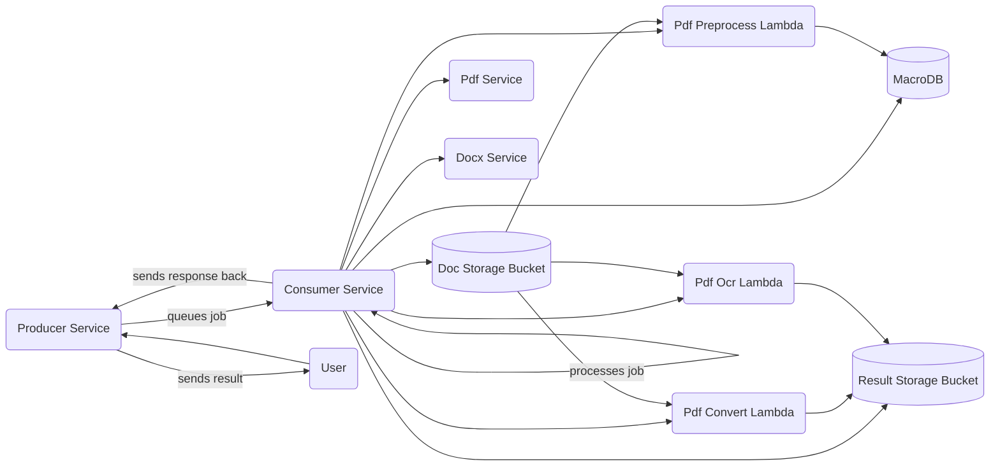

# Document Processing

Contains all items related to how the Web app will handle async document
processing.

## Usage

You can use the `/docs` endpoint for a full swagger.

## Local Development

*First time*

The first time you run the pdf/docx services, since they use the ECR image you
will need to first login to ECR docker registry so the images can be pulled.
`aws ecr get-login-password --region us-east-1 | docker login --username AWS --password-stdin 569036502058.dkr.ecr.us-east-1.amazonaws.com`

The producer service is available at `http://localhost:4000`
The consumer service is available at `http://localhost:4001`

## Deployment

To learn more read the [infra](./infra/README.md) documentation.

## More Information

I highly encourage you to read through the README.md of each sub-folder in
the `document-processing` space to learn more about everything that is part of
this ecosystem.

## Diagram

