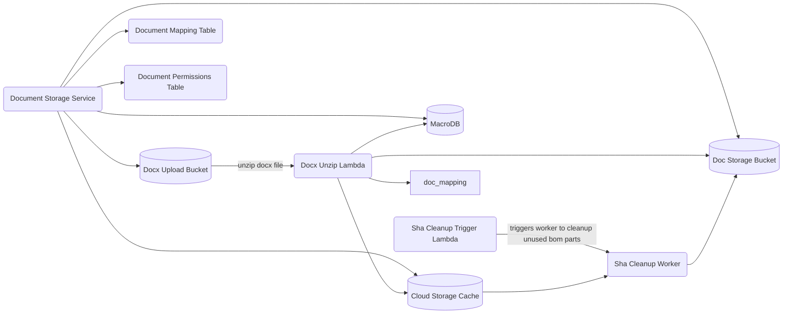

# Cloud Storage

This folder contains all the service(s) and infra for the document storage.

## Prerequisites

- docker
- sqlx-cli
- just
- pulumi cli
- aws cli

# Testing

To run tests locally, run the following commands:

```bash
docker volume create macro_db_volume
docker-compose up -d macrodb
just setup_test_envs
just initialize_dbs
just test
```

## Deployment

To learn more read the [infra](./infra/README.md) documentation.

## Instructions

- If you haven't built anything in his project before you will need to run `just build_lambdas`
- cd `infra`
- install node modules `npm i`
- ensure you are on your correct AWS account and have pulumi cli logged into your correct work account
- `pulumi up`
- select the stack
- _read_ and understand the changes that are going to happen and ensure they are all to be expected
- done.

## Diagram


