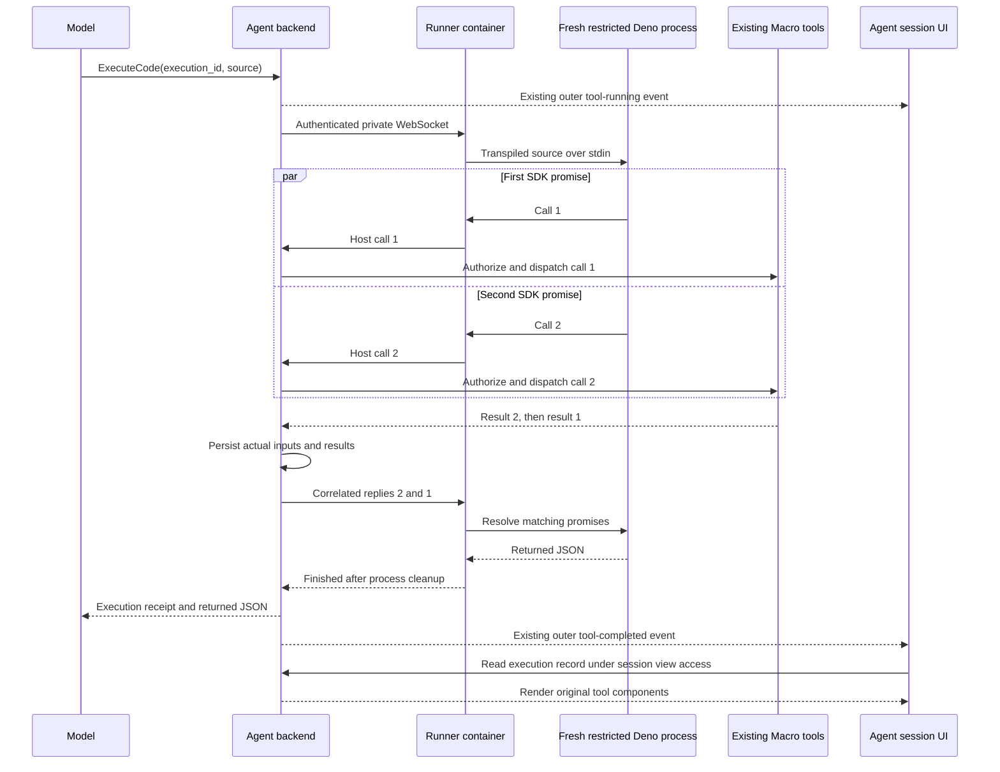

# Code mode

Agent sessions can call `macro_internal.ExecuteCode` with an async TypeScript
function body and await one JSON result. A private shared service supervises fresh
Deno processes; the agent backend dispatches SDK calls with the authenticated
session owner's permissions, bot attribution, usage accounting, and owner approval
checks. Deno receives no application credentials.

The general runner lives in [`code_execution`](../../crates/code_execution/src/lib.rs).
[`agent_code_mode`](../../crates/agent_code_mode/src/lib.rs) owns the SDK catalog,
execution policy, durable call records, and session-authorized record API. The
harness service composes the adapters and exposes the tools on its existing
session-authenticated internal MCP endpoint.
The in-process agent uses that same authenticated router through its MCP transport;
internal tools never go through the third-party app egress resolver.

## Execution and the existing components



The browser shows the ordinary outer running tool while the code executes.
**V1 does not stream individual inner calls to the browser or yield back to the
model.** When execution finishes, the existing agent stream carries the receipt;
the browser fetches its durable record and uses the current Macro renderers,
including search results, document chips, generated images, and `DisplayResults`.
It does not need a new browser WebSocket. Interactive tools and delegated agents
keep their direct host lifecycle and are excluded from SDK discovery and dispatch.

The model receives `{executionId, status, result, error}`. `result` is only the
value explicitly returned by the program. The full inner results stay in the
session's journal, even when code returns a small summary or fails after a write.
Every request records its caller-selected UUID in the outer tool input before
execution begins. The browser can recover the journal from that input if Stop
prevents the final receipt. Reusing the same ID and source returns the existing
receipt without replaying tools; another source is rejected. Program errors are
structured receipts with a failed status, so MCP clients retain their identity.
The journal is readable by the same people who can view the session and is deleted
with it. Calls are persisted before dispatch; interrupted calls have an unknown
outcome. Completed outputs that exceed the 2 MiB journal budget are explicitly
marked omitted, while their observed outcome is preserved.

`RunnerClient` dispatches independent calls in separate tasks and correlates replies
by run and call ID. Production dispatch is bounded to four concurrent calls per
execution and sixteen across the backend's shared client. `Promise.all` preserves
input order even when replies finish out of order; dependent `await`s stay sequential.
The low-level `RunnerClient::execute` event feed remains available for a future
streaming UI. The awaited `ProgramExecutor` path does not allocate or publish that feed.

## How the agent learns the SDK

1. Call `DescribeCodeTools` with `{names: []}` for the allowed method catalog.
2. Request up to five exact names to receive their descriptions and complete input
   and output JSON schemas, including referenced definitions, as JSON-encoded
   strings. Keeping schemas as text avoids provider-reserved `$ref` objects in
   tool responses (Gemini treats them as multimedia references).
3. Call `ExecuteCode` with a fresh UUID `execution_id`, an async TypeScript `source`
   body using `await sdk.ToolName(input)`, and an explicit JSON-compatible `return`.

The catalog is generated from the same registered tool types that execute calls.
The agent needs neither a filesystem SDK installation nor imports. The runtime
injects an `sdk` proxy; arguments still pass through each tool's normal deserializer,
authorization, owner approval gate, and implementation.

```ts
const searches = await Promise.all([
  sdk.NameSearch({ name: "launch" }),
  sdk.NameSearch({ name: "roadmap" }),
]);
return searches.map(search => ({ count: search.results.length }));
```

Source is a function body, not a module or filesystem path. TypeScript syntax is
transpiled without static type checking. Standard JavaScript, `await`, `return`,
`console`, `progress(value)`, and the lower-level `host.call(name, input)` are
available. Console/progress data is diagnostic only in v1; use `return` for data
the model needs. Imports, npm, and direct external I/O are unavailable.

Await every SDK call before returning. `undefined` becomes `null`. Errors reject
the corresponding promise; `Promise.allSettled` can collect independent failures.
A rejection, cancellation, or timeout never rolls back completed writes. Never
blindly replay a program that may have performed a write.

## Private protocol

`GET /health` is unauthenticated. Upgrade `GET /v1/execute` with
`Authorization: Bearer <CODE_EXECUTION_TOKEN>`; one socket owns one execution.

First client frame:

```json
{"type":"execute","request":{"source":"console.log('working'); return 42;","timeout_ms":30000}}
```

Server frames are `{"type":"event","event":{...}}` with a supervisor-assigned
UUIDv7 `run_id`, monotonic `sequence`, and a `type`: `queued`, `started`, `log`,
`progress`, `host_call`, or `finished`. Admission failures use `rejected`.

Reply on the **same socket**:

```json
{"type":"reply","reply":{"id":1,"result":{"status":"ok","value":{"items":[]}}}}
```

Errors use `{"status":"error","message":"..."}`. Cancellation uses
`{"type":"cancel"}`. Unknown/duplicate call IDs, duplicate replies, malformed
frames, and oversized output terminate the execution. The child cannot stamp
run IDs or lifecycle events. Its result remains untrusted program output.

## Isolation, limits, and cancellation

Deno 2.9.6 is pinned and checked on service startup. The supervisor invokes its
transpiler with config, lock discovery, remote modules, and npm disabled, then
passes emitted JavaScript as stdin data to a fixed bootstrap. It **never runs the
snippet file as an entrypoint**: Deno's initial static module graph is exempt from
normal runtime read checks. See [Deno security](https://docs.deno.com/runtime/fundamentals/security/).
The pinned `deno transpile` command is experimental; runtime upgrades must rerun
the sandbox tests. See [the transpile reference](https://docs.deno.com/runtime/reference/cli/transpile/).

The executing child has explicit deny permissions for read, write, network,
environment, subprocesses, FFI, system information, and imports. Its environment
is cleared before a small set of runtime paths is added. Every run has separate
working, home, temp, and cache directories. Neither application secrets nor AWS
credentials are passed to Deno. Source, arguments, results, and credentials are
not written to tracing logs. Temporary source and caches are removed after reaping.

| Default limit | Value |
| --- | --- |
| Running executions per container | 4 |
| Additional queued executions | 16 |
| Requested wall time, including queue/compile/host calls | Up to 30 seconds |
| TypeScript source | 64 KiB |
| Child frame / host reply | 256 KiB (SDK replies reserve envelope headroom) |
| Combined process stdout and stderr | 2 MiB |
| Host calls / pending host calls per execution | 128 / 16 |
| Supervisor events / buffered events | 1,024 / 32 |
| V8 old-space target per child | 128 MiB |
| Deployment task memory / CPU | 2 GiB / 1 vCPU |

The backend client additionally takes host concurrency limits, for example four
calls per execution and sixteen per backend process. Slow consumers fail with a
bounded error instead of buffering indefinitely. One event slot is reserved for
the supervisor's terminal event.

The supervisor enforces deadlines externally, including infinite loops. Explicit
cancellation, backend connection loss, and service shutdown kill and reap the
child. Cancellation also stops backend dispatch tasks. The code-mode domain binds each
execution to the session's active turn, checks it before dispatch, and observes
shared turn state every 250 ms (with a one-second read timeout). Stopping or
replacing the turn cancels execution across replicas, including stateless MCP
requests whose callers disconnected. The browser briefly polls an unfinished
journal after the outer call ends to pick up cancellation cleanup. Tool implementations must
cooperate with cancellation and own their idempotency policy. An already accepted
external write may complete after cancellation; a transport failure has an
unknown side-effect outcome and must not cause automatic execution replay. The
session renderer marks unfinished calls with an unknown outcome.

This is a **shared-container isolation model**, not per-tenant OS isolation.
The container runs as a non-root user, drops capabilities, has a read-only root,
and uses dedicated scratch storage. Deno is the tenant I/O boundary. A runtime
escape affects the shared container. CPU, native memory, ArrayBuffers, and disk
are not individually hard-capped by the V8 old-space flag; the task's overall
resource limits are shared. An OOM or task replacement interrupts all its runs.
No Docker socket, host workspace, or application data volume is mounted.

## Local use and verification

Install Deno **2.9.6** and enter `nix develop` at the repository root. Configure
`CODE_EXECUTION_TOKEN` with a dedicated random value of at least 32 printable
characters; do not reuse Macro's general internal key. Configuration uses
`macro_config`, supporting either environment variables or `APP_SECRETS_JSON`.

```sh
export DENO_BINARY="$(command -v deno)"
cargo run -p code_execution_service
```

Alternatively, with the token in your environment:

```sh
docker compose -f infra/local/code-execution.compose.yaml up --build
```

The local listener is `ws://127.0.0.1:8112/v1/execute`. The compose configuration
limits memory/processes and gives the runner a 512 MiB tmpfs. It is opt-in and does
not modify or require the existing application stack.

Run the real-runtime suite explicitly; its ignored tests require the pinned Deno
binary on `PATH`. The Rust CI workflow installs that runtime and runs those tests
when this package is affected. Tests cover sandbox denials, TypeScript, output limits, protocol
rejection, cancellation, queueing, cleanup, concurrent sessions, and parallel host
calls with progress and out-of-order replies.

```sh
unset SQLX_OFFLINE
cargo test -p code_execution -- --include-ignored
cargo test -p code_execution_service
cargo test -p agent_code_mode
cargo test -p agent_harness_service authenticated_mcp_runs_typescript_parallel_tools_and_persists_ui_results -- --ignored
just check
```

## Deployment

The Pulumi stack lives in `infra/stacks/code-execution-service`. It provisions one
Fargate task, a private Cloud Map name, a dedicated token/config in Doppler, logs,
and ingress restricted to the agent harness security group. There is no public
gateway or load balancer route. Its task IAM role has no application permissions.
The normal Docker build and the Nix/prebuilt deployment path both include Deno.

Deployment order: apply the Doppler project registration, update the harness stack
to export its security-group ID, set this stack's secret `serviceToken`, then
deploy the runner stack. The service inventory marks this stack `bootstrap_pending`
so normal deployment and live Doppler validation wait for that setup. Remove the
marker to activate it after configuration is ready. The exported `runnerUrl` is
`ws://runner.code-execution-<stack>.internal:8112/v1/execute`. Supply the same
dedicated credential and URL through the caller settings this stack writes to
the agent-harness-service Doppler project; redeploy the harness after its secret
sync completes. Both settings absent disables the execution/discovery tools, while
existing records remain readable. Configuring only one fails startup. This change declares infrastructure; it does not deploy or populate
real credentials.

The ECS scratch mount matches the Dockerfile `VOLUME` path so its non-root ownership
is preserved; see [ECS bind mounts](https://docs.aws.amazon.com/AmazonECS/latest/developerguide/bind-mounts.html).
Fargate scratch capacity is shared across the task, unlike the smaller local tmpfs.
The runner has no durable process state; execution records live in MacroDB. Deployments stop the old task before starting
the replacement; active executions are cancelled and callers must not replay writes.
